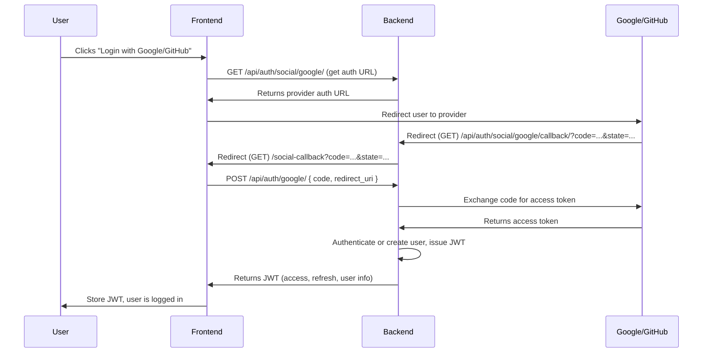

# Social Authentication Flow (Google/GitHub)

This document explains how social authentication (Google/GitHub OAuth2) is implemented in this project, including the flow between the frontend (React) and backend (Django REST Framework with dj-rest-auth/allauth).

---

## Overview

We use the **OAuth2 Authorization Code Flow** for social login. The process is split between the backend and frontend for security and flexibility.

- The backend handles the initial redirect to the provider and the callback from the provider.
- The frontend handles exchanging the code for a JWT by POSTing to the backend.

---

## Flow Diagram



---

## Step-by-Step

### 1. **Frontend: Get Auth URL**
- Frontend requests the provider's auth URL from the backend (`/api/auth/social/google/`).
- Backend returns the URL with proper state and redirect_uri.

### 2. **User Authenticates with Provider**
- User is redirected to Google/GitHub and authenticates.

### 3. **Provider Redirects to Backend Callback**
- Provider redirects to backend callback URL (e.g., `/api/auth/social/google/callback/`) with `?code=...&state=...`.

### 4. **Backend Redirects to Frontend**
- Backend callback view **does NOT exchange the code for a token**.
- Instead, it redirects the user to the frontend (e.g., `/social-callback?code=...&state=...`).

### 5. **Frontend Exchanges Code for JWT**
- Frontend reads the code from the URL and POSTs it to `/api/auth/google/` (or `/api/auth/github/`).
- Backend (dj-rest-auth/allauth) exchanges the code for an access token, authenticates/creates the user, and issues a JWT.
- Backend returns the JWT (and user info) to the frontend.

### 6. **Frontend Stores JWT**
- Frontend stores the JWT (e.g., in localStorage) and uses it for authenticated API requests.

---

## Security Notes

- **Do NOT pass JWTs in the URL.** Only pass the short-lived code.
- **Always use HTTPS** to protect tokens and codes in transit.
- **Remove the code from the URL** in the frontend after exchanging it for a JWT.
- **Set short expiry** on JWTs and use refresh tokens if needed.

---

## Example: Callback Redirect View (Backend)

```python
from django.shortcuts import redirect
from django.conf import settings

def oauth_callback(request):
    code = request.GET.get("code")
    state = request.GET.get("state")
    frontend_url = settings.FRONTEND_URL
    return redirect(f"{frontend_url}/social-callback?code={code}&state={state}")
```

---

## Example: Frontend Code (React)

```js
// In /social-callback route/component
import { useEffect } from 'react';
import { useNavigate, useLocation } from 'react-router-dom';

function SocialCallback() {
  const navigate = useNavigate();
  const location = useLocation();

  useEffect(() => {
    const params = new URLSearchParams(location.search);
    const code = params.get('code');
    if (code) {
      // Exchange code for JWT
      fetch('/api/auth/google/', {
        method: 'POST',
        headers: { 'Content-Type': 'application/json' },
        body: JSON.stringify({ code, redirect_uri: window.location.origin + '/social-callback' })
      })
        .then(res => res.json())
        .then(data => {
          localStorage.setItem('jwt', data.access);
          // Remove code from URL
          window.history.replaceState({}, document.title, '/');
          navigate('/');
        });
    }
  }, [location, navigate]);

  return <div>Logging you in...</div>;
}
```

---

## Troubleshooting

- If you get 403s, make sure both password and social logins use the same JWT system (djangorestframework-simplejwt).
- Make sure your DRF settings use `JWTAuthentication`.
- Make sure the user is active and created correctly by allauth/dj-rest-auth.

---

## References
- [django-allauth](https://django-allauth.readthedocs.io/en/latest/)
- [dj-rest-auth](https://dj-rest-auth.readthedocs.io/en/latest/)
- [djangorestframework-simplejwt](https://django-rest-framework-simplejwt.readthedocs.io/en/latest/) 