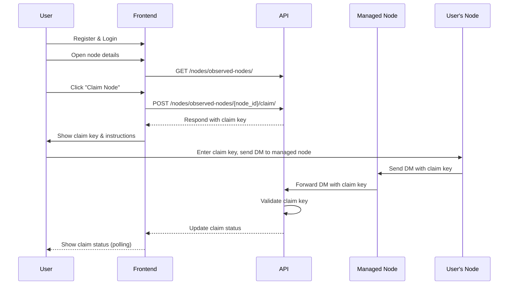

# User Onboarding Workflows

## Claiming a Node (Meshtastic Radio Device)

This workflow describes how a user can claim ownership of a node (Meshtastic radio device) in the Meshflow system.

### Step-by-Step Workflow

1. **User Registration & Login**
   - The user registers for an account and logs in via the frontend application.

2. **Finding the Node**
   - The user navigates to the list of nodes.
   - The user locates their node and opens its details page.

3. **Initiating a Claim**
   - If the node is unclaimed, a "Claim Node" button is visible.
   - The user clicks the button and is taken to the claim page.

4. **Confirming the Claim**
   - The user confirms they want to claim the node.
   - The frontend makes an API call:
     - `POST /api/nodes/observed-nodes/{node_id}/claim/`
   - The API responds with a unique **claim key**.

5. **Completing the Claim**
   - The frontend displays the claim key and instructions:
     - The user must send a direct message from their node to one of the system's managed (monitoring) nodes, containing the claim key.
   - The claim page should show a map of managed nodes to help the user choose a destination.

6. **Verification**
   - When a managed node receives the direct message, it forwards it to the API.
   - The API checks the message against outstanding claim keys.
   - If the claim key is valid, the node is marked as owned by the user.

7. **Status Updates**
   - The frontend polls the API for claim status updates and displays the current status to the user.

### Mermaid Diagram

