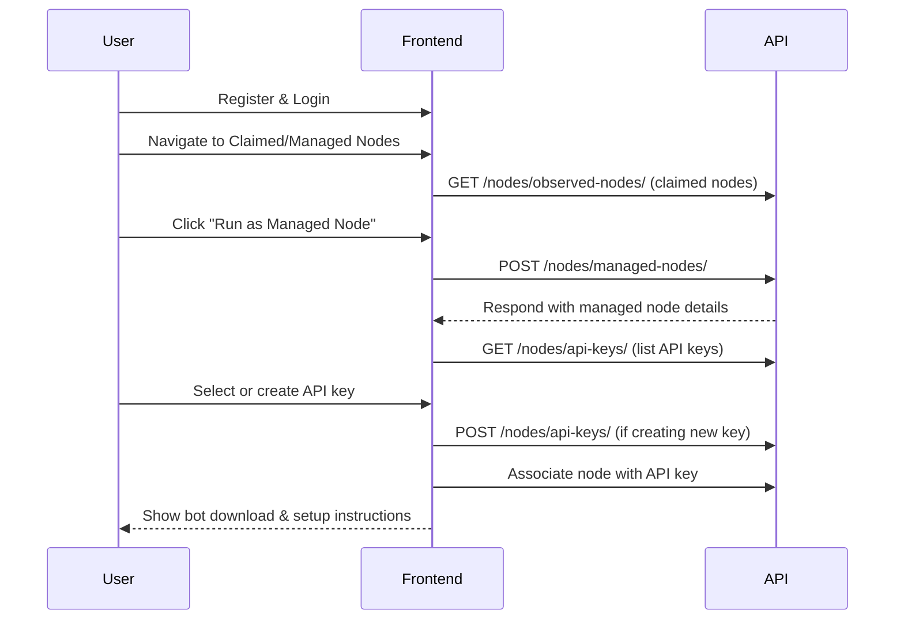

# User Onboarding Workflows

## Claiming a Node (Meshtastic Radio Device)

This workflow describes how a user can claim ownership of a node (Meshtastic radio device) in the Meshflow system.

### Step-by-Step Workflow

1. **User Registration & Login**
   - The user registers for an account and logs in via the frontend application.

2. **Finding the Node**
   - The user navigates to the list of nodes.
   - The user locates their node and opens its details page.

3. **Initiating a Claim**
   - If the node is unclaimed, a "Claim Node" button is visible.
   - The user clicks the button and is taken to the claim page.

4. **Confirming the Claim**
   - The user confirms they want to claim the node.
   - The frontend makes an API call:
     - `POST /api/nodes/observed-nodes/{node_id}/claim/`
   - The API responds with a unique **claim key**.

5. **Completing the Claim**
   - The frontend displays the claim key and instructions:
     - The user must send a direct message from their node to one of the system's managed (monitoring) nodes, containing the claim key.
   - The claim page should show a map of managed nodes to help the user choose a destination.

6. **Verification**
   - When a managed node receives the direct message, it forwards it to the API.
   - The API checks the message against outstanding claim keys.
   - If the claim key is valid, the node is marked as owned by the user.

7. **Status Updates**
   - The frontend polls the API for claim status updates and displays the current status to the user.

### Mermaid Diagram

## Adding a Managed Node

A managed node is a regular Meshtastic node linked to a bot script running locally (e.g., on a Raspberry Pi). This bot receives packets from the network and forwards them to the Meshflow system. Managed nodes are run by volunteers, distributed geographically, to provide Meshflow with a broader view of the mesh network. Each managed node belongs to a single constellation (e.g., a geographical mesh like Central Belt Scotland).

### Step-by-Step Workflow

1. **User Registration & Login**
   - The user must be registered and logged in to the system.

2. **Claiming the Node**
   - The user must have already claimed their node (see previous process for claiming a node).

3. **Navigating to Managed Nodes**
   - In the frontend, the user opens the settings menu and navigates to their "Claimed and Managed Nodes" page.

4. **Initiating Managed Node Setup**
   - If their node appears in the claimed list, the user clicks the "Run as a Managed Node" button.

5. **Creating the Managed Node**
   - The frontend sends a request to:
     - `POST /nodes/managed-nodes/` with the relevant node details.

6. **API Key Selection**
   - The user is presented with a list of their Node API keys, or the option to create a new one.
   - If the user chooses an existing API key, the managed node is added to that key.
   - If the user creates a new API key, the node is added to the new key.

7. **Bot Setup Instructions**
   - The user is presented with instructions for downloading the bot software and configuring it with the selected API key.

### Mermaid Diagram

### Additional Features & Reminders

- [ ] **API Endpoint for Managed Nodes:** Implement an endpoint to retrieve a user's managed nodes - /api/nodes/managed-nodes/mine/
- [ ] **API Endpoint for Claimed Nodes:** Implement an endpoint to retrieve a user's claimed nodes - /api/nodes/observed-nodes/mine/
- [ ] **OpenAPI Spec Updates:** Update the OpenAPI spec with new fields for managed nodes - see ManagedNodeSerializer in nodes/serializers.py
- [ ] **Managed Node Page:** Create a managed node page with stats, last heard, settings, and API key configuration.

---
