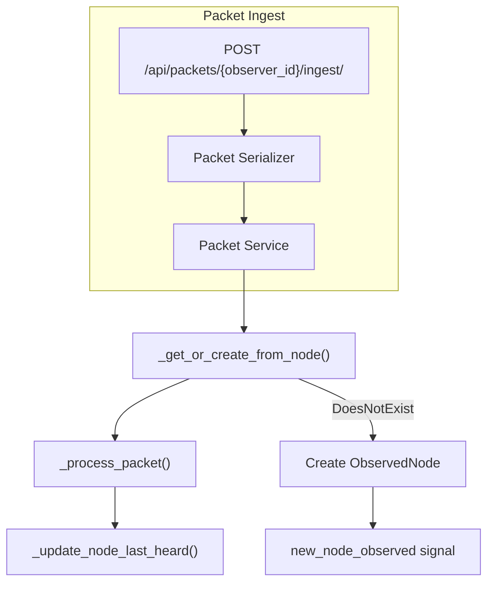

# ObservedNode Lifecycle

This document specifies how the meshflow-api handles Meshtastic node lifecycle events. It serves as the specification for integration tests and as reference for developers.

## Scope

- **Packet ingestion flow**: How packets create and update ObservedNode records
- **NodeUpsertView API**: Direct node create/update via REST
- **Signals**: `new_node_observed`, `node_claim_authorized`, etc.

## Key Models

- **ObservedNode**: A Meshtastic radio node seen on the mesh (from packet observations)
- **NodeLatestStatus**: Denormalized cache of latest position and device metrics per node
- **NodeOwnerClaim**: Pending claim for a node; when accepted, sets `ObservedNode.claimed_by`

---

## 1. Node Creation (New ObservedNode)

### Primary path: packet ingestion

Any packet type (Position, DeviceMetrics, NodeInfo, TextMessage, EnvironmentMetrics, etc.) can create an ObservedNode when the source node does not exist.

- **Location**: `Meshflow/packets/services/base.py` → `_get_or_create_from_node()`
- **Trigger**: `ObservedNode.objects.get(node_id=packet.from_int)` raises `DoesNotExist`
- **Fields set**:
  - `node_id` = `packet.from_int`
  - `node_id_str` = `packet.from_str` if present, else `meshtastic_id_to_hex(packet.from_int)`
  - `long_name` = `"Unknown Node " + node_id_str`
  - `short_name` = last 4 chars of `node_id_str` (or `"????"`)
- **Signal**: `new_node_observed.send(sender=self, node=self.from_node, observer=self.observer)`

```python
# From base.py
self.from_node = ObservedNode.objects.create(
    node_id=self.packet.from_int,
    node_id_str=node_id_str,
    long_name="Unknown Node " + node_id_str,
    short_name=node_id_str[-4:] if len(node_id_str) >= 4 else "????",
)
new_node_observed.send(sender=self, node=self.from_node, observer=self.observer)
```

### Secondary path: NodeUpsertView

- **Location**: `Meshflow/packets/views.py`, `Meshflow/packets/serializers.py` → `NodeSerializer`
- **Endpoint**: `POST /api/packets/{node_id}/upsert/`
- Creates ObservedNode with full payload (position, device_metrics, etc.)

---

## 2. Inferred Nodes (Non-NodeInfo Packets)

There is no separate "inferred node" code path. The same `_get_or_create_from_node()` logic applies to all packet types:

- **Position packets**: Create ObservedNode if unknown; no user/hw/fw/role info
- **Device metrics**: Same
- **Text messages**: Same
- **Environment / air quality / health / host metrics**: Same

When the first packet from a node is *not* a NodeInfo packet, the node is created with placeholder names:

- `long_name` = `"Unknown Node !xxxxxxxx"`
- `short_name` = last 4 chars of `node_id_str` (e.g. `"68b1"` from `!3ade68b1`)

Later NodeInfo packets can update these fields.

---

## 3. Updates to User Name, Hardware, Firmware, Role

### NodeInfo packet handling

- **Location**: `Meshflow/packets/services/node_info.py`
- **Trigger**: Ingested NODEINFO_APP packet
- **Logic**: If packet describes the sender (see note below), update ObservedNode:
  - `short_name`, `long_name`, `hw_model`, `role`, `public_key`, `mac_addr`, `is_licensed`, `is_unmessagable`

**Implementation note**: The current check `sender.node_id == self.packet.node_id` compares `int` vs `str` and never matches, so the early return never triggers and the update always runs. In practice NodeInfo packets are typically from the node describing itself (`from` == `decoded.user.id` in hex), so this is usually correct.

```python
# From node_info.py
sender.short_name = self.packet.short_name
sender.long_name = self.packet.long_name
sender.hw_model = self.packet.hw_model
sender.role = self.packet.role
sender.public_key = self.packet.public_key
sender.mac_addr = self.packet.mac_address
sender.is_licensed = self.packet.is_licensed
sender.is_unmessagable = self.packet.is_unmessagable
sender.save()
```

### NodeUpsertView

- Direct API can update any ObservedNode fields including `long_name`, `short_name`, `hw_model`, `role`.

---

## 4. Inferences About Values

### node_id ↔ node_id_str

- **Location**: `Meshflow/common/mesh_node_helpers.py`
- **Functions**:
  - `meshtastic_id_to_hex(int)` → `"!abcdef12"`
  - `meshtastic_hex_to_int(str)` → int

**Usage**:

- Packet serializer: `from_str` is always derived from `from_int` via `meshtastic_id_to_hex(from_int)` (payload `fromId` is overwritten)
- New ObservedNode: `node_id_str` = `packet.from_str` or `meshtastic_id_to_hex(packet.from_int)`
- NodeUpsertView: accepts hex `node_id` in URL, converts via `meshtastic_hex_to_int`

**Broadcast ID**: `0xFFFFFFFF` → `"^all"`

---

## 5. Other Lifecycle Events

| Event | Location | Action |
|-------|----------|--------|
| **last_heard** | `base.py` → `_update_node_last_heard()` | Updated on every packet from `packet.first_reported_time` |
| **Position** | `position.py` | Creates Position record; updates NodeLatestStatus (lat, lon, alt, heading, etc.) |
| **Device metrics** | `device_metrics.py` | Creates DeviceMetrics; updates NodeLatestStatus (battery, voltage, channel_util, etc.) |
| **Environment metrics** | `environment_metrics.py` | Creates EnvironmentMetrics; updates NodeLatestStatus |
| **Air quality / health / host metrics** | Similar telemetry services | Update NodeLatestStatus fields |
| **Node claim** | `text_message.py` | When text message (direct, not broadcast) contains claim key matching NodeOwnerClaim: sets `claimed_by`, marks claim accepted |

---

## 6. Packet Processing Flow



---

## 7. Integration Test Coverage Map (Future)

| Lifecycle Event | Integration Test(s) |
|-----------------|---------------------|
| New node from any packet type | `test_position_packet_creates_observed_node_and_position` (exists); add similar for DeviceMetrics, NodeInfo, TextMessage |
| Inferred node (Position first, no NodeInfo) | New test: ingest Position for unknown node, verify placeholder names |
| NodeInfo updates (name, hw, fw, role) | New test: ingest NodeInfo after inferred node, verify fields updated |
| node_id_str inference | Covered by existing position test; add explicit test for `from_int`-only payload |
| last_heard update | New test: ingest packet, verify `last_heard` on ObservedNode |
| Position → NodeLatestStatus | Partially covered by `test_downstream_positions` |
| Device metrics → NodeLatestStatus | New test or extend `test_downstream_device_metrics` |
| Node claim via text message | New test: create NodeOwnerClaim, ingest direct message with claim key, verify `claimed_by` |
