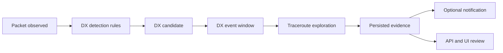
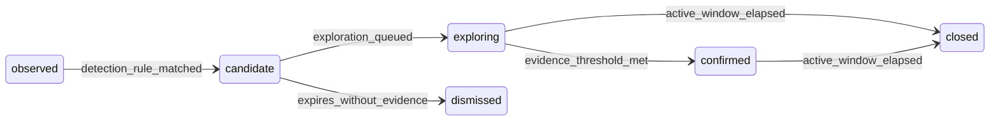

# DX Monitoring

DX Monitoring detects short-lived or unusual long-distance mesh visibility events,
captures traceroute evidence while the event is active, and notifies interested
users once the signal is useful enough to act on.

This initial design work is tracked by
[meshflow-api #220](https://github.com/pskillen/meshflow-api/issues/220) under
the parent epic [meshflow-api #217](https://github.com/pskillen/meshflow-api/issues/217).
Implementation is intentionally split into child tickets so each phase can be
delivered independently.

## Intent

Some Meshtastic nodes appear briefly at distances or times that do not match the
usual mesh topology. If the system starts seeing brand-new DX nodes, or nodes
that return after a long quiet period, the mesh may be experiencing:

- Tropospheric lift or ducting, often lasting seconds to minutes.
- Aircraft-mounted nodes, often lasting low tens of minutes.
- Balloon nodes, often lasting minutes to hours.
- Other unusual propagation paths or temporarily well-positioned nodes.

The goal is not to perfectly classify the cause at first. The first useful
version should detect plausible events, gather evidence quickly, avoid radio
flooding, and leave enough data for later review.

## Relationship To Existing Features

DX Monitoring is related to, but distinct from, these existing systems:

- [Mesh monitoring](../mesh-monitoring/README.md) watches specific nodes for
  silence, verifies suspected offline nodes with traceroutes, and notifies
  watchers. DX Monitoring starts from unusual positive observations instead of
  silence.
- [Traceroute](../traceroute/README.md) already records requested and completed
  traceroutes in `AutoTraceRoute`. DX Monitoring should reuse this persistence
  path for exploration evidence.
- The automatic traceroute scheduler already has `dx_across` and `dx_same_side`
  target strategies. Those names describe target-selection hypotheses for random
  auto traceroutes; they are not the same thing as user-facing DX Monitoring
  events.

## Terminology

- **DX candidate:** A single node or observation pattern that passes one or more
  detection rules and is worth investigating.
- **DX event:** A deduplicated time window that groups related candidates and
  evidence. A single event may involve multiple destination nodes and multiple
  managed source nodes.
- **Source:** A managed node asked to send traceroutes or otherwise providing
  observations.
- **Destination:** The observed node that looks unusual or distant.
- **Evidence:** Packets, observations, traceroutes, routes, return routes, and
  derived measurements attached to a candidate or event.
- **Event window:** The active period during which repeated observations should
  extend or reinforce one event instead of creating duplicates.
- **Cooldown:** A per-event, per-destination, or per-source limit that prevents
  repeated observations from generating too many traceroutes or notifications.
- **Subscriber:** A user or operational audience that has opted into DX event
  notifications.

## Proposed Flow

1. Packet ingestion updates observed-node state as it does today.
2. DX detection evaluates the observation against conservative rules.
3. Matching observations create or update a DX candidate and event window.
4. Exploration queues traceroutes from suitable managed sources, respecting bot
   queue capacity and API-side rate limits.
5. Traceroute completions and packet observations are attached as event evidence.
6. Notifications are sent only after the event passes configured quality and
   cooldown checks.
7. API and UI surfaces let users inspect active and historical events.

## Event Lifecycle

The exact state names can change during implementation, but each state should
answer a clear operational question:

- `candidate`: The signal is interesting enough to track.
- `exploring`: The system is actively trying to collect traceroute evidence.
- `confirmed`: The event is strong enough to expose or notify.
- `dismissed`: The signal expired without enough evidence.
- `closed`: The event is no longer active, but remains available for review.

## Detection MVP

The first detection phase should prefer simple, explainable rules over broad
anomaly detection. Suggested MVP rules:

1. **Brand-new observed node:** An `ObservedNode` is created or first heard and
   has a usable position or enough packet context to investigate.
2. **Newly returned node:** A known node is heard after a configurable quiet
   period, for example several days or weeks.
3. **Unusually distant observation:** The destination appears unusually far from
   the observing managed node or from the normal operating region, when both
   positions are known.

Rules should be independently enableable or at least independently testable.
They should produce a clear reason code so downstream event records can explain
why the system started exploring.

Initial non-goals:

- No machine-learning anomaly detector.
- No authoritative atmospheric classification.
- No notification based only on a single weak observation.
- No unbounded traceroute fan-out.

## Event Grouping And Deduplication

Detection should avoid creating one event per packet. The first implementation
should group observations by destination node and active time window. Later
versions can group by geography, constellation, route shape, or shared source
nodes.

Recommended defaults for the implementation tickets to refine:

- One active event per destination node per rule family.
- Extend the active window when fresh matching observations arrive.
- Keep an event-level exploration cooldown.
- Keep source and destination cooldowns so repeated observations do not create
  traceroute storms.
- Store reason codes and counters so operators can tune thresholds later.

## Traceroute Exploration

DX Monitoring should gather evidence with traceroutes, but only after the bot can
queue remote traceroute commands safely. The bot-side queue is tracked in
[meshtastic-bot #78](https://github.com/pskillen/meshtastic-bot/issues/78).

Exploration should:

- Persist every requested traceroute as an `AutoTraceRoute`.
- Use DX-specific trigger metadata after trigger taxonomy is clarified in
  [meshflow-api #218](https://github.com/pskillen/meshflow-api/issues/218).
- Select multiple managed sources when useful, not only the closest source.
- Respect liveness, ownership, constellation, and radio safety constraints.
- Record no-source, suppressed, queued, sent, completed, and failed outcomes.
- Attach completed traceroute packets back to the relevant DX event.

Source selection can reuse helpers from mesh monitoring and traceroute
scheduling, but DX source selection has a different goal from offline
verification. Mesh monitoring asks "can nearby infrastructure still reach this
node?" DX exploration asks "what sources can capture useful path evidence for
this unusual observation?"

**Phase 4 (implemented):** Bounded exploration uses `DxEventTraceroute`,
`trigger_type=DX_WATCH` (`trigger_source=dx_monitoring`), deduplication against
`NEW_NODE_BASELINE`, and the celery task `explore_active_dx_events`. Details:
**[exploration.md](exploration.md)**.

## Notifications

Notifications should come after detection and exploration have enough quality to
avoid noise. The first notification channel should reuse existing Discord DM
infrastructure where practical.

Open decisions for the notification ticket:

- Initial audience: staff only, verified Discord users, constellation members,
  explicit subscribers, or a combination.
- Notification trigger: candidate created, event confirmed, event closed, or
  particularly interesting traceroute completed.
- Cooldown policy: per event, per subscriber, and per time window.
- Message content: short summary, reason codes, affected nodes, source nodes,
  traceroute count, and event link.

The system should log notification failures and continue processing events.

## API And UI Surfaces

API work should expose read-oriented event data after the event model stabilizes:

- List and retrieve DX events.
- Filter by active/recent/closed state, time range, source node, destination
  node, rule/reason, and confidence/status.
- Include related candidates, evidence, `AutoTraceRoute` IDs, and traceroute
  packet IDs.
- Keep `openapi.yaml` in sync with any public contract changes.

UI work should be split into two delivery slices:

- **6a: early read-only visibility.** After the detection MVP and models are
  merged, add just enough API and UI to inspect what detection is doing while it
  runs for a few days. This should focus on active/recent events, reason codes,
  destination nodes, observer/source nodes, distances, counters, timestamps, and
  raw evidence links. It should not include subscriptions, notifications,
  exploration controls, or rich traceroute visualisation.
- **6b: full DX Monitoring UI.** After exploration and notification contracts
  stabilize, add the remaining user-facing experience: subscriptions,
  notification preferences, traceroute/evidence visualisation, node-detail
  integration, and richer historical review.

Both UI slices should follow the existing `meshtastic-bot-ui` API hook and
dashboard patterns, reuse map/table/modal components where practical, and poll
first unless a later event stream is justified.

The UI ticket is tracked in
[meshtastic-bot-ui #219](https://github.com/pskillen/meshtastic-bot-ui/issues/219).

## Operational Considerations

DX Monitoring can create bursts of work during the exact periods where the mesh
is interesting. The rollout needs conservative defaults and useful visibility.

Operational requirements:

- Safe default limits for event windows, cooldowns, queue depth, source fan-out,
  and notification volume.
- Admin or operational views for active events, recent failures, no-source
  outcomes, and queue pressure.
- Logs that include event ID, destination node, source node, reason code, and
  traceroute outcome.
- Retention or cleanup policy for candidate/event evidence.
- A kill switch or configuration path to disable detection, exploration, or
  notifications independently.

## Child Delivery Plan

The parent epic is [meshflow-api #217](https://github.com/pskillen/meshflow-api/issues/217).
Implementation should happen in these child tickets:

1. [meshflow-api #220](https://github.com/pskillen/meshflow-api/issues/220):
   design DX Monitoring feature.
2. [meshtastic-bot #78](https://github.com/pskillen/meshtastic-bot/issues/78):
   queue remote traceroute commands.
3. [meshflow-api #218](https://github.com/pskillen/meshflow-api/issues/218):
   clarify traceroute trigger taxonomy.
4. [meshflow-api #219](https://github.com/pskillen/meshflow-api/issues/219):
   detect initial DX Monitoring candidates.
5. [meshflow-api #221](https://github.com/pskillen/meshflow-api/issues/221):
   explore DX candidates with traceroutes.
6a. Early read-only DX visibility dashboard:
   expose the detection MVP enough to inspect live/recent candidates after
   Phase 3. This may need a small `meshflow-api` read-only endpoint plus a
   `meshtastic-bot-ui` dashboard slice.
6b. Full DX Monitoring UI:
   subscriptions, notification preferences, traceroute/evidence visualisation,
   node-detail integration, and richer historical review after exploration and
   notification contracts stabilize.
7. [meshflow-api #223](https://github.com/pskillen/meshflow-api/issues/223):
   notify subscribers about DX events.
8. [meshflow-api #222](https://github.com/pskillen/meshflow-api/issues/222):
   expose DX Monitoring events via API.
9. [meshtastic-bot-ui #219](https://github.com/pskillen/meshtastic-bot-ui/issues/219):
   add the full DX Monitoring dashboard experience.
10. [meshflow-api #224](https://github.com/pskillen/meshflow-api/issues/224):
   harden and operate the rollout.

## Open Questions

- What quiet period should define a "newly returned" node for the MVP?
- Should the first release be staff-only until false-positive rates are known?
- Should DX events be scoped globally, per constellation, or both?
- What is the first confidence threshold that is good enough for notification?
- How long should raw event evidence be retained?
- Should cross-environment traceroute completions be attached to DX events in
  the same way they are inferred for external traceroutes today?

## Rollout

1. Merge this design document and keep the epic updated.
2. Ship bot-side traceroute queueing before any API fan-out.
3. Clarify traceroute trigger metadata.
4. Ship detection without notifications.
5. Add early read-only API/UI visibility for detection results so operators can
   inspect real candidate data before exploration or notifications are enabled.
6. Add bounded traceroute exploration.
7. Expose the fuller read-only event API and operational views.
8. Add notifications behind conservative opt-in settings.
9. Add the full UI dashboard once exploration and notification contracts
   stabilize.
10. Harden defaults, logs, metrics, retention, and runbooks after real event data
   exists.
