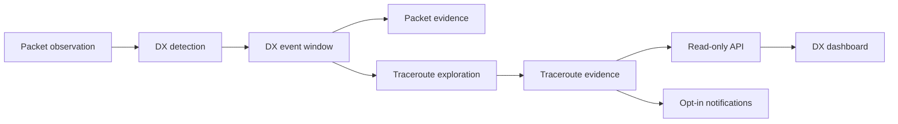

# DX Monitoring

DX Monitoring detects short-lived or unusual long-distance mesh visibility
events, preserves evidence while the signal is active, and eventually notifies
interested users when an event is strong enough to act on.

The feature is built around unusual positive observations: a node is heard well
outside the expected range of a local cluster, a previously DX-classified node
returns after a long quiet period, or a known distant node suddenly appears to be
directly reachable. This is different from mesh monitoring, which starts from
silence and verifies whether a watched node may be offline.

## Purpose

Meshtastic meshes sometimes see nodes that briefly appear outside the normal
local topology. These observations may come from tropospheric lift, aircraft,
balloons, temporary high locations, or other unusual RF paths. DX Monitoring
captures those moments before they disappear.

The first useful version prioritises:

- Conservative candidate detection.
- Durable event and evidence records.
- Bounded traceroute exploration in later phases.
- Operator visibility before user-facing notifications.
- Clear thresholds and cooldowns so the system can be tuned from real data.

## High-Level Design

Detection runs from packet ingestion and creates internal event records when a
rule matches. Repeated observations are grouped into active event windows instead
of creating one event per packet. Later phases attach traceroute evidence,
surface events through read-only APIs, and notify subscribed users behind
cooldowns.

## Core Concepts

- **DX candidate:** A node or observation pattern that matches a detection rule
  and is worth tracking.
- **DX event:** A deduplicated active window that groups related candidate
  observations and evidence.
- **Destination:** The observed node that appears unusual.
- **Observer:** The managed node that reported the packet observation.
- **Evidence:** Packet observations, traceroutes, route metadata, distances, and
  timestamps attached to an event.
- **Reason code:** The rule that opened or reinforced an event, such as
  `new_distant_node`, `returned_dx_node`, or `distant_observation`.
- **Cooldown:** A limit that prevents repeated observations from creating noisy
  traceroutes or notifications.

## Current MVP Scope

The MVP detection phase is API-only. It records internal `DxEvent` and
`DxEventObservation` state from packet ingestion and does not send traceroutes,
notifications, or public API events.

Detection starts with three explainable rule families:

- Brand-new observed nodes that are suitably distant from the observing
  constellation's normal cluster.
- Previously DX-classified nodes heard again after a configurable quiet period.
- Distant observations where both observer and destination positions are known.

See [detection.md](detection.md) for the reference guide to the MVP detection
algorithm. See [future-detection.md](future-detection.md) for detection ideas
that are useful but outside the MVP.

## Relationship To Existing Features

- [Mesh monitoring](../mesh-monitoring/README.md) watches specific nodes for
  silence and verifies suspected offline state. DX Monitoring watches for
  unusual positive observations.
- [Traceroute](../traceroute/README.md) provides the persisted request and
  completion records that DX exploration reuses after queueing and trigger
  taxonomy are ready.
- Existing automatic traceroute strategies such as `dx_across` and
  `dx_same_side` describe random target-selection hypotheses. They are not the
  same thing as persisted DX Monitoring events.

## Delivery Shape

DX Monitoring is delivered in independent phases:

1. Feature design and terminology.
2. Safe server-side traceroute dispatch queueing.
3. Traceroute trigger taxonomy cleanup.
4. Candidate event detection.
5. Bounded traceroute exploration.
6. Read-only API and UI event surfaces.
7. Opt-in notifications.
8. Operational hardening, metrics, retention, and rollout tuning.

The phase plan lives in [DELIVERY_PLAN.md](DELIVERY_PLAN.md).

## Non-Goals For Early Phases

Early DX Monitoring does not attempt to classify the physical cause of an event,
run machine-learning anomaly detection, notify users from weak single-packet
signals, or fan out unbounded traceroutes. The system starts with durable,
explainable observations and grows outward once operators can inspect real event
quality.
