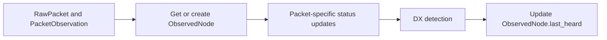

# DX Monitoring Detection

This guide describes the MVP detection behaviour for DX Monitoring candidate
events. The detector is intentionally conservative: it records explainable
signals during packet ingestion, groups repeated observations into active event
windows, and leaves traceroute exploration, notifications, and public API
surfaces to later phases.

## Purpose

DX detection identifies packet observations that look unusual enough to review or
investigate. The MVP creates internal event records for nodes that appear outside
the normal range of an observing cluster:

- A newly positioned observed node that is suitably distant from the observing
constellation's normal cluster.
- A previously DX-classified node that returns after a long quiet period.
- A direct or near-direct observation between a managed observer and a suitably
distant observed node.

New nodes and returning nodes are common on an active mesh and are not DX events
by themselves. The defining signal is that the node is outside the normal
distance envelope for the observer's cluster, or that the node has already been
seen as DX before and has now reappeared after a long dark period. The detector
only starts caring about a node once the node has a usable position, because
distance from the local cluster is the core signal. The detector does not
classify the propagation cause. A candidate can be caused by tropospheric lift,
aircraft, balloons, temporary node placement, data errors, or ordinary mesh
changes. The event record explains why the candidate exists and preserves the
evidence needed to tune the rules.

## Runtime Position

Detection runs inside packet processing for each ingested packet.

The detector evaluates the packet after packet-specific processing updates
derived state, such as `NodeLatestStatus`, and before
`ObservedNode.last_heard` is overwritten for the current packet. This lets the
rules compare the current observation with the node's previous `last_heard`
value.

## Position Availability

An `ObservedNode` can be created by any first-heard packet type. In Meshtastic,
the first packet may be node-info, text, telemetry, position, or something else,
and packets can arrive in any order. Most first sightings do not include a
position.

Creating an `ObservedNode` is therefore not enough to open a DX event. The
distance-based rules wait until packet processing has a usable destination
position in `NodeLatestStatus`. If a node is first created by a `NodeInfoPacket`
or `MessagePacket`, detection records no candidate at that point. When a later
`PositionPacket` or other status update supplies coordinates, the detector can
evaluate whether that now-positioned node is outside the observing
constellation's normal range.

The implementation tracks enough per-node DX metadata to distinguish "first time
we can evaluate this node's position" from ordinary repeated packets. A local
node that receives its first position inside the cluster range remains a
non-event.

## Inputs

Each detection pass receives:

- The `RawPacket` being processed.
- The `PacketObservation` linking the packet to the observing `ManagedNode`.
- The observing `ManagedNode`.
- The observed `ObservedNode` identified by `RawPacket.from_int`.
- Whether the observed node was created by this packet.
- The observed node's previous `last_heard` value.
- Whether the observed node has already had a usable position evaluated for DX.
- The observer's `Constellation`, used as the current model for the local mesh
cluster.
- Usable observer and destination positions when distance-based rules need them.

The detector ignores packets that do not have a usable `from_int`, do not have a
`PacketObservation`, do not have a `first_reported_time`, or are observations of
the managed observer's own node.

Packet-ingest rules also require a **direct** observation: both `hop_start` and
`hop_limit` must be present on the `PacketObservation`, and
`hop_start - hop_limit` must be zero (no remaining relay hops). Multi-hop or
unknown hop metadata is ignored for `new_distant_node`, `returned_dx_node`, and
`distant_observation` so routine multi-hop DX-style paths do not open events.
Traceroute response packets are excluded from packet-ingest DX; long RF hops can
still surface via `traceroute_distant_hop` when a completed traceroute is processed.

## Event Records

The MVP stores two levels of data:

- `DxEvent` is the deduplicated event window for one destination node and one
reason code.
- `DxEventObservation` is the evidence row for a packet observation that matched
that event.

`DxEvent` stores the destination `ObservedNode`, observing `Constellation`,
reason code, state, first-observed and last-observed timestamps, active-window
expiry, observation counter, last observer, and the best or latest distance
values when the rule can calculate them.

`DxEventObservation` links the event to the `RawPacket`, `PacketObservation`,
observer, observed timestamp, reason metadata, and optional distance.

## Reason Codes

### `new_distant_node`

The detector emits `new_distant_node` when a node receives its first usable
position for DX evaluation and that position is suitably distant from the
observing constellation's normal cluster.

This rule does not fire for ordinary new nodes inside the usual range. New nodes
appear multiple times per day and are background mesh activity. A new node only
becomes interesting when its location or observation geometry places it outside
the expected cluster envelope, such as a Central Belt Scotland observer suddenly
hearing a node in Aberdeen, the Midlands, or Northern Ireland.

The first packet that created the `ObservedNode` may not be the packet that opens
the DX event. A node can be created by node-info, text, or telemetry with no
coordinates, then become eligible later when a position arrives. That later
positioned observation is the first meaningful point for this rule.

While the node stays beyond the cluster-distance threshold, later packets still
match this reason code and extend the same deduplicated `DxEvent` until the
active window expires.

The MVP distance decision is deliberately explicit and tunable. The observer's
constellation represents the local cluster, and the initial implementation uses
managed-node default locations in that constellation as the cluster footprint. A
candidate is distant when it exceeds the configured cluster-distance threshold
from that footprint and the packet observation itself is also consistent with a
long-distance sighting.

### `returned_dx_node`

The detector emits `returned_dx_node` when a node with previous DX event history
is heard again after the configured DX quiet period.

This rule does not fire for ordinary nodes that go offline and come back. People
turn nodes on every few days, leave them in boxes for months, and later bring
them back online. That is normal mesh churn. The return becomes interesting when
the node was previously classified as DX for the observing constellation, or has
stored evidence showing it was outside the cluster envelope before it went dark.

The quiet-period comparison uses the packet's `first_reported_time` and the
previous `ObservedNode.last_heard`. A node with no previous `last_heard` is not a
returned DX node unless it has earlier DX event evidence attached through another
path.

### `distant_observation`

The detector emits `distant_observation` when the observer and observed node have
usable positions and their great-circle distance exceeds the configured direct
observation threshold, and the packet observation is direct (see hop predicate above).

The observer position comes from the observing `ManagedNode` default location.
The observed-node position comes from `NodeLatestStatus` after packet-specific
status updates have run. Distance is calculated with the shared geographic helper
used elsewhere in the API. If either side lacks coordinates, this rule does not
match.

This rule covers known distant nodes as well as new ones. For example, a Central
Belt router directly hearing Aberdeen during a tropo opening is interesting even
if the Aberdeen node already exists in the database.

### `traceroute_distant_hop`

When a traceroute completes, the service rebuilds the forward path (source
managed node, each `route` relay entry, target observed node) and the return path
(target, each `route_back` relay, source). For each consecutive pair with
coordinates on both ends, if great-circle distance exceeds
`DX_MONITORING_TRACEROUTE_HOP_DISTANCE_KM`, a `traceroute_distant_hop` candidate is
recorded with the hop’s **to** node as the `DxEvent` destination (when that node
exists as an `ObservedNode`). Pairs missing coordinates or involving nodes marked
`exclude_from_detection` in `DxNodeMetadata` are skipped. Evidence metadata
includes `auto_traceroute_id`, `path_direction` (`forward` or `return`), hop
indices, endpoint node ids, `distance_km`, and `threshold_km`.

## Deduplication

Detection does not create one event per packet. For each matching reason code,
the detector looks for an active `DxEvent` with the same observing constellation,
destination node, and reason code.

When an active event exists, the detector:

- Updates `last_observed_at`.
- Extends the active-window expiry.
- Increments the observation counter.
- Updates the last observer.
- Updates latest and best distance fields when distance is available.
- Adds a `DxEventObservation` evidence row.

When no active event exists, the detector creates a new `DxEvent` and attaches
the first evidence row.

An event is active while its expiry timestamp is in the future. Repeated packets
inside the active window reinforce the same event. A later packet after expiry
creates a new event, so operators can distinguish separate bursts.

## Conservative Defaults

The MVP uses configuration that favours low noise:

- Detection is controlled by `DX_MONITORING_DETECTION_ENABLED`.
- The returned-DX quiet period defaults to 30 days.
- The active event window defaults to 60 minutes.
- The cluster-distance threshold defaults to 150 km.
- The direct-observation threshold defaults to 100 km.
- The traceroute hop-distance threshold defaults to 150 km.

Rule thresholds are independent so operators can tune sensitivity without
changing the data model.

## Algorithm

For each packet processed by `BasePacketService`:

1. Capture whether the `ObservedNode` was created and the previous
  `ObservedNode.last_heard`.
2. Run packet-specific processing so latest node status is current.
3. Stop if detection is disabled or the packet is not eligible (including non-direct
   hop metadata for packet-ingest rules, and traceroute packets for those rules).
4. Load destination position state after packet-specific processing.
5. Skip distance-based rules when the destination position is still unknown.
6. Evaluate each MVP rule independently.
7. For each matched rule, find or create the active event for observing
  constellation, destination node, and reason code.
8. Persist a `DxEventObservation` for the packet evidence.
9. Return without sending traceroutes, notifications, or user-facing API events.
10. Continue normal packet processing and update `ObservedNode.last_heard`.

## False-Positive Controls

The MVP suppresses noisy candidates by:

- Ignoring packets that cannot be tied to an observed node and observation.
- Ignoring self-observations from the managed observer.
- Treating ordinary new nodes inside the cluster range as non-events.
- Waiting for usable destination coordinates before evaluating a node as
  distant.
- Requiring previous DX event history for returned-DX detection.
- Requiring coordinates on both nodes, or a usable cluster footprint, for
distance detection.
- Grouping repeated packets into one active event.
- Keeping reason codes separate so one noisy rule does not hide another signal.

## Non-Goals

This phase does not:

- Queue traceroutes.
- Select exploration source nodes.
- Send Discord or user notifications.
- Expose public API endpoints or update `openapi.yaml`.
- Build UI surfaces.
- Confirm or classify the physical cause of an event.
- Run a machine-learning anomaly detector.

The output is internal event and evidence state that can be inspected by
operators and used by later DX Monitoring phases.
