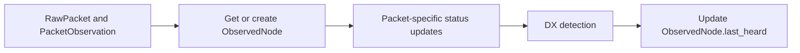

# DX Monitoring Detection

This guide describes the MVP detection behaviour for DX Monitoring candidate
events. The detector is intentionally conservative: it records explainable
signals during packet ingestion, groups repeated observations into active event
windows, and leaves traceroute exploration, notifications, and public API
surfaces to later phases.

Most of the detection logic lives in
`Meshflow/dx_monitoring/services.py`. Packet detection is wired through
`Meshflow/packets/services/*.py`.

## Purpose

DX detection identifies observations that are unusual enough to review or
investigate. In a mesh network, hearing a far-away node is not inherently
unusual: multi-hop DX reachability is intended behaviour. The unusual signal is
that two distant nodes appear to communicate directly, or that traceroute
evidence shows a distant pair as consecutive hops.

The MVP creates internal event records for:

- A newly positioned node that is suitably distant from the observing
  constellation's normal cluster and is heard directly by a managed monitoring
  node.
- A previously DX-classified node that returns after a long quiet period and is
  again heard directly by a managed monitoring node.
- A direct packet observation between a managed monitoring node and a suitably
  distant observed node.

New nodes, returning nodes, and ordinary multi-hop distant reachability are
common on an active mesh and are not DX events by themselves. The detector only
starts caring about packet-ingest observations when the node has a usable
position and the packet metadata shows a direct link. The detector does not
classify the propagation cause. A candidate can be caused by tropospheric lift,
aircraft, balloons, temporary node placement, data errors, or ordinary mesh
changes. The event record explains why the candidate exists and preserves the
evidence needed to tune the rules.

## Runtime Position

Detection runs inside packet processing for each ingested packet.

The detector evaluates the packet after packet-specific processing updates
derived state, such as `NodeLatestStatus`, and before
`ObservedNode.last_heard` is overwritten for the current packet. This lets the
rules compare the current observation with the node's previous `last_heard`
value.

## Position Availability

An `ObservedNode` can be created by any first-heard packet type. In Meshtastic,
the first packet may be node-info, text, telemetry, position, or something else,
and packets can arrive in any order. Most first sightings do not include a
position.

Creating an `ObservedNode` is therefore not enough to open a DX event. The
distance-based rules wait until packet processing has a usable destination
position in `NodeLatestStatus`. If a node is first created by a `NodeInfoPacket`
or `MessagePacket`, detection records no candidate at that point. When a later
`PositionPacket` or other status update supplies coordinates, the detector can
evaluate whether that now-positioned node is outside the observing
constellation's normal range.

The implementation tracks enough per-node DX metadata to distinguish "first time
we can evaluate this node's position" from ordinary repeated packets. A local
node that receives its first position inside the cluster range remains a
non-event.

## Inputs

Each detection pass receives:

- The `RawPacket` being processed.
- The `PacketObservation` linking the packet to the observing `ManagedNode`.
- The observing `ManagedNode`.
- The observed `ObservedNode` identified by `RawPacket.from_int`.
- Whether the observed node was created by this packet.
- The observed node's previous `last_heard` value.
- Whether the observed node has already had a usable position evaluated for DX.
- The observer's `Constellation`, used as the current model for the local mesh
cluster.
- Usable observer and destination positions when distance-based rules need them.
- Packet hop metadata, especially whether the packet was observed with zero
  remaining intermediate hops between sender and managed observer.

The detector ignores packets that do not have a usable `from_int`, do not have a
`PacketObservation`, do not have a `first_reported_time`, or are observations of
the managed observer's own node.

Packet-ingest rules also require a **direct** observation: both `hop_start` and
`hop_limit` must be present on the `PacketObservation`, and
`hop_start - hop_limit` must be zero (no remaining relay hops). Multi-hop or
unknown hop metadata is ignored for `new_distant_node`, `returned_dx_node`, and
`distant_observation` so routine multi-hop DX-style paths do not open events.
Traceroute response packets are excluded from packet-ingest DX; long RF hops can
still surface via `traceroute_distant_hop` when a completed traceroute is processed.

## Event Records

The MVP stores two levels of data:

- `DxEvent` is the deduplicated event window for one destination node and one
reason code.
- `DxEventObservation` is the evidence row for a packet observation that matched
that event.

`DxEvent` stores the destination `ObservedNode`, observing `Constellation`,
reason code, state, first-observed and last-observed timestamps, active-window
expiry, observation counter, last observer, and the best or latest distance
values when the rule can calculate them.

`DxEventObservation` links the event to the `RawPacket`, `PacketObservation`,
observer, observed timestamp, reason metadata, and optional distance.

## Reason Codes

### `new_distant_node`

The detector emits `new_distant_node` when a node receives its first usable
position for DX evaluation, that position is suitably distant from the observing
constellation's normal cluster, and the packet observation is direct from the
managed observer's point of view.

This rule does not fire for ordinary new nodes inside the usual range. New nodes
appear multiple times per day and are background mesh activity. A new node only
becomes interesting when it is both distant and directly heard by one of the
managed monitoring nodes. A Central Belt Scotland node that merely learns about a
Midlands node through normal mesh forwarding is expected behaviour; a Central
Belt monitoring node hearing that Midlands node with zero hops is the candidate.

The first packet that created the `ObservedNode` may not be the packet that opens
the DX event. A node can be created by node-info, text, or telemetry with no
coordinates, then become eligible later when a position arrives. That later
positioned observation is the first meaningful point for this rule.

While the node stays beyond the cluster-distance threshold, later direct packets
still match this reason code and extend the same deduplicated `DxEvent` until the
active window expires. Later multi-hop packets do not reinforce the packet-ingest
event.

The MVP distance decision is deliberately explicit and tunable. The observer's
constellation represents the local cluster, and the initial implementation uses
managed-node default locations in that constellation as the cluster footprint. A
candidate is distant when it exceeds the configured cluster-distance threshold
from that footprint and the packet observation itself shows a direct link.

### `returned_dx_node`

The detector emits `returned_dx_node` when a node with previous DX event history
is heard directly again after the configured DX quiet period.

This rule does not fire for ordinary nodes that go offline and come back. People
turn nodes on every few days, leave them in boxes for months, and later bring
them back online. That is normal mesh churn. The return becomes interesting when
the node was previously classified as DX for the observing constellation, or has
stored evidence showing it was outside the cluster envelope before it went dark,
and the new observation is direct rather than ordinary mesh forwarding.

The quiet-period comparison uses the packet's `first_reported_time` and the
previous `ObservedNode.last_heard`. A node with no previous `last_heard` is not a
returned DX node unless it has earlier DX event evidence attached through another
path.

### `distant_observation`

The detector emits `distant_observation` when the observer and observed node have
usable positions, their great-circle distance exceeds the configured direct
observation threshold, and the packet was heard directly.

The observer position comes from the observing `ManagedNode` default location.
The observed-node position comes from `NodeLatestStatus` after packet-specific
status updates have run. Distance is calculated with the shared geographic helper
used elsewhere in the API. If either side lacks coordinates, this rule does not
match.

This rule covers known distant nodes as well as new ones. For example, a Central
Belt router directly hearing Aberdeen during a tropo opening is interesting even
if the Aberdeen node already exists in the database. A Central Belt router seeing
Aberdeen over normal multi-hop forwarding is not a packet-ingest DX event.

## Direct-Link Requirement

Packet-ingest DX detection requires direct or effectively direct communication
between the managed observer and the observed source node. The intent is to
detect unusual RF reachability involving monitoring infrastructure, not normal
mesh propagation through intermediate nodes.

The implementation uses `PacketObservation` hop metadata to decide whether an
observation is direct. The exact predicate is implementation-owned and should be
tested against real Meshtastic packet semantics, but the reference behaviour is:

- direct observations are eligible for packet-ingest DX detection;
- multi-hop observations are not eligible for packet-ingest DX detection;
- missing or ambiguous hop metadata is treated conservatively and does not open a
  packet-ingest DX event.

This means packet-ingest detection can only find direct DX involving the managed
nodes that report packets to the API. Direct links between two ordinary observed
nodes are not visible through this mechanism unless one side is also a managed
observer.

## Traceroute-Derived Detection

DX events can also be detected from completed traceroutes. A traceroute provides
route-shape evidence that packet-ingest observation does not: if two consecutive
hops in a long traceroute are very far apart, that hop pair is itself an
interesting DX candidate.

Traceroute-derived detection should:

- examine completed traceroute paths after they are parsed and stored;
- compare consecutive hop pairs when both nodes have usable positions;
- emit a distinct reason code, such as `traceroute_distant_hop`, when the
  distance between consecutive hops exceeds the configured traceroute-hop
  threshold;
- attach the traceroute packet, route metadata, hop pair, hop index, and distance
  as evidence;
- deduplicate by observing constellation, hop-pair nodes, reason code, and active
  window;
- honour the same node suppression rules used by packet-ingest detection.

This is separate from queueing traceroutes in response to DX candidates. Existing
manual, automatic, or monitoring traceroutes can discover DX evidence even before
DX-triggered traceroute exploration exists.

## Node Suppression And Mobile Noise

Some nodes create noisy or misleading DX evidence. Mobile nodes are the main
example: a node that physically moves can appear to create a distant link when it
is simply no longer where its old position suggested.

`DxNodeMetadata` supports excluding a node from DX detection. Suppression applies
bidirectionally:

- if the suppressed node is the packet sender/source, packet-ingest detection
  ignores the observation;
- if the suppressed node is the managed observer/receiver, packet-ingest
  detection ignores the observation;
- if the suppressed node appears in either side of a traceroute hop pair,
  traceroute-derived detection ignores that hop pair.

The suppression record includes notes so operators can explain why the node is
excluded, for example "mobile test node", "aircraft tracker", or "bad location
data".

### `traceroute_distant_hop`

When a traceroute completes, the service rebuilds the forward path (source
managed node, each `route` relay entry, target observed node) and the return path
(target, each `route_back` relay, source). For each consecutive pair with
coordinates on both ends, if great-circle distance exceeds
`DX_MONITORING_TRACEROUTE_HOP_DISTANCE_KM`, a `traceroute_distant_hop` candidate is
recorded with the hop’s **to** node as the `DxEvent` destination (when that node
exists as an `ObservedNode`). Pairs missing coordinates or involving nodes marked
`exclude_from_detection` in `DxNodeMetadata` are skipped. Evidence metadata
includes `auto_traceroute_id`, `path_direction` (`forward` or `return`), hop
indices, endpoint node ids, `distance_km`, and `threshold_km`.

## Deduplication

Detection does not create one event per packet. For each matching reason code,
the detector looks for an active `DxEvent` with the same observing constellation,
destination node, and reason code.

When an active event exists, the detector:

- Updates `last_observed_at`.
- Extends the active-window expiry.
- Increments the observation counter.
- Updates the last observer.
- Updates latest and best distance fields when distance is available.
- Adds a `DxEventObservation` evidence row.

When no active event exists, the detector creates a new `DxEvent` and attaches
the first evidence row.

An event is active while its expiry timestamp is in the future. Repeated packets
inside the active window reinforce the same event. A later packet after expiry
creates a new event, so operators can distinguish separate bursts.

## Conservative Defaults

The MVP uses configuration that favours low noise:

- Detection is controlled by `DX_MONITORING_DETECTION_ENABLED`.
- The returned-DX quiet period defaults to 30 days.
- The active event window defaults to 60 minutes.
- The cluster-distance threshold defaults to 150 km.
- The direct-observation threshold defaults to 100 km.
- Multi-hop packet observations are not eligible for packet-ingest DX detection.

Rule thresholds are independent so operators can tune sensitivity without
changing the data model.

## Algorithm

For each packet processed by `BasePacketService`:

1. Capture whether the `ObservedNode` was created and the previous
  `ObservedNode.last_heard`.
2. Run packet-specific processing so latest node status is current.
3. Stop if detection is disabled or the packet is not eligible (including non-direct
   hop metadata for packet-ingest rules, and traceroute packets for those rules).
4. Load destination position state after packet-specific processing.
5. Skip distance-based rules when the destination position is still unknown.
6. Skip packet-ingest rules unless the packet observation is direct.
7. Skip packet-ingest rules if either side of the observation is suppressed.
8. Evaluate each MVP rule independently.
9. For each matched rule, find or create the active event for observing
  constellation, destination node, and reason code.
10. Persist a `DxEventObservation` for the packet evidence.
11. Return without sending traceroutes, notifications, or user-facing API events.
12. Continue normal packet processing and update `ObservedNode.last_heard`.

## False-Positive Controls

The MVP suppresses noisy candidates by:

- Ignoring packets that cannot be tied to an observed node and observation.
- Ignoring self-observations from the managed observer.
- Treating ordinary new nodes inside the cluster range as non-events.
- Waiting for usable destination coordinates before evaluating a node as
  distant.
- Treating multi-hop observations of distant nodes as normal mesh behaviour.
- Requiring direct packet observations for packet-ingest DX detection.
- Requiring previous DX event history for returned-DX detection.
- Requiring coordinates on both nodes, or a usable cluster footprint, for
  distance detection.
- Ignoring suppressed nodes whether they appear as the sender, receiver/observer,
  or a traceroute hop endpoint.
- Grouping repeated packets into one active event.
- Keeping reason codes separate so one noisy rule does not hide another signal.

## Non-Goals

This phase does not:

- Send Discord or user notifications.
- Expose public API endpoints or update `openapi.yaml`.
- Build UI surfaces.
- Confirm or classify the physical cause of an event.
- Run a machine-learning anomaly detector.

This phase may consume completed traceroutes as evidence, but it does not
trigger additional traceroutes. DX-triggered traceroute exploration remains a
later phase.

The output is internal event and evidence state that can be inspected by
operators and used by later DX Monitoring phases.
