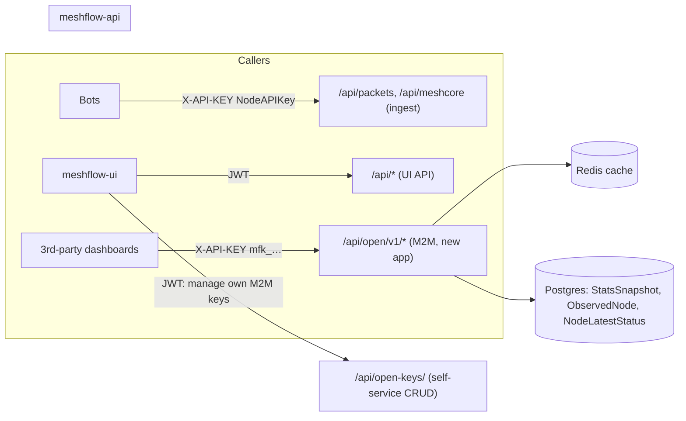

# Machine-to-machine (M2M) data API — design brainstorm

**Status:** brainstorm / draft — not implemented. Nothing here is a commitment; open questions are at the bottom.

## Motivation

External developers want to build dashboards on top of Meshflow data. The first request:

> Trying to make one of these https://meshcore.scotmesh.net/ for the Meshtastic side. Do you have an API which is
> not account bound, just to get info such as packets heard today, routers, clients, repeaters, feeders, etc., for
> analytics over time too… the links are intended to go to Meshflow node pages.

What they need:

- **Mesh-level aggregates** (packets heard today, nodes online, counts by role, feeder count), not per-packet data.
- **Time series** so they can chart trends themselves.
- **Stable node identifiers and a canonical Meshflow URL** so their UI can link back to our node pages.
- **Separate Meshtastic and MeshCore data.** The two meshes have different roles and metrics and must not be mixed.

## Goals / non-goals

**Goals**

- A read-only, versioned HTTP API, separate from both the bot ingest API (`NodeAPIKey`) and the web UI API (JWT).
- Self-service API keys: any logged-in user can create several named keys, after accepting the terms of use.
- Enforceable limits: per-key rate limits, revocation, and usage visibility.
- Aggregates first. Per-node data only for **infrastructure** nodes (routers/repeaters), and only with fields a guest
  can already see.

**Non-goals (v1)**

- Write access of any kind.
- Raw packets, text messages, traceroutes, precise positions of client nodes.
- OAuth client-credentials flows or third-party identity providers.
- Paid tiers or SLAs.

## What already exists (and why it's not enough)

Much of what the requester wants is already **guest-readable with no key at all**:

| Need | Existing endpoint | Notes |
|---|---|---|
| Nodes seen in 2h/24h/7d/30d/90d | `GET /api/nodes/observed-nodes/recent_counts/?protocol=` | Protocol-split already |
| Hourly online / packet volume / new nodes | `GET /api/stats/snapshots/` | `online_nodes`, `packet_volume`, `new_nodes`, `mc_*` variants |
| Live global packet stats | `GET /api/stats/global/` | Meshtastic only |
| Node list incl. role | `GET /api/nodes/observed-nodes/` | Guest-redacted; heavy payload for this use case |

Gaps:

1. **No terms, attribution or accountability.** Anonymous callers never agree to anything and we cannot tell them apart.
2. **No throttling.** `REST_FRAMEWORK` has no `DEFAULT_THROTTLE_*`. Guest endpoints can be scraped without limit
   (this is a separate issue worth fixing regardless — see [Guest endpoints](#guest-endpoints-side-issue)).
3. **These endpoints serve the UI, not a public contract.** Their shapes change whenever the UI needs something.
   An external consumer needs a versioned, stable contract.
4. **Missing aggregates:** counts by role, feeder counts, "packets today" as one number, and infra health metrics.

## Proposal overview



- New Django app, e.g. `open_data/`, mounted at **`/api/open/v1/`** (name open to bikeshedding: `m2m`, `public`, `data`).
- **Only** M2M-key authentication on those routes. JWT is not accepted and `NodeAPIKey` is not accepted, so the three
  auth surfaces never overlap.
- Key management (create/list/revoke) is a normal JWT-authenticated UI API in the same app, e.g. `/api/open-keys/`.

## Authentication

### Options considered

| Option | Verdict |
|---|---|
| Django core | Has no API-key mechanism. |
| DRF `TokenAuthentication` (`authtoken`) | One token per user, stored in plaintext. Doesn't meet "multiple keys per user". ✗ |
| [`djangorestframework-api-key`](https://florimondmanca.github.io/djangorestframework-api-key/) | Mature, hashed keys, prefix lookup, expiry, revocation, `AbstractAPIKey` for a custom model with a `user` FK. Its `HasAPIKey` is a *permission* rather than an authentication class, so `request.user` stays anonymous unless we add a small auth class. Viable. |
| Own model (like `NodeAPIKey`) | Small amount of code, fits existing patterns. Must avoid `NodeAPIKey`'s plaintext storage. **Recommended**, or the library above if we'd rather not own the crypto details. |

Either way, no external identity provider is needed. The user already logs in with Google/GitHub/Discord, and the key
belongs to that Meshflow user.

### Recommended key model (`OpenDataAPIKey`)

| Field | Notes |
|---|---|
| `id` | UUID |
| `owner` | FK `users.User`. Several keys per user, with a cap (e.g. 5). |
| `name` | User label, e.g. "scotmesh dashboard" |
| `prefix` | First ~8 chars, stored in plaintext and indexed, used for lookup and display (`mfk_ab12cd34…`) |
| `hashed_key` | SHA-256 of the full key. Keys are high-entropy random values, so a fast hash is fine; no bcrypt needed. |
| `created_at`, `last_used_at`, `revoked_at`, `expires_at` (nullable) | `last_used_at` is written at most once per N minutes to avoid a DB write per request. |
| `terms_version` / `terms_accepted_at` | The terms version accepted when the key was created |
| `intended_use` | Free text, required: what the caller is building and its URL. Supports good-faith review. |
| `rate_tier` | Default `standard`; staff can raise it |

- Key format: `mfk_<prefix>_<secret>`. The `mfk_` prefix makes leaked keys easy to spot and lets us register the
  pattern with GitHub secret scanning later.
- The full key is **shown once** on creation and never again.
- Accepted as `X-API-KEY: …` or `Authorization: Bearer …` (the scheme is different from JWT's, so the two can't be
  confused).
- Authentication returns `(key.owner, key)`, the same pattern as `NodeAPIKeyAuthentication`.

### Who may create keys

Any authenticated user (not only the feeder group), after accepting the current terms. Staff can revoke any key and
suspend a user's ability to create keys. That could be a `can_use_open_api` flag or membership of an `open_api_banned`
group.

## Terms of use (self-service flow)

Key creation happens in the UI and shows the terms. The user must tick "I agree" and fill in `intended_use`. Terms are
versioned (`OPEN_API_TERMS_VERSION`), and a bump requires re-acceptance before existing keys keep working (or within
a grace period). Draft wording:

1. **Acceptable use.**
   - Stay within the published rate limits and don't try to get around them (e.g. by spreading traffic over several
     keys).
   - Cache responses. Hourly data does not need polling more than once per hour, and "live" summaries no more than
     once a minute.
   - No bulk re-hosting of the whole dataset. Only use it for your stated purpose.
   - Don't try to re-identify people or pinpoint home locations from the data.
   - Keep your key secret. Never embed it in client-side JavaScript; proxy it through your own backend.
2. **Good faith.** The data is free, but it takes a lot of volunteer effort and hardware to collect. Use it in the
   spirit it's offered: to help the mesh community. We may revoke keys at our discretion, and the service comes with
   no guarantee of availability or accuracy.
3. **Non-commercial only.** No selling, reselling or paywalling the data or products built mainly on it, and no use in
   commercial services. Ask us if you're unsure.
4. **Attribution.** Any public display of the data must show "Data: Meshflow" linked to the Meshflow site, and should
   link individual nodes to their Meshflow node pages (the API provides these URLs).

Suggested licence to cite: **CC BY-NC 4.0** (or BY-NC-SA if we want derivatives shared alike). This makes rules 3–4
recognisable and legally meaningful rather than home-made.

## API surface (v1 sketch)

Everything is **split by protocol in the path**. Meshtastic and MeshCore never share a response.

```
GET /api/open/v1/meta                              # terms version, attribution string, rate limits, data freshness
GET /api/open/v1/constellations                    # id, name, slug — for filtering

GET /api/open/v1/meshtastic/summary                # "right now" snapshot
GET /api/open/v1/meshtastic/timeseries             # from StatsSnapshot
GET /api/open/v1/meshtastic/infra-nodes            # routers/repeaters + health
GET /api/open/v1/meshtastic/feeders                # active feeders (aggregate or list — see open questions)

GET /api/open/v1/meshcore/summary
GET /api/open/v1/meshcore/timeseries
GET /api/open/v1/meshcore/infra-nodes              # adv_type=repeater/room
GET /api/open/v1/meshcore/feeders
```

Common query params: `constellation=<id>` (optional; the default is the whole network).

### `…/summary` (example, Meshtastic)

```json
{
  "protocol": "meshtastic",
  "generated_at": "2026-09-24T12:00:00Z",
  "constellation": null,
  "packets": { "today": 184223, "last_24h": 201554, "last_1h": 8120 },
  "nodes_heard": { "2h": 412, "24h": 903, "7d": 1450, "30d": 2210 },
  "nodes_by_role_24h": { "CLIENT": 610, "CLIENT_MUTE": 140, "ROUTER": 38, "ROUTER_LATE": 12, "CLIENT_BASE": 20, "TRACKER": 9, "SENSOR": 4, "unknown": 70 },
  "feeders": { "active": 27, "total": 34 },
  "attribution": { "text": "Data: Meshflow", "url": "https://…" }
}
```

- "today" is a UTC day. Should we add a `tz` param? Most consumers are UK-based, so Europe/London may be the better
  default (see open questions).
- MeshCore uses `nodes_by_type_24h` keyed on `adv_type`: `chat`, `repeater`, `room`, `sensor`, `unknown`.
- `feeders.active` is `ManagedNodeStatus.is_sending_data=True` for that protocol.

### `…/timeseries`

`?metric=online_nodes|packet_volume|new_nodes&interval=hour|day&from=&to=`. Served straight from `StatsSnapshot`
(hourly already exists for both protocols; daily is a rollup or computed with SQL `date_trunc`). Maximum range per
request is e.g. 90 days at hourly resolution and 2 years at daily. Response:
`{ "metric": …, "interval": …, "points": [{"t": "…", "v": 123}] }`.

To add later: `nodes_by_role` as a snapshot type, so role mix can be charted over time. Today only the current role
mix can be derived; history needs a new collector.

### `…/infra-nodes`

"Infra" means:

- **Meshtastic:** `meshtastic_role IN (ROUTER, ROUTER_LATE, REPEATER, ROUTER_CLIENT, CLIENT_BASE?)`
- **MeshCore:** `meshcore_adv_type IN (repeater, room)`

Should `CLIENT_BASE` count as infra? See open questions.

Per node:

```json
{
  "id": "!433b82f0",
  "long_name": "Ben Lomond Router",
  "short_name": "BLR",
  "role": "ROUTER",
  "hw_model": "RAK4631",
  "last_heard": "…",
  "meshflow_url": "https://<ui-host>/nodes/!433b82f0",
  "health": {
    "battery_level": 87, "voltage": 4.02,
    "channel_utilization": 12.4, "air_util_tx": 1.9,
    "uptime_seconds": 1209600, "reported_at": "…"
  }
}
```

- Source: `NodeLatestStatus` (latest values only). Could later add `…/infra-nodes/{id}/health?from=&to=` from
  `DeviceMetrics` for history.
- **No position** in v1, matching guest redaction. Router positions are arguably public (they're on hills), but that
  is a per-owner privacy decision, so it's out of v1.
- MeshCore health: we need to check which repeater telemetry we actually ingest. `channel_utilization` and
  `air_util_tx` are Meshtastic-specific columns, so the MeshCore health block will have different fields.
- Owners should be able to opt a node out of the open API, e.g. an `ObservedNode` flag `exclude_from_open_api`.

## Rate limiting, caching, observability

- **Throttling:** DRF throttles backed by the existing Redis cache (`django_redis`). A custom `OpenAPIKeyRateThrottle`
  keyed on key id, e.g. `60/min` and `5000/day`, plus a per-user throttle so a user can't get around the limit with
  several keys. Return `429` with `Retry-After`, and add `X-RateLimit-*` headers.
- **Response caching:** summaries cached 60 s and timeseries 5–15 min in Redis, shared across all keys, so load does
  not grow with the number of consumers. Send `Cache-Control` and `ETag` so good clients can do conditional requests.
- **Usage metering:** Redis `INCR` per key per day (flushed to a `OpenDataAPIUsageDaily` table by Celery), shown to
  the user on their key page and to staff in admin. Document the new Redis usage in `docs/REDIS.md`.
- **Prometheus:** a labelled counter per endpoint (not per key; that label set would grow without bound).

## Self-service UI (meshflow-ui)

- New "Developer / API access" page under the user menu.
- List keys: name, prefix, created, last used, requests today/30d, revoke button.
- "Create key" flow: terms (versioned, scroll-to-accept), `name`, `intended_use`, then the key is shown once with a
  copy button and a warning.
- Public docs page: rendered from a **separate OpenAPI file** (`openapi-open.yaml`) or a filtered tag. This keeps the
  public contract separate from the internal one.

## Guest endpoints (side issue)

If M2M launches while the guest endpoints stay unthrottled, anyone can skip the terms by scraping the UI API. At
minimum, add an anonymous `AnonRateThrottle` (per IP) to guest-readable endpoints, set generously enough for the UI.
Consider stating in the terms that the UI API is not a supported integration surface.

## Phasing

1. **Phase 0 — policy:** agree the terms text and licence, and decide the open questions below.
2. **Phase 1 — keys:** `OpenDataAPIKey` model, auth class, throttle, self-service CRUD, admin, terms versioning, tests,
   and an OpenAPI entry for the key endpoints.
3. **Phase 2 — Meshtastic data:** `meta`, `summary`, `timeseries`, `infra-nodes`, `feeders`, response caching.
   Enough for the scotmesh-style dashboard.
4. **Phase 3 — MeshCore parity:** the same endpoints for MeshCore, depending on #329 snapshot coverage and a check of
   MeshCore repeater telemetry.
5. **Phase 4 — history:** role-mix snapshots, infra-node health history, daily rollups, usage dashboard.
6. **UI** (meshflow-ui) alongside phases 1–2.

## Open questions

1. **Name/path:** `/api/open/v1/`, `/api/m2m/v1/`, or a separate subdomain (`data.meshflow…`)? A subdomain makes
   separate throttling, caching and CDN rules easier later.
2. **Licence:** CC BY-NC 4.0 vs BY-NC-SA vs custom terms only?
3. **Terms bump:** block keys immediately, or allow a grace period?
4. **Who gets keys:** any logged-in user automatically, or staff approval (a "pending" state)? Approval is more
   friction but lets you vet the good-faith declaration.
5. **"Today":** UTC day or Europe/London day?
6. **Infra definition:** is `CLIENT_BASE` infra? Include `ROUTER_CLIENT` / `REPEATER` (deprecated roles still seen on
   air)?
7. **Feeders:** aggregate counts only, or a list of feeders with node links? A list reveals who runs feeders, though
   that is already public in the UI.
8. **Positions:** keep all positions out, or allow infra nodes to opt in?
9. **Node opt-out:** do owners get an "exclude from open API" toggle in v1?
10. **Guest throttling:** fix now, as a separate small PR, independent of this work?
