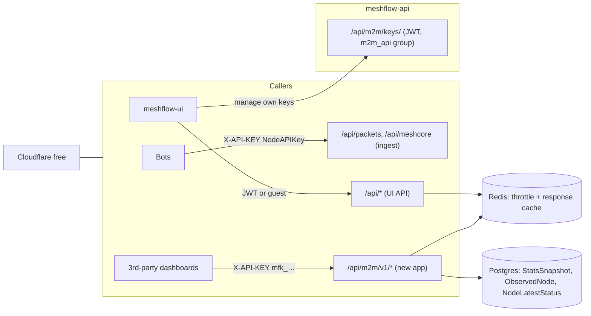

# Machine-to-machine (M2M) data API

**Status:** shipped. Public contract is `/api/m2m/v1/`. Key management is JWT at `/api/m2m/keys/`. MeshCore infra `health` is `null` until telemetry exists. Role-mix history is [#424](https://github.com/pskillen/meshflow-api/issues/424).

## Motivation

External developers want to build dashboards on top of Meshflow data. The first request:

> Trying to make one of these https://meshcore.scotmesh.net/ for the Meshtastic side. Do you have an API which is
> not account bound, just to get info such as packets heard today, routers, clients, repeaters, feeders, etc., for
> analytics over time too… the links are intended to go to Meshflow node pages.

What they need:

- **Mesh-level aggregates** (packets heard today, nodes online, counts by role, feeder count), not per-packet data.
- **Time series** so they can chart trends themselves.
- **Stable node identifiers and a canonical Meshflow URL** so their UI can link back to our node pages.
- **Separate Meshtastic and MeshCore data.** The two meshes have different roles and metrics and must not be mixed.

## Decisions (summary)

| Topic | Decision |
|---|---|
| Path / name | Single domain, **`/api/m2m/v1/`**. The feature is called "M2M API". |
| Licence | **CC BY-NC 4.0** |
| Who can mint keys | Users in a Django group, **`m2m_api`**, granted by staff (same pattern as `feeder`). |
| Request-time auth | **The API key alone.** No group or permission check per request. The key is bound to its owner, and an inactive owner kills the key. |
| "Today" | **UTC calendar day**, following the existing all-UTC convention (see [Time and day boundaries](#time-and-day-boundaries)). Documented in feature docs and OpenAPI. |
| Infra roles (Meshtastic) | `ROUTER`, `ROUTER_LATE`, plus deprecated `ROUTER_CLIENT` and `REPEATER` (still heard on air). **`CLIENT_BASE` excluded** in v1. |
| Infra types (MeshCore) | `adv_type` `repeater` (2) and `room` (3) |
| Feeders | **Aggregate counts only.** Feeders are internal to Meshflow. |
| Positions | **Omitted** everywhere |
| Node opt-out | Yes, for **feeders and claimed nodes**, shipped in v1 even where no per-node data is shared yet |
| Guest throttling | **In scope** for this work: Django/DRF throttling, with Cloudflare free as an outer layer |
| Ingress | All public traffic arrives via **Cloudflare Tunnel** (dev and test excepted), so `CF-Connecting-IP` can be trusted in prod |
| Terms bump | **90-day** grace period for existing keys to re-accept, then `403` until re-accepted |
| Initial rates | Guest 120/min per IP; guest expensive endpoints 10/min per IP; JWT users 600/min; M2M 60/min + 5000/day per key, with the same ceiling per owner |

## Goals / non-goals

**Goals**

- A read-only, versioned HTTP API, separate from both the bot ingest API (`NodeAPIKey`) and the web UI API (JWT).
- Self-service API keys for approved users (several named keys per user), minted after accepting the terms of use.
- Enforceable limits: per-key rate limits, revocation, and usage visibility.
- Throttle the existing guest-readable UI endpoints, so the M2M terms can't be bypassed by scraping them.

**Non-goals (v1)**

- Write access of any kind.
- Raw packets, text messages, traceroutes, positions.
- Per-feeder data.
- OAuth client-credentials flows or third-party identity providers.
- Paid tiers or SLAs.

## Existing surface (checked)

The permissions work in [#346](https://github.com/pskillen/meshflow-api/issues/346) (see
[permissions/README.md](../../permissions/README.md)) **removed the JWT requirement for most reads.**
`AllowGuestReadOnly` is used on:

| Area | Guest-readable endpoints | Cost |
|---|---|---|
| Constellations / channels | `GET /api/constellations/…` | cheap |
| Messages | `GET /api/messages/` | moderate (paginated) |
| Observed nodes | list / retrieve / search / `recent_counts` (redacted) | moderate |
| Stats | `GET /api/stats/snapshots/` | cheap (stored rows) |
| Stats | `GET /api/stats/global/` | **expensive**: live `COUNT` + `Trunc` over `MtRawPacket`. With no `start_date` it scans **all history**. |
| Traceroutes | `GET /api/traceroutes/`, `/{id}/` | moderate |
| Traceroute analytics | heatmap edges (**Neo4j**), feeder reach, constellation coverage (H3), traceroute stats | **expensive** |

None of these are throttled. `REST_FRAMEWORK` has no `DEFAULT_THROTTLE_*`. Some already answer part of the
requester's question, but they serve the UI and are not a stable contract. See
[Guest endpoint throttling](#guest-endpoint-throttling).

## Architecture



- New Django app **`m2m_api`**.
- **`/api/m2m/v1/*`** accepts **only** M2M-key authentication. JWT and `NodeAPIKey` are not accepted, so the auth
  surfaces never overlap.
- **`/api/m2m/keys/`** is key management over JWT (UI API). It sits outside `v1` because it is not part of the M2M
  contract.

## Authentication and access

### Why our own model

- **Django core** has no API-key mechanism.
- **DRF `authtoken`** allows one plaintext token per user.
- **`djangorestframework-api-key`** would work, but implements access as a *permission* rather than authentication,
  so we'd write the auth class anyway.
- **Own model:** a small, well-understood amount of code, in line with `NodeAPIKey`, but **hashed** (unlike
  `NodeAPIKey`, which stores keys in plaintext).

### `M2MApiKey` model

| Field | Notes |
|---|---|
| `id` | UUID |
| `owner` | FK `users.User`, `on_delete=CASCADE`. Several keys per user, capped (e.g. 5). |
| `name` | User label, e.g. "scotmesh dashboard" |
| `prefix` | 8 random chars, unique and indexed, stored in plaintext for lookup and display |
| `hashed_key` | SHA-256 of the full key. Keys are high-entropy random values, so a fast hash is enough. Compare with `hmac.compare_digest`. |
| `intended_use` | Required free text: what the caller is building, plus its URL |
| `terms_version`, `terms_accepted_at` | The terms accepted when the key was minted |
| `created_at`, `last_used_at`, `revoked_at`, `revoked_reason` | `last_used_at` is written at most once per ~5 min |
| `rate_tier` | `standard` by default; staff can raise it |

- Key format: `mfk_<prefix>_<secret>`. The `mfk_` prefix makes leaked keys easy to spot and can later be registered
  with GitHub secret scanning.
- The full key is **shown once** on creation.
- Sent as `X-API-KEY: …` (preferred) or `Authorization: Bearer mfk_…`.

### Lifecycle and checks

| Moment | Check |
|---|---|
| **Mint** (`POST /api/m2m/keys/`) | JWT user, `is_active`, member of group **`m2m_api`** (or staff), accepts the **current** terms version, under the key cap |
| **List / revoke own** | JWT user who owns the key. Revoking is allowed even after losing the group, so users can clean up. |
| **Each M2M request** | Key found by prefix, hash matches, `revoked_at IS NULL`, **`owner.is_active`**. **No group check.** |

- The request context is the key. `request.auth` is the `M2MApiKey`, and views never use `request.user` for data
  decisions. `request.user` is set to the owner only so logging and metrics can name the person.
- **Disabling a user** (`is_active=False`) immediately stops all their keys through the per-request check, and stops
  minting because their JWT login stops working. A `pre_save` signal on `User` also stamps `revoked_at` on their keys
  (reason `owner_disabled`), so the state is explicit in admin and survives re-activation. Re-activating the user does
  **not** bring keys back; they mint new ones.
- **Removing a user from `m2m_api`** stops new mints only. Existing keys keep working by design.
- **"Remove from M2M & revoke keys"**: a single staff operation that removes the user from `m2m_api` **and** revokes
  all their keys (reason `access_withdrawn`) in one transaction. It appears as:
  - a Django admin action on the User list and a button on the User change page, and
  - a staff-only endpoint `POST /api/m2m/admin/users/{id}/withdraw/`, so a system-admin UI can call it later.
- Admin: list and filter keys, see usage, revoke, change tier. Staff can also revoke any single key.

## Terms of use

Shown in the UI key-creation flow. The user ticks "I agree" and fills in `intended_use`. Terms are versioned
(`M2M_TERMS_VERSION` setting). When the version is bumped, existing keys keep working for a **90-day grace period**
(`M2M_TERMS_GRACE_DAYS`). Responses carry an `X-M2M-Terms-Action-Required` header, and the owner sees a banner in
the UI. After the grace period, the key returns `403` until the owner re-accepts. Re-accepting updates the key's
`terms_version`, and the key itself is unchanged.

1. **Acceptable use.**
   - Stay within the published rate limits and don't try to get around them (e.g. by spreading traffic over several
     keys).
   - Cache responses: poll hourly data no more than hourly, and summaries no more than once a minute.
   - No bulk re-hosting of the dataset.
   - Don't try to re-identify people or locate their homes.
   - Keep your key server-side and never embed it in browser JavaScript.
2. **Good faith.** The data is free, but it takes a lot of volunteer effort and hardware to collect. Use it to help
   the mesh community. Keys may be revoked at our discretion, and the service comes with no guarantee of availability
   or accuracy.
3. **Non-commercial only.** No selling, reselling or paywalling the data or products built mainly on it, and no use in
   commercial services.
4. **Attribution.** Data is licensed **[CC BY-NC 4.0](https://creativecommons.org/licenses/by-nc/4.0/)**. Any public
   display must show "Data: Meshflow" linked to the Meshflow site, and should link nodes to their Meshflow pages via
   the `meshflow_url` field.

## Time and day boundaries

Nothing in the code or docs previously defined "today". The effective convention is **UTC everywhere**:

- `TIME_ZONE = "UTC"`, `USE_TZ = True` (`Meshflow/settings/base.py`).
- `StatsSnapshot` rows are hourly on **UTC hour boundaries**, `recorded_at` = start of the completed hour, written at
  :05 UTC ([packet-stats/meshtastic.md](../packet-stats/meshtastic.md)).
- Live stats `Trunc` in UTC. `recent_counts` uses rolling windows (2h/24h/7d…), not calendar days.
- `traceroute_analytics` daily snapshots use `date.today()` in a UTC container.

**Decision:** for M2M, "today" = **00:00 UTC to now**. During British Summer Time that means UK "today" starts at
23:00 UTC the previous evening. That is intentional, and every relevant response states it:

- `packets.today` is the **sum of completed-hour `packet_volume` snapshots since 00:00 UTC**. It lags up to ~65 min
  and excludes the in-progress hour. The response carries `as_of` (end of the last completed hour) and `day_start`
  (00:00 UTC), so consumers are never guessing.
- The same wording goes in the OpenAPI descriptions and in [packet-stats/README.md](../packet-stats/README.md).

## API surface (v1)

Everything is **split by protocol in the path**. Meshtastic and MeshCore never share a response. All timestamps are
ISO 8601 UTC.

```
GET /api/m2m/v1/meta                     # terms version, licence, attribution, rate limits, time conventions
GET /api/m2m/v1/constellations           # id, name — for filtering

GET /api/m2m/v1/meshtastic/summary
GET /api/m2m/v1/meshtastic/timeseries
GET /api/m2m/v1/meshtastic/infra-nodes

GET /api/m2m/v1/meshcore/summary
GET /api/m2m/v1/meshcore/timeseries
GET /api/m2m/v1/meshcore/infra-nodes
```

Common query param: `constellation=<id>` (optional; default = whole network).

### `…/summary` (Meshtastic example)

```json
{
  "protocol": "meshtastic",
  "constellation": null,
  "generated_at": "2026-09-24T12:03:10Z",
  "packets": {
    "today": 184223,
    "day_start": "2026-09-24T00:00:00Z",
    "as_of": "2026-09-24T12:00:00Z",
    "last_24h": 201554
  },
  "nodes_heard": { "2h": 412, "24h": 903, "7d": 1450, "30d": 2210 },
  "nodes_by_role_24h": {
    "CLIENT": 610, "CLIENT_MUTE": 140, "CLIENT_BASE": 20, "ROUTER": 38, "ROUTER_LATE": 12,
    "ROUTER_CLIENT": 3, "REPEATER": 2, "TRACKER": 9, "SENSOR": 4, "unknown": 65
  },
  "infra_nodes_24h": 55,
  "feeders": { "active": 27, "total": 34 },
  "attribution": { "text": "Data: Meshflow", "url": "https://…", "licence": "CC BY-NC 4.0" }
}
```

- `nodes_by_role_24h` reports **every** role, including `CLIENT_BASE`, because counts identify nobody.
  `infra_nodes_24h` uses the infra definition, so it excludes `CLIENT_BASE`.
- Role is the node's **current** role, since there's no role history.
- `feeders` are aggregate only: `active` = `ManagedNodeStatus.is_sending_data`, `total` = non-deleted `ManagedNode`,
  per protocol.
- `packets.last_24h` is the sum of the last 24 completed-hour snapshots.
- MeshCore uses `nodes_by_type_24h` keyed on `adv_type` (`chat`, `repeater`, `room`, `sensor`, `unknown`) and the
  `mc_*` snapshot types.
- Opted-out nodes **are still counted** in aggregates. Opt-out only affects per-node output.

### `…/timeseries`

`?metric=online_nodes|packet_volume|new_nodes&interval=hour|day&from=&to=`

- Served from `StatsSnapshot` (`mc_*` types for MeshCore).
- `day` buckets are UTC days summed from hourly rows.
- Range caps: hourly up to 31 days per request; daily up to 400 days.
- Response: `{ "metric", "interval", "unit", "points": [{"t": "…", "v": 123}] }`.
- For `packet_volume` hourly points, `v` is the count, with an optional `by_type` breakdown.

To add later: a `nodes_by_role` snapshot type for charting role mix over time.

### `…/infra-nodes`

- **Meshtastic:** reuse `nodes.constants.INFRASTRUCTURE_ROLES` (ROUTER, ROUTER_CLIENT, REPEATER, ROUTER_LATE). Mesh
  monitoring and the UI's `INFRASTRUCTURE_ROLE_IDS` use the same set. `CLIENT_BASE` is excluded.
- **MeshCore:** `meshcore_adv_type IN (2 repeater, 3 room)`.
- Excludes opted-out nodes. Default filter is heard in the last 7 days (`?heard_within=24h|7d|30d`).
- Paginated with the standard `page_size` param.

```json
{
  "id": "!433b82f0",
  "long_name": "Ben Lomond Router",
  "short_name": "BLR",
  "role": "ROUTER",
  "role_deprecated": false,
  "hw_model": "RAK4631",
  "last_heard": "…",
  "meshflow_url": "https://<ui-host>/nodes/!433b82f0",
  "health": {
    "battery_level": 87, "voltage": 4.02,
    "channel_utilization": 12.4, "air_util_tx": 1.9,
    "uptime_seconds": 1209600, "reported_at": "…"
  }
}
```

- `health` comes from `NodeLatestStatus` (latest values only). History from `DeviceMetrics` is a later phase.
- **No position, owner or claim fields.**
- **MeshCore:** `channel_utilization` / `air_util_tx` are Meshtastic columns, so the MeshCore `health` block will have
  its own fields, defined once we've checked what repeater telemetry we ingest.
- `meshflow_url` is built from a `FRONTEND_URL`-style setting plus the node's `node_id_str` (or the MeshCore pubkey
  route the UI uses).

## Node opt-out

A single field on **`ObservedNode`**: `m2m_opt_out` (bool, default `false`).

- **Who can set it:**
  - The **claimant** (`claimed_by`) of a claimed node.
  - The **owner of a `ManagedNode`** matched to the node (Meshtastic node id or MeshCore pubkey), which covers
    feeders.
  - Staff.
- **Where:** a `PATCH` on the existing observed-node / managed-node settings surfaces in the UI API, plus a toggle in
  meshflow-ui on the node settings page.
- **Effect in v1:** excluded from `infra-nodes` and any future per-node M2M output. Still counted in aggregates.
  Feeders are aggregate-only in v1, so for a feeder that isn't an infra node the flag has no visible effect yet. It's
  stored now so per-node feeder data can come later without a consent gap.

## Rate limiting and caching

### M2M endpoints

- `M2MKeyRateThrottle` (DRF `SimpleRateThrottle`, Redis cache), keyed on **key id**: e.g. `60/min`, `5000/day`,
  depending on tier.
- `M2MOwnerRateThrottle` keyed on **owner id**, so several keys can't be used to get around the limit.
- `429` with `Retry-After`. Add `X-RateLimit-Limit` / `-Remaining` headers.
- Response cache in Redis, shared across all keys: `summary` for 60 s, `timeseries` / `infra-nodes` for 5 min.
  Also send `Cache-Control: max-age=…` and `ETag`.
- Usage metering: a Redis `INCR` per key per UTC day, flushed hourly by Celery to an `M2MApiKeyUsageDaily` table and
  shown on the key page. Document in [REDIS.md](../../REDIS.md).

### Guest endpoint throttling

In scope for this work. Two layers.

**1. Django / DRF (source of truth, versioned in code)**

- **Client IP behind Cloudflare.** DRF's default `get_ident` uses `X-Forwarded-For`/`REMOTE_ADDR`, which behind CF
  (and any local reverse proxy) is the proxy's address, so every guest would share one bucket. Add a shared
  `common.throttling.client_ip(request)` that trusts **`CF-Connecting-IP`** only when enabled by a setting
  (`TRUST_CF_CONNECTING_IP=true`). Otherwise it falls back to `REMOTE_ADDR`. Prod is reached only via **Cloudflare
  Tunnel**, so the header is trustworthy there: enable it in prod, and leave it off in dev/test, where clients connect
  directly.
- Throttle classes, all based on that IP:
  - `GuestBurstThrottle`: e.g. `120/min` per IP, applied to all `AllowGuestReadOnly` views when unauthenticated.
    Generous, because one SPA page load makes several calls.
  - `GuestExpensiveThrottle` (scoped): e.g. `10/min` per IP on `stats/global`, `traceroute_analytics/*`
    (Neo4j/H3) and `observed-nodes/search`.
  - Authenticated JWT users: `UserRateThrottle` at a high ceiling (e.g. `600/min`), just as a backstop.
- **Never throttle ingest.** Bot ingest (`/api/packets/…`, `/api/meshcore/…`) and the WebSocket are excluded.
  Throttles are attached per view (or via a mixin/decorator on guest views) rather than through
  `DEFAULT_THROTTLE_CLASSES`, so ingest can't be caught by accident.
- **Cap expensive params for guests.** `stats/global` without `start_date` scans the whole table. For guests,
  require or clamp the range (e.g. default and maximum 30 days) and cache the result for 60 s.
- Roll out with rates **set high** at first, log `429`s, then tighten.
- Settings: rates as env vars (`THROTTLE_GUEST_BURST`, `THROTTLE_GUEST_EXPENSIVE`, `THROTTLE_USER`,
  `THROTTLE_M2M_KEY`, …) in [ENV_VARS.md](../../ENV_VARS.md).

**2. Cloudflare free (outer layer, configured in the dashboard/IaC)**

- One **rate-limiting rule** (the free plan allows a small number with limited options; check what's currently
  offered) on `/api/` paths, set well above the Django limits. It's a flood backstop that stops traffic before it
  reaches the attic box.
- **Bot Fight Mode:** be careful, because it can challenge legitimate M2M clients and bots. Leave it off for `/api/`,
  or confirm it doesn't affect `/api/m2m/` and ingest paths.
- Optionally, **edge caching** for `/api/m2m/v1/*` GETs is possible later, but the cache key would have to include
  the API key header or it would leak cached responses past auth. Skip for v1; the Django Redis cache is enough.

## Self-service UI (meshflow-ui)

- "Developer / API access" page, visible to members of `m2m_api` (others see "request access" text explaining how).
- List keys: name, prefix, created, last used, requests today/30d, revoke.
- Create flow: terms (versioned) → `name`, `intended_use` → key shown once with copy button.
- Node settings: "Exclude from public data API" toggle for claimed nodes and managed nodes.
- Public docs: a separate **`openapi-m2m.yaml`**, rendered by the existing Redocly image, so the public contract
  stays apart from the internal `openapi.yaml`.

## Phasing

1. **Phase 1 — guest throttling:** CF-aware client IP, guest/user throttles, range clamp and cache on
   `stats/global`, env vars, tests. Independent of M2M and worth shipping first.
2. **Phase 2 — keys:** `m2m_api` group (data migration), `M2MApiKey`, auth class, owner-disable signal, key CRUD,
   admin, terms versioning, M2M throttles, `ObservedNode.m2m_opt_out` plus permission to set it, tests, OpenAPI.
3. **Phase 3 — Meshtastic data:** `meta`, `constellations`, `summary`, `timeseries`, `infra-nodes`, response cache,
   usage metering, `openapi-m2m.yaml`. This unblocks the scotmesh-style dashboard.
4. **Phase 4 — MeshCore parity:** the same endpoints, after checking MeshCore snapshot coverage (#329) and repeater
   telemetry.
5. **Phase 5 — history:** role-mix snapshots, infra-node health history.
6. **UI** (meshflow-ui): key page with phase 2, opt-out toggle with phase 2, docs link with phase 3.

## Open questions

None outstanding. Tracking epic: see GitHub (linked from the phase issues).
