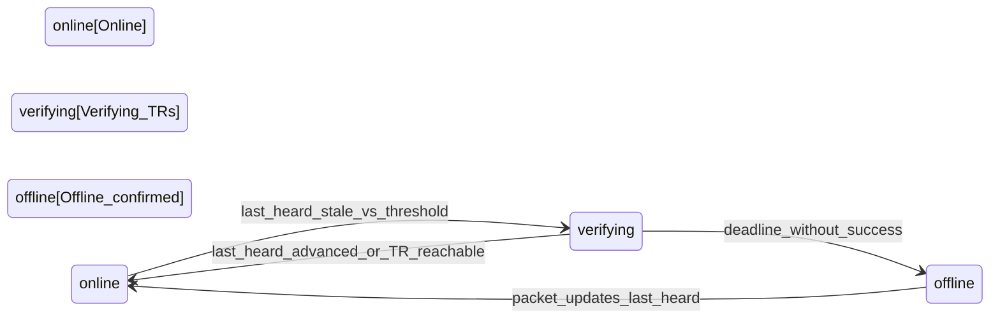

# Mesh monitoring

Mesh monitoring lets users **watch** Meshtastic **observed nodes** on the map. When a watched node has been **silent** longer than a configurable threshold, the system runs a **verification round** (mesh **traceroutes** from nearby infrastructure nodes). If the node still cannot be shown as reachable before a deadline, the system treats it as **offline** and can **notify** watchers (e.g. verified **Discord** DMs).

This document describes the **intended design** (models, Celery, APIs, and integrations). Parts of the stack ship in phases; see **Implementation status** below.

## Implementation status

| Area | Status (typical) |
|------|-------------------|
| Shared helpers (`nodes.managed_node_liveness`, `common.geo`, `nodes.positioning`, `traceroute.trigger_intervals`, random auto TR) | Shipped in API (refactor / traceroute) |
| Verified Discord DMs (prefs, test, `push_notifications.discord`) | Shipped (`users` + `push_notifications`) |
| Django app **`mesh_monitoring`** (`NodeWatch`, `NodePresence`), Celery **`process_node_watch_presence`**, `AutoTraceRoute.trigger_type=monitor`, hooks in **`packets`** + **`traceroute.target_selection`** | **Shipped** (phase 03b) |
| Watch **REST** CRUD | **`GET/POST /api/monitoring/watches/`**, **`GET/PATCH/PUT/DELETE …/watches/{id}/`** — authenticated; see **`openapi.yaml`** (`Mesh Monitoring` tag) |
| **UI** (My Nodes watch toggles) | **meshtastic-bot-ui** My Nodes page + `meshtastic-api` client (phase 04) |

Env: **`MESH_MONITORING_VERIFICATION_SECONDS`** (default `180`) for the verification window after silence.

## Concepts

### What “watched” means

A node is **watched** when there is at least one **`NodeWatch`** row: a user has opted in to monitoring for a specific **`ObservedNode`**, with `enabled=True`.

- **Per-user:** Each watch is `(user, observed_node)` with a **unique** constraint.
- **Eligibility** (who may create a watch): the user **claims** the node (`observed_node.claimed_by == user`) **or** the node’s **role** is in **`nodes.constants.INFRASTRUCTURE_ROLES`** (routers/repeaters/etc., shared with other product rules).
- **Silence threshold:** Each watch has **`offline_after`** (e.g. default 2 hours). If several users watch the same node, the effective threshold is the **minimum** `offline_after` among **enabled** watches — one shared silence window per observed node.

### How watching works at runtime

1. **Packet path:** Whenever any packet is processed for a node, **`last_heard`** on **`ObservedNode`** is updated (see `packets` services). That is the primary signal that the node is still seen on the mesh.
2. **Periodic job:** A Celery task (e.g. every minute), **`process_node_watch_presence`**, considers every **`ObservedNode`** that has at least one enabled watch. It compares `last_heard` to the effective threshold and maintains **`NodePresence`** (one row per observed node used for monitoring state).
3. **Verification:** If the node is “too quiet” but not yet confirmed offline, the system enters a **verifying** state and schedules **monitoring traceroutes** — same **WebSocket** command path as manual/auto TR (`meshtastic-bot`), but `AutoTraceRoute.trigger_type=monitor` and `trigger_source` identifies mesh monitoring.
4. **Random auto TR:** The existing **`schedule_traceroutes`** job continues to pick random targets; **`pick_traceroute_target`** **excludes** nodes that are in verification or already **offline_confirmed** so monitoring and random scheduling do not fight over the same targets.

### When a node is treated as offline

**Offline** is **confirmed** only after a **verification window** (on the order of a few minutes): traceroutes are attempted from up to **three** geographically close **managed** sources (with rate limits such as **`MONITORING_TRIGGER_MIN_INTERVAL_SEC`**), and success means either fresh **`last_heard`** after verification started **or** a **completed** monitoring traceroute (including a direct path with empty hop lists; reachability despite sparse packets).

If the deadline passes without success, **`NodePresence.offline_confirmed_at`** is set, **`verification_started_at`** is cleared, and **watchers** are notified (deduped per user). **Discord** delivery uses **`push_notifications.discord.send_dm`** and the same verified-user rules as the test endpoint ([Discord notifications](../discord/notifications.md)).

### Recovery

Any packet that advances **`last_heard`** should clear **`offline_confirmed_at`** and **`verification_started_at`** on **`NodePresence`** (via a small hook from packet processing into **`mesh_monitoring.services`**). The node is then treated as **online** again for monitoring purposes.

## Documentation map

| Doc | Contents |
|-----|----------|
| [flow.md](flow.md) | Chronological sequence, state machine, component responsibilities |
| [discord.md](discord.md) | How Discord alerts fit into monitoring (pointer to `docs/features/discord/`) |
| [../discord/README.md](../discord/README.md) | Discord linking + notifications (auth vs DMs) |
| [../traceroute/README.md](../traceroute/README.md) | Traceroute feature, WebSocket delivery, heatmap |

## High-level state (per observed node with ≥1 enabled watch)

For a step-by-step timeline and components, see [flow.md](flow.md).
