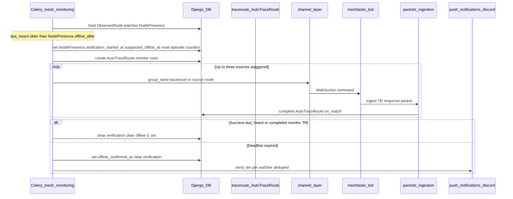
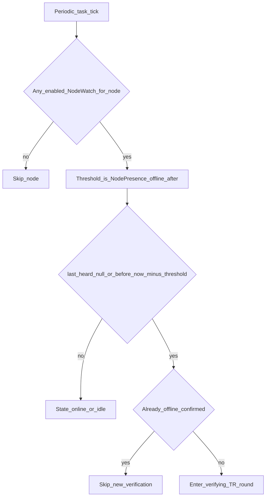
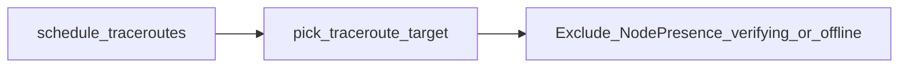

# Mesh monitoring — flow and components

Companion to [README.md](README.md). Diagrams use **Mermaid**; node IDs avoid spaces.

## Component responsibilities

| Component | Responsibility |
|-----------|------------------|
| **`mesh_monitoring` (Django app)** | `NodeWatch`, `NodePresence`; Celery task `process_node_watch_presence`; `selection` of monitoring TR sources; `services` state machine; future watch CRUD views |
| **`packets`** | Update `ObservedNode.last_heard`; on advance, call into `mesh_monitoring` to clear presence; TR packet receiver completes `AutoTraceRoute` rows |
| **`traceroute`** | `AutoTraceRoute` including `trigger_type=4` (Node Watch); `pick_traceroute_target` excludes nodes under verification/offline; channel layer sends commands to bots |
| **`meshtastic-bot`** | WebSocket client receives `traceroute` command, runs TR on radio, reports packets back to API |
| **`push_notifications.discord`** | Send DM to a verified Discord user id (no OAuth in this module) |
| **`users`** | `User` fields for verified Discord notify; mesh monitoring reads them when notifying watchers |
| **`meshtastic-bot-ui`** | Future: create/update/delete watches, show monitoring hints |

Shared building blocks (already in API): **`nodes.managed_node_liveness`** (recent ingestion for managed sources), **`common.geo.haversine_km`**, **`nodes.positioning.managed_node_lat_lon`**, **`traceroute.trigger_intervals`**.

## Chronological sequence (happy path → verify → recover)

When the periodic task detects **stale `last_heard`** for a watched node, it starts verification, sends TRs, then either confirms offline or returns to online.

**Notes:**

- **`NodePresence.is_offline`** is set together with **`offline_confirmed_at`** when the verification window expires without success; both clear on recovery. **`observed_online_at`** is set when the presence row is first created while the node is not silent, or when recovery clears a prior confirmed-offline state (periodic task sees fresh **`last_heard`**, or **`clear_presence_on_packet_from_node`** after a packet). Episode-only timestamps (**`suspected_offline_at`**, **`last_tr_sent`**, **`last_zero_sources_at`**, **`tr_sent_count`**) are nulled when verification succeeds (TR completion or periodic success) or when the node is heard again.
- **Stagger:** Multiple sources may use Celery **`countdown`** (e.g. 0s / 30s / 60s) so radios respect spacing (`MONITORING_TRIGGER_MIN_INTERVAL_SEC` / firmware limits).
- **Stale TR timeout:** Existing `mark_stale_traceroutes_failed` behavior still applies; monitoring logic treats completed/failed outcomes as part of the verification window (see epic design).

## Silence detection (simplified)

## Source selection (monitoring traceroutes)

Monitoring picks **managed** nodes with **`allow_auto_traceroute=True`** that pass the same **liveness** rules as the random auto-scheduler (**`nodes.managed_node_liveness`**). Candidates are ranked by **distance** to the target observed node (using **`common.geo.haversine_km`** and **`nodes.positioning.managed_node_lat_lon`**), then up to **three** sources are used, respecting per-source TR spacing.

## Interaction with random auto traceroute

This keeps random exploration from targeting nodes already under active monitoring verification.

## Discord notifications (offline)

Only users who should receive an alert:

- Have an **enabled** watch on that observed node.
- Have **verified** Discord notification binding (same rules as `POST .../discord/notifications/test/`).

Implementation details and prefs API: [Discord notifications](../discord/notifications.md). Mesh monitoring does **not** embed Discord HTTP; it calls **`push_notifications.discord`**.

## `NodePresence` observability (ops / debugging)

| Field | When set | Reset |
|-------|----------|--------|
| `suspected_offline_at` | Same tick as starting a new verification episode (`verification_started_at`) | When the node is **not silent** (Celery clears), or `clear_presence_on_packet_from_node` runs after a packet advances `last_heard` |
| `last_tr_sent` | Each time `send_monitoring_traceroute_command` successfully moves a monitoring `AutoTraceRoute` to `sent` | Same reset paths as above |
| `tr_sent_count` | Incremented on each such send; set to **0** at episode start | Same reset paths; also cleared with presence |
| `last_zero_sources_at` | When `_dispatch_monitoring_round` finds **no** eligible managed sources | Same reset paths |

These fields are **not** used for suppression or routing logic; they exist for support and tuning (e.g. spotting zero-source offline confirms or TR spam).
