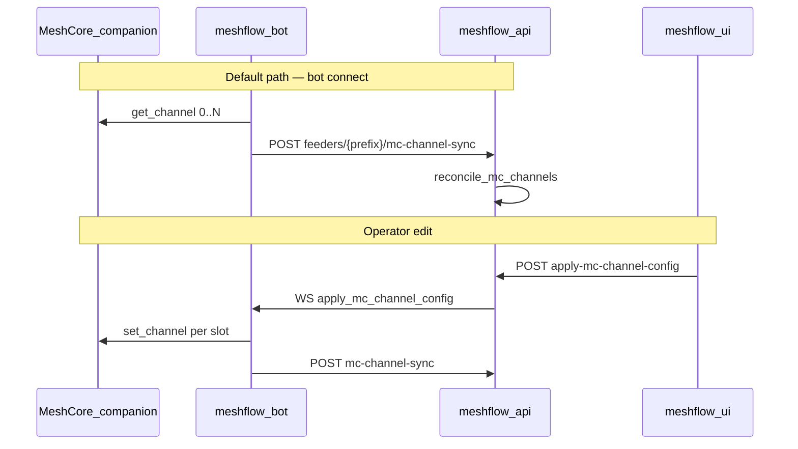

# MeshCore channel sync (`mc-channel-sync`)

Meshflow **feeders** (MeshCore `ManagedNode`s) listen on group channels configured on the companion radio. The API cannot read the radio directly; **meshflow-bot** uploads a **device channel snapshot** after connect (and again after operator **apply-to-radio**). The API reconciles that snapshot into a **per-feeder mirror** and a **constellation-scoped channel catalog** used for ingest, text history, and the UI.

This feature is **configuration only** — it does not upload mesh traffic. Packet ingest uses the same feeder identity URLs but a separate endpoint ([packet-ingestion](../../packet-ingestion/README.md)).

---

## Implementation status

| Area | Status | Notes |
|------|--------|--------|
| `POST …/mc-channel-sync/` (device → API) | Shipped | Feeder Node API key; full snapshot reconcile |
| Bot read on connect + after apply | Shipped | `meshcore.commands.get_channel`; optional dual API POST |
| `POST …/apply-mc-channel-config/` (UI → device) | Shipped | WebSocket + Redis channel layer |
| Canonical `MessageChannel` + `ManagedNodeMcChannelLink` | Shipped | Logical identity separate from device slot ([#379](https://github.com/pskillen/meshflow-api/issues/379)) |
| `region_scope` on channels | Shipped | [#391](https://github.com/pskillen/meshflow-api/issues/391) |
| API-only mirror edits (no device round-trip) | Not supported | Next connect sync overwrites API from device |
| Periodic background sync | Not supported | Connect + post-apply only |

---

## Documentation map

| Doc | Contents |
|-----|----------|
| [flow.md](flow.md) | End-to-end sequences, HTTP/WebSocket contracts, reconcile behaviour |
| [data-model.md](data-model.md) | `MessageChannel`, feeder links, placeholders at ingest |
| [operations.md](operations.md) | Auth, dual API, scaling, troubleshooting |
| [region-scope.md](region-scope.md) | Region scope semantics, API field, bot/UI behaviour |
| [region-scope-progress.md](region-scope-progress.md) | Execution log ([#391](https://github.com/pskillen/meshflow-api/issues/391)) |
| [region-scope-outstanding.md](region-scope-outstanding.md) | Protocol gaps and follow-ups |

**Related (other features)**

| Doc | Relationship |
|-----|----------------|
| [feeder-bootstrap.md](../feeder-bootstrap.md) | First feeder, API key, env vars |
| [text-message-channels.md](../text-message-channels.md) | MC text ingest, `TextMessage`, wire format |
| [ADR-0002](../../packet-ingestion/adr/0002-mc-channel-modelling.md) | Normative channel modelling |
| [meshflow-bot `docs/MESHCORE.md`](https://github.com/pskillen/meshflow-bot/blob/main/docs/MESHCORE.md) | Bot env and transport |

**OpenAPI:** `McChannelSyncRequest`, `McChannelSyncResponse`, `McChannelApplyRequest` under `/meshcore/`.

---

## Concepts

| Term | Meaning |
|------|---------|
| **Device slot** | `mc_channel_idx` (0–63) on the companion channel table. On the wire, `channel_message` carries **index only**, not name or hashtag. |
| **Canonical channel** | Constellation-scoped `MessageChannel` row (`protocol=MESHCORE`). Identity is **logical** (name / type / `region_scope`), not device index. |
| **Feeder mirror** | `ManagedNode.mc_channels` M2M **through** `ManagedNodeMcChannelLink`: which canonical channel sits in which device slot **for this feeder**. |
| **Snapshot** | Full list of configured slots from the device; reconcile **replaces** the feeder link rows to match (no partial merge). |
| **Source of truth** | **Device** for names and types; API mirror is overwritten on each successful sync. UI/admin **apply** writes the device first, then syncs back. |

**Meshtastic contrast:** MT feeders map eight fixed slots via `meshtastic_channel_0..7` FKs on `ManagedNode`. MC feeders use the mirror + sync pipeline instead.

---

## Architecture (overview)

**Drift:** If apply fails or the API catalog is edited without a device write, the **next successful sync from the device** wins. There is no three-way merge.

---

## Code anchors (meshflow-api)

| Piece | Path |
|-------|------|
| Sync view | `Meshflow/meshcore_packets/views.py` — `MeshCoreMcChannelSyncView` |
| Apply view | `Meshflow/meshcore_packets/views.py` — `ManagedNodeMcChannelApplyView` |
| Reconcile | `Meshflow/meshcore_packets/services/channel_sync.py` — `reconcile_mc_channels` |
| Canonical upsert | `Meshflow/meshcore_packets/services/channel_identity.py` — `upsert_canonical_mc_channel` |
| Ingest resolution | `Meshflow/meshcore_packets/services/channel.py` — `resolve_mc_channel` |
| WS dispatch | `Meshflow/meshcore_packets/services/channel_apply.py` |
| Serializers | `Meshflow/meshcore_packets/serializers_channel.py` |
| URLs | `Meshflow/meshcore_packets/urls.py` |
| Models | `Meshflow/constellations/models.py`, `Meshflow/nodes/models.py` (`ManagedNodeMcChannelLink`) |
| Feeder auth | `Meshflow/common/meshcore_feeder_auth.py` |
| Apply labels | `Meshflow/common/mc_channel_labels.py` |

**meshflow-bot:** `src/meshcore/channel_sync.py`, `src/meshcore/channels.py`, `src/bot.py` (`apply_mc_channel_config`).

**meshflow-ui:** `MeshCoreChannelEditor` in `src/components/nodes/MeshCoreChannelEditor.tsx`, `src/lib/mc-channel-editor.ts`.

---

## Consumers

| Consumer | Use |
|----------|-----|
| **Packet ingest** | `resolve_mc_channel(observer, channel_idx)` → `MessageChannel` FK on `MeshCoreTextPacket` |
| **Text messages API** | `TextMessage.channel`; history filtered by canonical channel id |
| **Node Settings UI** | `GET` managed node `mc_channels` mirror; apply pushes to radio |
| **Django admin** | Read-only mirror on MC managed nodes; **Push MC channel config** action |
| **Constellation API** | Nested `channels` on constellation detail (MC catalog) |
