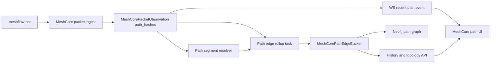

# ADR-0001 - MeshCore passive packet path subsystem

**Status:** Proposed  
**Date:** 2026-05-28  
**Tracking:** [meshflow-api#267](https://github.com/pskillen/meshflow-api/issues/267)

> **Naming note.** This subsystem lives under `meshcore/packet-path-tracing/` for discoverability, but it is **passive packet path evidence**, not an active probe. Meshtastic "traceroute" is a commanded round trip; MeshCore here is reconstructed from packets the mesh forwarded anyway. Prose deliberately avoids "trace"/"probe" wording so the distinction from `traceroute` stays obvious.

## Context

Meshtastic path discovery is represented by the `traceroute` subsystem:

- `AutoTraceRoute` records a commanded probe, its lifecycle, and its result.
- `TraceroutePacketService` completes the row from a Meshtastic traceroute response.
- `traceroute_analytics` denormalises completed traceroutes into Neo4j and powers heatmap, coverage, and router-style analytics.

MeshCore packet path data is different. Forwarded MeshCore packets may include repeater path segments (`path_hashes`) on each feeder observation, but they are passive packet evidence rather than commanded traceroute responses. Channel messages often do not identify the sender, paths may differ per feeder for the same deduped packet, and path segments are short opaque hashes until a proven resolver exists.

The current passive slice already captures the raw path data on `MeshCorePacketObservation.path_hashes` and exposes display-only `resolved_path` in the message heard API. [Traceroute ADR-0001](../../../traceroute/adr/0001-mc-path-hash-resolution.md) explicitly forbids heuristic hash-to-node matching until the derivation or binding is proven.

This ADR proposes a distinct **MeshCore passive packet path** subsystem that mirrors useful Meshtastic traceroute outcomes - maps, graph exports, important-router stats - without pushing passive packet observations through `AutoTraceRoute`.

## Decision

Create a MeshCore-specific passive packet path subsystem, likely in a new Django app such as `meshcore_path` / `meshcore_packet_path` or a clearly bounded package under `meshcore_packets`, with these boundaries:

1. **Source of truth remains raw ingest.** `MeshCorePacketObservation.path_hashes` is the **authoritative per-feeder capture** of wire path segments for uploaded packets. It is not strictly immutable: ingest uses `update_or_create` on `(packet, observer)` and may refresh RF/path fields when the same feeder re-reports an observation (see `meshcore_packets/serializers.py`). Downstream rollups must therefore treat an observation's path as the latest authoritative value, not an append-only event.
2. **Resolution is explicit and versioned.** Hash segment to `ObservedNode` resolution is stored separately from raw observations and is only populated by proven rules. No such rule exists today; see [Resolution plan](#resolution-plan) for which event sources *might* enable one once their relationship to path hashes is established.
3. **Passive evidence does not become `AutoTraceRoute`.** The subsystem must not create `AutoTraceRoute` rows for every packet path. It has no pending/sent/completed lifecycle, no timeout, and no WebSocket command dispatch.
4. **Analytics are aggregate-first.** Neo4j and longer-term history receive coalesced edge rollups, not one graph write per packet observation.
5. **Realtime display is best-effort, short-lived evidence.** The UI may receive WebSocket events for recent packet paths, emitted **after transaction commit** and subject to sampling/coalescing/caps. No downstream code may assume every observation produces a realtime event; the durable record is the aggregate path-edge model.

## Non-goals

- No MeshCore active traceroute command design in this ADR. Active MeshCore traceroute may later use a sibling model or an extended `AutoTraceRoute` path after a separate spike.
- No heuristic matching of path hashes to `ObservedNode` rows using suffix/prefix/last-heard guesses.
- No success/failure or coverage percentage semantics copied from Meshtastic traceroutes. Passive packet path evidence can show observed paths, not attempted route success.
- No requirement to preserve every raw path edge forever once raw observations and aggregate rollups are available.

## Data flow




## Proposed model concepts

Names are illustrative; implementation may adjust them.

### `MeshCorePathSegmentResolution`

One row per resolvable path segment identity.


| Field              | Purpose                                                                                         |
| ------------------ | ----------------------------------------------------------------------------------------------- |
| `segment_hash`     | Normalized hex segment, e.g. `f3bcf1`                                                           |
| `hash_size`        | Bytes per segment (`rx_log_data.path_hash_size`); derive from segment length only as a fallback |
| `hash_mode`        | `path_hash_mode` from the carrying frame (see collision note below)                             |
| `observed_node`    | Nullable FK to `ObservedNode(protocol=MESHCORE)`                                                |
| `status`           | `unknown`, `resolved`, `ambiguous`, `stale`                                                     |
| `source`           | `path_update`, `trace_data`, `derived_hash`, `manual_admin`, etc.                               |
| `resolver_version` | Allows reprocessing when the resolver changes                                                   |
| `confidence`       | Optional score or enum; keep exact/proven matches distinct from hints                           |
| `last_seen_at`     | Last observation carrying this segment                                                          |


**Hash mode / size are part of segment identity.** The wire carries `path_hash_mode` on `channel_message` and `contact_message`, and `path_hash_size` on `rx_log_data` (see [MESHCORE_PACKET_FIELDS.md](../../../packet-ingestion/MESHCORE_PACKET_FIELDS.md)). If the mode affects how a segment is derived or interpreted, then `segment_hash + hash_size` alone is **not** a safe identity — two unrelated hops could collide across modes. Until the meaning of `path_hash_mode` is confirmed (spike), treat the resolution key as `(hash_mode, hash_size, segment_hash)` and do not merge segments observed under different modes. Capturing the mode now avoids a painful re-key later if it turns out to matter.

Raw display can continue resolving at read time, but graph export and historical UI need proactive resolution so the same segment maps consistently across API, WebSocket, and rollup jobs.

### `MeshCorePathEdgeBucket`

Aggregate edge counts for history and Neo4j export.


| Field                               | Purpose                                                   |
| ----------------------------------- | --------------------------------------------------------- |
| `bucket_start`, `bucket_size`       | Hour or day bucket                                        |
| `from_kind`, `to_kind`              | `feeder`, `hash`, `node`, `unknown`                       |
| `from_hash`, `to_hash`              | Raw hash endpoint when unresolved                         |
| `from_node`, `to_node`              | Nullable FKs when resolved                                |
| `observer`                          | Optional feeder dimension for per-feeder views            |
| `constellation`                     | Optional feeder/channel constellation dimension           |
| `packet_count`, `observation_count` | Rollup weight                                             |
| `first_seen_at`, `last_seen_at`     | Edge recency                                              |
| `avg_snr`, `min_snr`, `max_snr`     | Optional RF summaries where observation SNR is meaningful |


The first implementation can roll up hash-to-hash edges only. Node-to-node and feeder-to-node edges should appear as resolution improves.

### Edge semantics (what an edge means)

A feeder observation gives an **ordered list of path hash segments** plus the observing feeder. It does **not**, on its own, give a sender or a proven direction — channel messages frequently lack any sender identity, and the relationship between list order and physical forwarding direction is not yet confirmed.

Therefore the **first rollup creates only ordered hash-chain edges between consecutive segments**, plus an optional `observer` (feeder) dimension:

- For path `[h1, h2, h3]`: edges `h1 -> h2` and `h2 -> h3`, with `from_kind = to_kind = hash`.
- The observing feeder is recorded as a dimension on the bucket (for per-feeder views and as a likely terminal endpoint), **not** asserted as a graph node on the chain unless that is later proven.

Explicitly **out of scope for v1 edges** until proven:

- `sender -> hop1` edges (sender identity usually unknown for channel text).
- `hopN -> observer` / `observer -> hopN` edges as directed claims.
- Any node-to-node edge before the segment is resolved to an `ObservedNode` via `[MeshCorePathSegmentResolution](#meshcorepathsegmentresolution)`.

Treat edge direction as "list order", not "forwarding direction", and label it as such in the API and UI until direction is established. Resolved node/feeder edges are an enrichment layer applied on top once resolution exists.

### Optional short-retention raw edge table

If debugging or near-realtime replay needs per-observation edge rows, add a short-retention table such as `MeshCorePathEdgeObservation`. It should be TTL/prunable and not the primary analytics source.

## Capture plan

### Current capture

Mostly done:

- `meshflow-bot` uploads `path_hashes` for supported packet types when the MeshCore event includes `path` and `path_hash_size`.
- `meshcore_packets` stores those segments on `MeshCorePacketObservation`, not on the deduped packet row, so each feeder can retain its own path.
- Message history exposes `heard[].path_hashes`, `heard[].resolved_path`, and `path_known=false` for display.

### Additional capture

Add tickets for:

1. Upload non-text `rx_log_data` PATH frames where they carry path data but no business message.
2. Upload `path_update` events. **Caveat:** captured `path_update` frames carry `public_key` only — no path hash is present in that event in the field docs ([MESHCORE_PACKET_FIELDS.md](../../../packet-ingestion/MESHCORE_PACKET_FIELDS.md)). So `path_update` does **not** today prove any hash → pubkey binding; capture it because it *may help once its relationship to path hashes is proven*, not as a known resolver source.
3. Upload `trace_data` events after a spike confirms their relationship to active MeshCore traces, path hashes, SNR, and endpoints.
4. Store `path_hash_size` (and `path_hash_mode`, see segment identity note) explicitly; only fall back to segment length when a frame omits the size, so different segment widths/modes never collide.

## Resolution plan

Resolution should happen in two layers:

1. **Read-time formatting** remains for simple API display. `path_resolution.format_path_hops()` can continue returning `unknown` until a cache/table supplies a proven mapping.
2. **Proactive resolver** updates `MeshCorePathSegmentResolution` whenever:
  - a new event that is *proven* to bind a segment to an identity is ingested (no such event is confirmed yet — `path_update` carries a pubkey but no path hash, so it is a candidate to investigate, not a current source),
  - a new full `ObservedNode.mc_pubkey` is learned and a proven derivation rule exists,
  - a resolver version changes,
  - an operator triggers a backfill.

No proven resolver exists at the time of writing; the v1 table is populated entirely with `status = unknown` and the proactive resolver is a later milestone gated on a spike. The resolver must be idempotent and test-backed. Tests should explicitly reject suffix/prefix/recency guesses unless the ADR proving that rule has been updated.

## Neo4j plan

Do not reuse the Meshtastic `MeshNode.node_id` integer key directly for MeshCore. Current traceroute graph export assumes `meshtastic_node_id` and completed `AutoTraceRoute` rows.

Use either:

- a generalized key, e.g. `node_key = "mt:!12345678"`, `node_key = "mc:<internal_id>"`, `node_key = "mc_hash:<size>:<hash>"`; or
- a parallel label for MeshCore passive entities, e.g. `MeshCorePathNode`.

Create passive relationships separate from active traceroutes:


| Relationship    | Meaning                                                              |
| --------------- | -------------------------------------------------------------------- |
| `PATH_OBSERVED` | Passive MeshCore packet path edge, weighted by bucketed observations |
| `ROUTED_TO`     | Existing active Meshtastic traceroute edge                           |


Recommended relationship properties:

- `protocol = "meshcore"`
- `evidence = "packet_path"`
- `bucket_start`, `bucket_size`
- `weight`
- `observation_count`, `packet_count`
- `resolved = true/false`
- `source = "rollup"`

Neo4j export should read `MeshCorePathEdgeBucket` rows. It should not run from the ingest request or per-observation signal.

## API and WebSocket plan

### Realtime API / WS

Add a WebSocket event for short-term visualization:

```json
{
  "type": "meshcore.packet_path.observed",
  "observed_at": "2026-05-28T08:35:00Z",
  "packet_id": "uuid",
  "observer": {"internal_id": 123, "node_id_str": "mc:abcdef123456"},
  "path": [
    {"hash": "f3bcf1", "status": "unknown"},
    {"hash": "a1", "status": "resolved", "node_id_str": "mc:..."}
  ],
  "rx_snr": -9.75
}
```

Events are emitted **after the ingest transaction commits** (e.g. via `transaction.on_commit`) so consumers never see a path that was rolled back. They are **best-effort**: under load they may be sampled, coalesced per feeder/channel, or dropped against a cap. No subscriber may treat the WS stream as a complete or ordered log of observations — the durable record is the aggregate path-edge model.

Use a bounded in-memory or Redis-backed recent buffer plus `GET /api/meshcore/path-tracing/recent/` so the UI can reconnect without needing long polling or replaying all observations.

### History APIs

Suggested endpoints:


| Endpoint                                     | Purpose                                  |
| -------------------------------------------- | ---------------------------------------- |
| `GET /api/meshcore/path-tracing/recent/`     | Short window for realtime page hydration |
| `GET /api/meshcore/path-tracing/edges/`      | Bucketed edges for map/topology views    |
| `GET /api/meshcore/path-tracing/nodes/<id>/` | Node-centric path evidence               |
| `GET /api/meshcore/path-tracing/routers/`    | Important router / centrality summary    |


**Backfill is a management command first**, not an HTTP endpoint. Rollup/resolution backfill should ship as `manage.py` commands (consistent with the existing Neo4j export commands) so an early subsystem does not add another write surface to secure, document, and rate-limit. A staff-only `POST /api/meshcore/path-tracing/backfill/` can be added later if operators actually need to trigger it from the UI.

These should live under MeshCore path tracing, not `/api/traceroutes/`, until/unless the API grows a protocol-neutral topology namespace.

## UI plan

### Immediate / realtime view

Goal: operational view of what the MC mesh is doing now.

- Subscribe to `meshcore.packet_path.observed`.
- Show recent packet paths with feeder markers, resolved nodes where available, and hash labels where unresolved.
- Keep client-side retention short, e.g. 5-30 minutes, with server-provided caps.
- Make unknown/ambiguous hops visually distinct from resolved nodes.

### Longer-term history

Goal: logical and geographic map of the MC mesh over hours/days/weeks.

- Query aggregate edges from `GET /api/meshcore/path-tracing/edges/`.
- Support time windows and constellation filters.
- Show two modes:
  - **Geographic:** only resolved nodes/feeders with positions.
  - **Logical:** graph layout that can include unresolved hash nodes.
- Avoid labeling passive weights as traceroute success. Use wording like "observed packet path weight" or "passive path observations".

### Important routers / centrality

Mirror the useful Meshtastic analytics, but relabel the semantics for passive evidence:


| Metric                 | MC passive interpretation                                                       |
| ---------------------- | ------------------------------------------------------------------------------- |
| Degree                 | Number of distinct neighboring path entities in rollups                         |
| Weighted degree        | Sum of passive path observations touching this entity                           |
| Betweenness centrality | How often a resolved node/hash sits between other entities in the passive graph |
| PageRank / eigenvector | Relative importance in the passive path graph                                   |
| Feeder reach           | Distinct path entities/packets heard by one feeder, not success rate            |


Unresolved hash nodes may rank highly. The UI should expose them as "unresolved path hash" until resolution lands.

## Scale controls

Passive MC path data can be much higher volume than active MT traceroutes. Required controls:

1. Ingest stores only compact raw `path_hashes` on observations.
2. Realtime WS events are sampled, coalesced, or capped per feeder/channel if volume spikes.
3. Rollups process observations in batches and checkpoint by `upload_time` plus primary key.
4. Aggregate tables are bucketed and indexed by time, constellation, endpoint keys, and resolution status.
5. Neo4j export is async and idempotent from rollups.
6. Optional raw edge observation tables are short-retention only.

## Ownership


| Area                                        | Owner                                                          |
| ------------------------------------------- | -------------------------------------------------------------- |
| Raw packet and observation capture          | `meshcore_packets`                                             |
| Segment resolution and passive edge rollups | `meshcore_path` (new) or bounded `meshcore_packets` package    |
| Neo4j export/query implementation           | `traceroute_analytics` or a renamed topology analytics package |
| Realtime path WebSocket events              | `ws` plus the MeshCore passive path service boundary           |
| UI realtime/history pages                   | `meshflow-ui` MeshCore section                                 |
| Active MeshCore traceroute                  | Separate future ADR                                            |


## Milestones

### Milestone 1 - minimum viable passive path (target first deliverable)

A deliberately small slice that is useful on its own and avoids a big-bang platform jump:

1. **Capture expansion:** persist `path_hash_size` and `path_hash_mode` on observations; ingest PATH `rx_log_data` frames that carry path data but no business message.
2. **Resolution table (unknowns only):** add `MeshCorePathSegmentResolution` keyed by `(hash_mode, hash_size, segment_hash)`, populated with `status = unknown`. No proactive resolver yet.
3. **Hourly hash-to-hash rollup:** add `MeshCorePathEdgeBucket` + a Celery rollup that emits ordered hash-chain edges (plus observer dimension) per [Edge semantics](#edge-semantics-what-an-edge-means); checkpointed and idempotent; backfill via management command.
4. **Read-only edges API:** `GET /api/meshcore/path-tracing/edges/` over buckets, documented in OpenAPI. Direction labelled as "list order".

Milestone 1 ships honest, scalable, hash-only evidence with no resolver, no Neo4j, no WS, and no new write endpoints.

### Later milestones

1. **Spike:** confirm/deny whether `path_hash_mode`, `path_update`, or `trace_data` enable a proven segment → identity binding; update [traceroute ADR-0001](../../../traceroute/adr/0001-mc-path-hash-resolution.md) and this ADR.
2. **Proactive resolver:** only if the spike yields a proven rule; backfill via management command; tests reject heuristics.
3. **Neo4j export:** passive MC graph export from rollups, with protocol/evidence-separated relationships.
4. **Realtime:** recent buffer, post-commit best-effort WS event, recent endpoint.
5. **History/centrality API:** node and router/centrality endpoints.
6. **UI:** realtime short-term display, then geographic/logical history map and router panels.

## Consequences

Positive:

- MC path work can scale independently of active MT traceroute lifecycle.
- We keep raw evidence honest while progressively resolving hashes to nodes.
- UI can deliver both immediate operational visibility and long-term topology maps.
- Neo4j can support MC centrality without polluting MT `AutoTraceRoute` semantics.

Tradeoffs:

- More subsystem surface area than reusing `AutoTraceRoute`.
- Some analytics will initially include unresolved hash nodes.
- Existing MT heatmap APIs cannot be reused unchanged because they assume integer Meshtastic node IDs and active traceroute semantics.

## Open questions

- Should the new Django app be named `meshcore_path`, `meshcore_packet_path`, or stay inside `meshcore_packets`? (Prefer a name without "trace"/"traceroute" to avoid implying an active probe.) [DECISION: `meshcore_packet_path`]
- What is the meaning of `path_hash_mode`, and does it change how a segment must be interpreted (and therefore keyed)?
- Should passive MC Neo4j data use a new relationship type (`PATH_OBSERVED`) or a shared relationship with `evidence` and `protocol` properties? [DECISION: new `PATH_OBSERVED` relationship type]
- What retention period should apply to raw recent path buffers and optional raw edge observation rows? [DECISION: 6 months - ensure any impl plan includes a celery job to evict old data]
- Which centrality metrics are worth computing in Postgres vs Neo4j?

