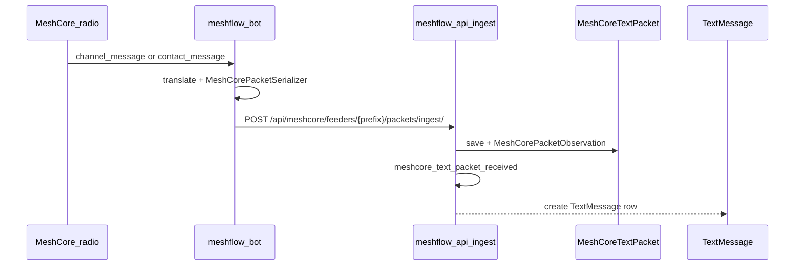

# MeshCore text messages and channels

How MeshCore **group text** and **channel configuration** flow from the radio through **meshflow-bot**, **meshflow-api**, and **meshflow-ui**. This document is the feature-level guide for Phase 2 work under epic [#266](https://github.com/pskillen/meshflow-api/issues/266).

**Tracking issues:**

| Issue | Repo | Focus |
|-------|------|--------|
| [#296](https://github.com/pskillen/meshflow-api/issues/296) | meshflow-api | Ingest MC text → `TextMessage` business model + history API |
| [#297](https://github.com/pskillen/meshflow-api/issues/297) | meshflow-api (+ ui, bot children) | Configure MC channels on feeders; sync to device |

**Normative ADRs:** [ADR-0002](../packet-ingestion/adr/0002-mc-channel-modelling.md) (channels), [ADR-0003](../packet-ingestion/adr/0003-mc-broadcast-semantics.md) (broadcast vs DM), [ADR-0001](../packet-ingestion/adr/0001-mc-node-identity.md) (sender identity on text).

**Related:** [mc-channel-sync/](mc-channel-sync/) (feeder channel mirror, apply-to-radio), [feeder-bootstrap.md](feeder-bootstrap.md), [README.md](README.md) (phase docs), [MESHCORE_PACKET_FIELDS.md](../packet-ingestion/MESHCORE_PACKET_FIELDS.md), [message-sender.md](message-sender.md) (channel `Name: body` sender inference).

---

## Mental model: Meshtastic vs MeshCore

| | **Meshtastic** | **MeshCore** |
|---|----------------|--------------|
| Channel on radio | Fixed slots 0–7, PSK + name in firmware | Arbitrary list on companion; **index** on wire, **name** only in device config |
| Feeder channel config | API slot FKs → `MessageChannel` (operator maps slots in UI) | Device is source of truth; API **mirror** via bot `mc-channel-sync` on connect |
| Feeder channel link in API | `meshtastic_channel_0..7` | `ManagedNodeMcChannelLink` (slot → canonical `MessageChannel`; reconciled from device snapshot) |
| What a text packet carries | Channel index + sender node id | `channel_message`: **index + body only** (no sender pubkey); `contact_message`: **12-hex sender prefix** + body |
| Broadcast vs DM | `to_int == 0xFFFFFFFF` vs directed node id | Broadcast = **no** `to_pubkey*` on wire; channel text is always broadcast on that index ([ADR-0003](../packet-ingestion/adr/0003-mc-broadcast-semantics.md)) |
| UI today | Slot 0–7 mapping on [Node Settings](https://github.com/pskillen/meshflow-ui/blob/main/src/pages/user/NodeSettings.tsx) | MC feeders: mirror + **Apply to radio** on Node Settings |

MeshCore channels are still **scoped to a constellation**: channel index `0` in one region is not the same `MessageChannel` row as index `0` in another ([ADR-0002](../packet-ingestion/adr/0002-mc-channel-modelling.md) §6).

---

## End-to-end architecture

### Ingest path

Text heard on the mesh is uploaded as raw packets; normalisation into `TextMessage` is implemented ([#296](https://github.com/pskillen/meshflow-api/issues/296)).



### Channel configuration

Feeder channel mirror, `mc-channel-sync`, apply-to-radio, scaling, and troubleshooting are documented in **[mc-channel-sync/](mc-channel-sync/)** ([#297](https://github.com/pskillen/meshflow-api/issues/297)).

Brief mental model: the **companion device** is source of truth for names, types, and slot indices; the API holds a per-feeder mirror plus constellation-scoped canonical `MessageChannel` rows for ingest and UI. Ingest, channel sync, and bot version share **`/api/meshcore/feeders/{feeder_pubkey_prefix}/…`** (see [feeder-bootstrap.md](feeder-bootstrap.md)).

---

## On the wire (what the bot sees)

From Phase 0.4 captures ([meshflow-bot `docs/meshcore_packets/`](https://github.com/pskillen/meshflow-bot/tree/main/docs/meshcore_packets)):

### `channel_message` → group / channel text

Decoded payload includes:

- `channel_idx` — zero-based integer (dispatch key on the wire)
- `text` — message body
- `sender_timestamp`, `path_len`, `path_hash_mode`, etc.

It does **not** include channel name, hashtag string, sender full pubkey, or destination fields. Meshflow cannot learn “Galloway” or “#foo” from the packet alone.

### `contact_message` → DM / private text

Contact DMs are also used for **node ownership claims**: the user sends only the UI-generated claim key to a feeder ([node-claims-meshcore.md](../node-lifecycle/node-claims-meshcore.md)).

- `pubkey_prefix` — 12 hex chars (6-byte sender prefix)
- `text`, `channel_idx` (often `0` in samples; DMs are not a channel in the ADR sense)

See [MESHCORE_PACKET_FIELDS.md](../packet-ingestion/MESHCORE_PACKET_FIELDS.md) for field tables.

---

## meshflow-bot

### Environment (feeder)

See [feeder-bootstrap.md](feeder-bootstrap.md) and [meshflow-bot `docs/MESHCORE.md`](https://github.com/pskillen/meshflow-bot/blob/main/docs/MESHCORE.md).

| Variable | Role |
|----------|------|
| `RADIO_PROTOCOL=meshcore` | Use `MeshCoreRadio` + `MeshCorePacketSerializer` |
| `MESHCORE_UPLOAD_ENABLED=true` | POST packets to API (otherwise capture-only dumps) |
| `STORAGE_API_ROOT` / `STORAGE_API_TOKEN` | Feeder-scoped ingest + `mc-channel-sync` (see [feeder-bootstrap.md](feeder-bootstrap.md)) |
| `STORAGE_API_2_*` (optional) | Second upload destination; **no** WS unless `MESHFLOW_WS_URL` points there |
| `MESHCORE_SERIAL_DEVICE` or `MESHCORE_BLE_ADDRESS` | Transport to companion |

Uploadable text events today ([`MeshCorePacketSerializer`](https://github.com/pskillen/meshflow-bot/blob/main/src/meshcore/serializers.py)):

| Bot `event_type` | `payload_type` sent to API | Notes |
|------------------|----------------------------|--------|
| `channel_message` | `channel_text` | No `from_pubkey`; `channel_idx` + `text` |
| `contact_message` | `contact_text` | `from_pubkey_prefix` + `text` |
| `rx_log_data` + `ADVERT` | `advert` | Position/name; **not** channel text (separate pipeline) |

Non-text `rx_log_data` (e.g. `TEXT_MSG`, `PATH`) is skipped via `MeshCoreSkipUpload`.

### Translation and upload shape

1. [`event_to_incoming_packet`](https://github.com/pskillen/meshflow-bot/blob/main/src/meshcore/translation.py) builds a generic `IncomingPacket` with `raw` envelope `{ meshcore, type, payload, attributes }`.
2. [`MeshCorePacketSerializer.serialise_raw_packet`](https://github.com/pskillen/meshflow-bot/blob/main/src/meshcore/serializers.py) maps to API ingest JSON, including top-level `channel_idx` and `text` for text types.

Example ingest body (channel text, illustrative):

```json
{
  "event_type": "channel_message",
  "payload_type": "channel_text",
  "channel_idx": 0,
  "text": "hello mesh",
  "pkt_hash": 123456,
  "rx_time": 1730000000,
  "rx_rssi": -90,
  "raw": { "meshcore": true, "type": "channel_message", "payload": { "...": "..." } }
}
```

Channel sync and apply behaviour: [mc-channel-sync/flow.md](mc-channel-sync/flow.md). The bot does **not** pull API channel config on startup.

---

## meshflow-api — data models

Channel catalogue and feeder mirror: [mc-channel-sync/data-model.md](mc-channel-sync/data-model.md). Below focuses on **text ingest** models.

### Raw ingest: `MeshCoreTextPacket`

[`Meshflow/meshcore_packets/models.py`](../../../Meshflow/meshcore_packets/models.py)

| Field | Purpose |
|-------|---------|
| `text` | Message body |
| `channel` | FK → `MessageChannel` resolved at ingest |
| `from_pubkey` / `from_pubkey_prefix` | Sender when known (contact); empty for channel text |
| `to_pubkey_prefix` | DM directed-to-us semantics (often null in bot upload today) |

Parent `MeshCoreRawPacket` holds `event_type`, `pkt_hash`, `rx_time`, `observer`, etc.

### Observations: `MeshCorePacketObservation`

Per-feeder sighting of a packet, with optional `channel` FK (same `MessageChannel` as on the text row when applicable).

### `TextMessage` (business model)

[`Meshflow/text_messages/models.py`](../../../Meshflow/text_messages/models.py) — **Meshtastic-only today.**

| Field | Role |
|-------|------|
| `original_packet` | FK → MT `MessagePacket` (MT rows) |
| `original_mc_packet` | FK → `MeshCoreTextPacket` (MC rows) |
| `protocol` | `MESHTASTIC` / `MESHCORE` |
| `sender` | FK → `ObservedNode`; **nullable** for MC channel text |
| `channel` | FK → `MessageChannel` |
| `recipient_meshtastic_node_id` | MT broadcast sentinel; null for MC broadcast |
| `sent_at` | MC uses packet `rx_time` where applicable |

**Dedup:** one `TextMessage` per **on-air channel transmission** (deduped `MeshCoreTextPacket`; multiple feeders add observations only — [#387](https://github.com/pskillen/meshflow-api/issues/387)). MT: one per deduped `MtRawPacket` via `original_packet`.

**History API (planned):** existing `GET /api/messages/` list stays **channel broadcast** only (like MT today): include MC rows with `protocol=MESHCORE`, `sender` null, channel set; **store** contact/DM rows but expose them via a future DM endpoint.

---

## meshflow-api — ingest and channel resolution

**Endpoint:** `POST /api/meshcore/feeders/{feeder_pubkey_prefix}/packets/ingest/`  
**Code:** [`MeshCorePacketIngestSerializer`](../../../Meshflow/meshcore_packets/serializers.py), ingest views + [`resolve_meshcore_feeder`](../../../Meshflow/common/meshcore_feeder_auth.py)

Flow for text packets:

1. Validate envelope (`payload_type` `channel_text` or `contact_text`, `text` required).
2. **`resolve_mc_channel(observer, channel_idx)`** — [`channel.py`](../../../Meshflow/meshcore_packets/services/channel.py) (before dedup key so canonical channel id is shared across feeders).
3. Resolve dedup key ([`dedup_key.py`](../../../Meshflow/meshcore_packets/services/dedup_key.py)); lookup + persist on [`dedup.py`](../../../Meshflow/meshcore_packets/services/dedup.py) / `pkt_hash` column.

### `resolve_mc_channel`

1. Clamp `channel_idx` to `0..63`.
2. Look up `ManagedNodeMcChannelLink` for `(observer, channel_idx)` → canonical `MessageChannel`.
3. If missing, auto-create placeholder canonical + link (overwritten on next device sync).

Heard traffic links to **logical** channels without names on the wire; multiple feeders with the same hashtag at different indices share one canonical row after sync.

### Signals

| Signal | When | Subscriber |
|--------|------|------------|
| `meshcore_packet_received` | Every stored packet | Identity upsert ([`receivers.py`](../../../Meshflow/meshcore_packets/receivers.py)) |
| `meshcore_text_packet_received` | `MeshCoreTextPacket` saved | `text_messages` → `TextMessage` |

Identity receiver **skips** channel text (no `from_pubkey` / prefix). Contact text creates or touches a **prefix stub** `ObservedNode` per [ADR-0001](../packet-ingestion/adr/0001-mc-node-identity.md).

---

## meshflow-ui

- **Meshtastic feeders:** [Node Settings](https://github.com/pskillen/meshflow-ui/blob/main/src/pages/user/NodeSettings.tsx) — slots 0–7 → `meshtastic_channel_*`.
- **MeshCore feeders:** channel editor and **Apply to radio** — see [mc-channel-sync/README.md](mc-channel-sync/README.md#consumers).

**Message history UI** for MC: API supports `GET /api/messages/text/?protocol=meshcore` for channel broadcast.

---

## Operator checklist

1. Create MC **constellation** and **ManagedNode** feeder ([feeder-bootstrap.md](feeder-bootstrap.md)).
2. Link **Node API key** via `NodeAuth` (one key per feeder recommended).
3. Configure bot env (`MESHCORE_UPLOAD_ENABLED`, storage API).
4. Start bot with upload enabled; on connect it syncs device channels to API. Optionally use UI to apply changes **to the radio**, then wait for re-sync.
5. Confirm `channel_message` ingest: `MeshCoreTextPacket` rows with `channel` FK and matching `mc_channel_idx`.
6. Confirm `TextMessage` rows appear on `GET /api/messages/text/?protocol=meshcore` for channel traffic.

---

## Implementation status summary

| Capability | Status |
|------------|--------|
| Bot upload `channel_text` / `contact_text` | **Done** |
| Feeder-scoped ingest ([#295](https://github.com/pskillen/meshflow-api/issues/295)) | **Done** |
| `TextMessage` + MC provenance ([#296](https://github.com/pskillen/meshflow-api/issues/296)) | **Done** |
| Channel sync + apply ([#297](https://github.com/pskillen/meshflow-api/issues/297), [#379](https://github.com/pskillen/meshflow-api/issues/379)) | **Done** — see [mc-channel-sync/](mc-channel-sync/) |
| MC message history in UI | **Deferred** |
| Empty device channel table / auto `mc_pubkey` | **Outstanding** — [phase-2-outstanding.md](./phase-2-outstanding.md) |

---

## References

- [mc-channel-sync/](mc-channel-sync/) — feeder channel mirror and apply
- [ADR-0002 — MC channel modelling](../packet-ingestion/adr/0002-mc-channel-modelling.md)
- [ADR-0003 — MC broadcast semantics](../packet-ingestion/adr/0003-mc-broadcast-semantics.md)
- [ADR-0001 — MC node identity](../packet-ingestion/adr/0001-mc-node-identity.md)
- [Packet ingestion — MeshCore section](../packet-ingestion/README.md)
- [Implementation plan — Phase 2.1+](implementation-plan.md)
- [API keys & WebSocket](../../API_KEYS.md)
