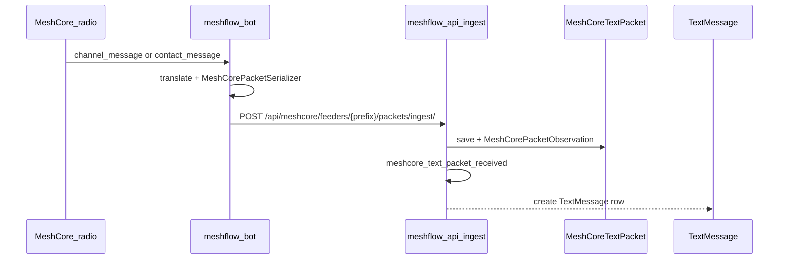
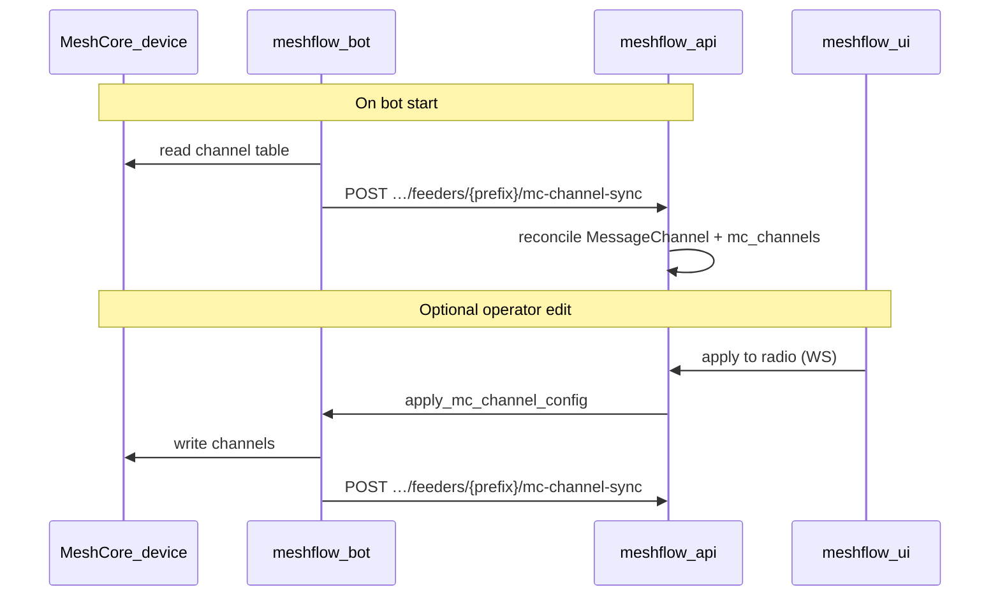

# MeshCore text messages and channels

How MeshCore **group text** and **channel configuration** flow from the radio through **meshflow-bot**, **meshflow-api**, and **meshflow-ui**. This document is the feature-level guide for Phase 2 work under epic [#266](https://github.com/pskillen/meshflow-api/issues/266).

**Tracking issues:**

| Issue | Repo | Focus |
|-------|------|--------|
| [#296](https://github.com/pskillen/meshflow-api/issues/296) | meshflow-api | Ingest MC text → `TextMessage` business model + history API |
| [#297](https://github.com/pskillen/meshflow-api/issues/297) | meshflow-api (+ ui, bot children) | Configure MC channels on feeders; sync to device |

**Normative ADRs:** [ADR-0002](../packet-ingestion/adr/0002-mc-channel-modelling.md) (channels), [ADR-0003](../packet-ingestion/adr/0003-mc-broadcast-semantics.md) (broadcast vs DM), [ADR-0001](../packet-ingestion/adr/0001-mc-node-identity.md) (sender identity on text).

**Related:** [feeder-bootstrap.md](feeder-bootstrap.md), [README.md](README.md) (phase docs), [MESHCORE_PACKET_FIELDS.md](../packet-ingestion/MESHCORE_PACKET_FIELDS.md).

---

## Mental model: Meshtastic vs MeshCore

| | **Meshtastic** | **MeshCore** |
|---|----------------|--------------|
| Channel on radio | Fixed slots 0–7, PSK + name in firmware | Arbitrary list on companion; **index** on wire, **name** only in device config |
| Feeder channel config | API slot FKs → `MessageChannel` (operator maps slots in UI) | Device is source of truth; API **mirror** via bot `mc-channel-sync` on connect |
| Feeder channel link in API | `meshtastic_channel_0..7` | `ManagedNode.mc_channels` M2M (reconciled from device snapshot) |
| What a text packet carries | Channel index + sender node id | `channel_message`: **index + body only** (no sender pubkey); `contact_message`: **12-hex sender prefix** + body |
| Broadcast vs DM | `to_int == 0xFFFFFFFF` vs directed node id | Broadcast = **no** `to_pubkey*` on wire; channel text is always broadcast on that index ([ADR-0003](../packet-ingestion/adr/0003-mc-broadcast-semantics.md)) |
| UI today | Slot 0–7 mapping on [Node Settings](https://github.com/pskillen/meshflow-ui/blob/main/src/pages/user/NodeSettings.tsx) | MC feeders: mirror + **Apply to radio** on Node Settings |

MeshCore channels are still **scoped to a constellation**: channel index `0` in one region is not the same `MessageChannel` row as index `0` in another ([ADR-0002](../packet-ingestion/adr/0002-mc-channel-modelling.md) §6).

---

## End-to-end architecture

### Ingest path

Text heard on the mesh is uploaded as raw packets; normalisation into `TextMessage` is implemented ([#296](https://github.com/pskillen/meshflow-api/issues/296)).



### Configuration path ([#297](https://github.com/pskillen/meshflow-api/issues/297))

The **MeshCore device / companion** is the **source of truth** for channel names, types (public / hashtag), and indices. The API holds a **mirror** per feeder (`ManagedNode.mc_channels`). On every bot connect the bot reads the device and **uploads a full snapshot**; the API reconciles its own state. Operator edits in the UI go **to the device first** (WebSocket), then the bot re-syncs so the API matches the radio again.

**Feeder identity:** ingest, channel sync, and bot version use **`/api/meshcore/feeders/{feeder_pubkey_prefix}/…`** (12-hex prefix from device pubkey). See [feeder-bootstrap.md](feeder-bootstrap.md) ([#295](https://github.com/pskillen/meshflow-api/issues/295)).



**Drift:** if the API mirror and device disagree (e.g. failed push), the **next connect sync overwrites the API** from the device. No three-way merge in v1.

The bot starts **`MeshflowWSClient`** for MeshCore when `STORAGE_API_ROOT` + token are set (WebSocket URL derived from the API base URL unless `MESHFLOW_WS_URL` is set). The feeder’s 12-hex pubkey prefix is appended automatically on connect (not an operator env var).

### Horizontal scaling (API web tier)

Apply and traceroute commands use **Django Channels + Redis DB 0** ([`docs/REDIS.md`](../../REDIS.md)), not in-process Django signals. Signals only run inside one Python process and do not reach other workers or hosts.

| Piece | Scales horizontally? |
|-------|----------------------|
| `POST apply-mc-channel-config` on any Gunicorn/Uvicorn worker | Yes — handler calls `channel_layer.group_send` via Redis |
| `feeder_ws_group_has_subscribers` on any worker | Yes — `channels_redis` stores group membership in Redis DB 0 |
| Bot `NodeConsumer` WebSocket | One connection per bot; must land on **some** ASGI instance in the deployment that shares that Redis |
| Browser UI WebSocket (`text_messages`, JWT) | Separate consumer/groups; unrelated to feeder commands |

You do **not** need a separate “signal” bus for multi-worker API: Redis channel layer already is that bus.

### Local API + pre-prod bot (common 503 cause)

Sharing **Postgres** and **Redis** is not enough if the **HTTP hosts differ**:

- UI / `apply-mc-channel-config` → `http://localhost:8000` (local Django)
- Bot → `STORAGE_API_ROOT=https://pre-prod…/api` and WebSocket to **pre-prod**

The bot registers in Redis group `node_mc_{uuid}` through **pre-prod’s** `NodeConsumer`. Local Django also reads Redis DB 0, so presence *can* work if both use the same `REDIS_HOST` / password and the managed node `internal_id` + `mc_pubkey` match the device. If local settings use **`InMemoryChannelLayer`** (tests only) or a different Redis DB/host, local apply always sees **503 feeder not connected** even though pre-prod logs show `MeshflowWSClient: connected`.

**Practical dev setups (pick one):**

1. Point **meshflow-ui** at pre-prod API (browser and bot share one deployment), or  
2. Point **bot** `STORAGE_API_ROOT` at local API and run bot + API locally, or  
3. Keep split hosts but verify local `CHANNEL_LAYERS` is `channels_redis` to the **same** Redis DB 0 as pre-prod.

**Common 503 causes (fixed on api #335 / bot #108 branch):**

| Symptom | Cause | Fix |
|---------|--------|-----|
| 503 `feeder_bot_not_connected` but Redis has `asgi:group:node_mc_{uuid}` | Presence check called `group_channels()` (not in channels_redis 4.x) | ZSET probe on `asgi:group:…` |
| 503 `command_dispatch_unavailable`, log `__proxy__` | gettext labels in apply payload | Plain `PUBLIC`/`HASHTAG` + `_ws_json_safe()` |
| Apply works on pre-prod UI but not localhost | Bot WS registered on pre-prod only | Align UI API URL with bot `STORAGE_API_ROOT` or shared Redis + local `channels_redis` |

**Dual API (`STORAGE_API_2_*`):** with `MESHCORE_UPLOAD_ENABLED`, the bot POSTs **`mc-channel-sync`** (and packets) to **both** `STORAGE_API_ROOT` and `STORAGE_API_2_ROOT`. **WebSocket** and **apply** use **primary** only (`STORAGE_API_ROOT` / `MESHFLOW_WS_URL`). API 2 gets mirror updates on connect; UI apply against API 2 will 503 unless WS is also on API 2.

**Django admin:** read-only device mirror on MeshCore managed nodes; **MeshCore channels** admin for constellation catalog; **Push MC channel config to feeder device** action (see [feeder-bootstrap.md](feeder-bootstrap.md) §5).

**Implementation plan:** Cursor workspace plan `mc_text_textmessage_pipeline_2c3e9fb8.plan.md` (historical); **this doc is canonical** in git for operators and PRs.

---

## On the wire (what the bot sees)

From Phase 0.4 captures ([meshflow-bot `docs/meshcore_packets/`](https://github.com/pskillen/meshflow-bot/tree/main/docs/meshcore_packets)):

### `channel_message` → group / channel text

Decoded payload includes:

- `channel_idx` — zero-based integer (dispatch key on the wire)
- `text` — message body
- `sender_timestamp`, `path_len`, `path_hash_mode`, etc.

It does **not** include channel name, hashtag string, sender full pubkey, or destination fields. Meshflow cannot learn “Galloway” or “#foo” from the packet alone.

### `contact_message` → DM / private text

Contact DMs are also used for **node ownership claims**: the user sends only the UI-generated claim key to a feeder ([node-claims-meshcore.md](../node-lifecycle/node-claims-meshcore.md)).

- `pubkey_prefix` — 12 hex chars (6-byte sender prefix)
- `text`, `channel_idx` (often `0` in samples; DMs are not a channel in the ADR sense)

See [MESHCORE_PACKET_FIELDS.md](../packet-ingestion/MESHCORE_PACKET_FIELDS.md) for field tables.

---

## meshflow-bot

### Environment (feeder)

See [feeder-bootstrap.md](feeder-bootstrap.md) and [meshflow-bot `docs/MESHCORE.md`](https://github.com/pskillen/meshflow-bot/blob/main/docs/MESHCORE.md).

| Variable | Role |
|----------|------|
| `RADIO_PROTOCOL=meshcore` | Use `MeshCoreRadio` + `MeshCorePacketSerializer` |
| `MESHCORE_UPLOAD_ENABLED=true` | POST packets to API (otherwise capture-only dumps) |
| `STORAGE_API_ROOT` / `STORAGE_API_TOKEN` | Feeder-scoped ingest + `mc-channel-sync` (see [feeder-bootstrap.md](feeder-bootstrap.md)) |
| `STORAGE_API_2_*` (optional) | Second upload destination; **no** WS unless `MESHFLOW_WS_URL` points there |
| `MESHCORE_SERIAL_DEVICE` or `MESHCORE_BLE_ADDRESS` | Transport to companion |

Uploadable text events today ([`MeshCorePacketSerializer`](https://github.com/pskillen/meshflow-bot/blob/main/src/meshcore/serializers.py)):

| Bot `event_type` | `payload_type` sent to API | Notes |
|------------------|----------------------------|--------|
| `channel_message` | `channel_text` | No `from_pubkey`; `channel_idx` + `text` |
| `contact_message` | `contact_text` | `from_pubkey_prefix` + `text` |
| `rx_log_data` + `ADVERT` | `advert` | Position/name; **not** channel text (separate pipeline) |

Non-text `rx_log_data` (e.g. `TEXT_MSG`, `PATH`) is skipped via `MeshCoreSkipUpload`.

### Translation and upload shape

1. [`event_to_incoming_packet`](https://github.com/pskillen/meshflow-bot/blob/main/src/meshcore/translation.py) builds a generic `IncomingPacket` with `raw` envelope `{ meshcore, type, payload, attributes }`.
2. [`MeshCorePacketSerializer.serialise_raw_packet`](https://github.com/pskillen/meshflow-bot/blob/main/src/meshcore/serializers.py) maps to API ingest JSON, including top-level `channel_idx` and `text` for text types.

Example ingest body (channel text, illustrative):

```json
{
  "event_type": "channel_message",
  "payload_type": "channel_text",
  "channel_idx": 0,
  "text": "hello mesh",
  "pkt_hash": 123456,
  "rx_time": 1730000000,
  "rx_rssi": -90,
  "raw": { "meshcore": true, "type": "channel_message", "payload": { "...": "..." } }
}
```

### Bot channel configuration

| Step | Behaviour |
|------|-----------|
| **On connect** | `read_device_channels` via `meshcore.commands.get_channel`; `POST` snapshot to **`/api/meshcore/feeders/{prefix}/mc-channel-sync/`** for each entry in `bot.storage_apis` (primary + optional API 2). |
| **On UI / admin “apply”** | WebSocket `apply_mc_channel_config` on **primary** WS only → `set_channel` on device → re-sync to **all** `storage_apis`. |
| **Channel types (v1)** | **PUBLIC** and **HASHTAG** only. |

The bot does **not** pull API channel config and push to device on startup. If the device reports zero named channels, logs include a per-slot scan warning ([#107](https://github.com/pskillen/meshflow-bot/pull/107)) — still an open ops issue when other tools show channels on the same radio.

**Example sync payload** (illustrative):

```json
{
  "channels": [
    { "mc_channel_idx": 0, "name": "Public", "mc_channel_type": "PUBLIC", "mc_hashtag": null },
    { "mc_channel_idx": 1, "name": "Galloway", "mc_channel_type": "HASHTAG", "mc_hashtag": "galloway" }
  ],
  "synced_at": "2026-05-20T12:00:00Z"
}
```

---

## meshflow-api — data models

### `MessageChannel` (constellation-scoped)

[`Meshflow/constellations/models.py`](../../../Meshflow/constellations/models.py)

| Field | Role |
|-------|------|
| `name` | Operator-facing label (UI/admin); not on wire |
| `constellation` | FK |
| `protocol` | `MESHCORE` for MC rows |
| `mc_channel_idx` | Device slot `0..63`; unique per `(constellation, protocol)` |
| `mc_channel_type` | `PUBLIC` / `HASHTAG` |
| `mc_hashtag` | Hashtag string when type is `HASHTAG` (no leading `#` in DB) |

Meshtastic channels use PSK-backed slots on the managed node (`meshtastic_channel_0..7`). MeshCore does **not** use those slots.

### `ManagedNode` (feeder)

| Field | Role |
|-------|------|
| `protocol` | `MESHCORE` for MC feeders |
| `mc_pubkey` | Full 64-hex feeder identity ([#295](https://github.com/pskillen/meshflow-api/issues/295)) |
| `meshtastic_channel_0..7` | Meshtastic only |
| `mc_channels` | M2M mirror of device slots |
| `mc_channels_synced_at` | Last successful bot `mc-channel-sync` |

Authentication: Node API key via `NodeAuth`; feeder resolved by URL **`{feeder_pubkey_prefix}`** + optional **`X-MeshCore-Feeder-Pubkey`** header ([feeder-bootstrap.md](feeder-bootstrap.md)).

### Raw ingest: `MeshCoreTextPacket`

[`Meshflow/meshcore_packets/models.py`](../../../Meshflow/meshcore_packets/models.py)

| Field | Purpose |
|-------|---------|
| `text` | Message body |
| `channel` | FK → `MessageChannel` resolved at ingest |
| `from_pubkey` / `from_pubkey_prefix` | Sender when known (contact); empty for channel text |
| `to_pubkey_prefix` | DM directed-to-us semantics (often null in bot upload today) |

Parent `MeshCoreRawPacket` holds `event_type`, `pkt_hash`, `rx_time`, `observer`, etc.

### Observations: `MeshCorePacketObservation`

Per-feeder sighting of a packet, with optional `channel` FK (same `MessageChannel` as on the text row when applicable).

### `TextMessage` (business model)

[`Meshflow/text_messages/models.py`](../../../Meshflow/text_messages/models.py) — **Meshtastic-only today.**

| Field | Role |
|-------|------|
| `original_packet` | FK → MT `MessagePacket` (MT rows) |
| `original_mc_packet` | FK → `MeshCoreTextPacket` (MC rows) |
| `protocol` | `MESHTASTIC` / `MESHCORE` |
| `sender` | FK → `ObservedNode`; **nullable** for MC channel text |
| `channel` | FK → `MessageChannel` |
| `recipient_meshtastic_node_id` | MT broadcast sentinel; null for MC broadcast |
| `sent_at` | MC uses packet `rx_time` where applicable |

**Dedup:** one `TextMessage` per raw packet (`original_packet` or `original_mc_packet`).

**History API (planned):** existing `GET /api/messages/` list stays **channel broadcast** only (like MT today): include MC rows with `protocol=MESHCORE`, `sender` null, channel set; **store** contact/DM rows but expose them via a future DM endpoint.

---

## meshflow-api — ingest and channel resolution

**Endpoint:** `POST /api/meshcore/feeders/{feeder_pubkey_prefix}/packets/ingest/`  
**Code:** [`MeshCorePacketIngestSerializer`](../../../Meshflow/meshcore_packets/serializers.py), ingest views + [`resolve_meshcore_feeder`](../../../Meshflow/common/meshcore_feeder_auth.py)

Flow for text packets:

1. Validate envelope (`payload_type` `channel_text` or `contact_text`, `text` required).
2. Dedup by `pkt_hash` + time window ([`dedup.py`](../../../Meshflow/meshcore_packets/services/dedup.py)).
3. **`resolve_mc_channel(observer, channel_idx)`** — [`channel.py`](../../../Meshflow/meshcore_packets/services/channel.py).

### `resolve_mc_channel`

1. Clamp `channel_idx` to `0..63`.
2. Prefer `observer.mc_channels.filter(mc_channel_idx=idx).first()` (feeder mirror).
3. If missing, auto-create placeholder `MessageChannel`, attach to `observer.mc_channels`.

Heard traffic links to configured channels without names on the wire.

### Signals

| Signal | When | Subscriber |
|--------|------|------------|
| `meshcore_packet_received` | Every stored packet | Identity upsert ([`receivers.py`](../../../Meshflow/meshcore_packets/receivers.py)) |
| `meshcore_text_packet_received` | `MeshCoreTextPacket` saved | `text_messages` → `TextMessage` |

Identity receiver **skips** channel text (no `from_pubkey` / prefix). Contact text creates or touches a **prefix stub** `ObservedNode` per [ADR-0001](../packet-ingestion/adr/0001-mc-node-identity.md).

---

## meshflow-api — channel mirror and WebSocket

### Primary: `POST …/feeders/{prefix}/mc-channel-sync` (device → API)

- **Caller:** meshflow-bot with Node API key, after reading the device.
- **Body:** full channel list (`mc_channel_idx`, `name`, `mc_channel_type`, `mc_hashtag`); optional `synced_at`.
- **Effect:** upsert `MessageChannel` rows; set `ManagedNode.mc_channels` to match snapshot ([`reconcile_mc_channels`](../../../Meshflow/meshcore_packets/services/channel_sync.py)).
- **Read:** managed node API returns nested `mc_channels` for UI.

### Secondary: push UI / admin intent → device

- **REST:** `POST /api/meshcore/managed-nodes/{internal_id}/apply-mc-channel-config/` (owner JWT) → [`channel_apply`](../../../Meshflow/meshcore_packets/services/channel_apply.py) → Redis `group_send` → bot WS.
- **WebSocket command:** `apply_mc_channel_config` with `channels` array (plain string types).
- **Django admin:** action **Push MC channel config to feeder device** uses the same dispatch with mirror payload.
- Bot writes device, then re-syncs to all configured storage APIs.

**Permissions:** sync uses feeder key + prefix; apply uses authenticated node owner.

**Not v1:** API-only mirror edits without device round-trip (drift until next connect sync).

---

## meshflow-ui

- **Meshtastic feeders:** [Node Settings](https://github.com/pskillen/meshflow-ui/blob/main/src/pages/user/NodeSettings.tsx) — slots 0–7 → `meshtastic_channel_*`.
- **MeshCore feeders:** mirror from API; **Apply to radio** via `apply-mc-channel-config` (PUBLIC / HASHTAG, hashtag). Toasts on 503; richer offline UX still deferred.

**Message history UI** for MC remains deferred; API supports `GET /api/messages/text/?protocol=meshcore` for channel broadcast.

---

## Operator checklist

1. Create MC **constellation** and **ManagedNode** feeder ([feeder-bootstrap.md](feeder-bootstrap.md)).
2. Link **Node API key** via `NodeAuth` (one key per feeder recommended).
3. Configure bot env (`MESHCORE_UPLOAD_ENABLED`, storage API).
4. Start bot with upload enabled; on connect it syncs device channels to API. Optionally use UI to apply changes **to the radio**, then wait for re-sync.
5. Confirm `channel_message` ingest: `MeshCoreTextPacket` rows with `channel` FK and matching `mc_channel_idx`.
6. Confirm `TextMessage` rows appear on `GET /api/messages/text/?protocol=meshcore` for channel traffic.

---

## Implementation status summary

| Capability | Status |
|------------|--------|
| Bot upload `channel_text` / `contact_text` | **Done** |
| Feeder-scoped ingest + `mc-channel-sync` URLs ([#295](https://github.com/pskillen/meshflow-api/issues/295)) | **Done** (main + #335 fixes) |
| `ManagedNode.mc_channels` + `mc_channel_type` / `mc_hashtag` | **Done** |
| `TextMessage` + MC provenance ([#296](https://github.com/pskillen/meshflow-api/issues/296)) | **Done** |
| Bot sync + WS apply ([#297](https://github.com/pskillen/meshflow-api/issues/297)) | **Done** |
| UI mirror + apply-to-radio | **Done** |
| Apply 503 / msgpack / WS group fixes | **Done** on [api #335](https://github.com/pskillen/meshflow-api/pull/335), [bot #108](https://github.com/pskillen/meshflow-bot/pull/108) (merge pending) |
| Django admin MC channels + push action | **Done** (#335) |
| Dual API channel sync (no WS on API 2) | **Done** (bot behaviour; documented) |
| Empty device channel table / auto `mc_pubkey` | **Outstanding** — [phase-2-outstanding.md](./phase-2-outstanding.md) |
| MC message history in UI | **Deferred** |
| Three-way merge / periodic sync | **Deferred** |

---

## References

- [ADR-0002 — MC channel modelling](../packet-ingestion/adr/0002-mc-channel-modelling.md)
- [ADR-0003 — MC broadcast semantics](../packet-ingestion/adr/0003-mc-broadcast-semantics.md)
- [ADR-0001 — MC node identity](../packet-ingestion/adr/0001-mc-node-identity.md)
- [Packet ingestion — MeshCore section](../packet-ingestion/README.md)
- [Implementation plan — Phase 2.1+](implementation-plan.md)
- [API keys & WebSocket](../../API_KEYS.md)
