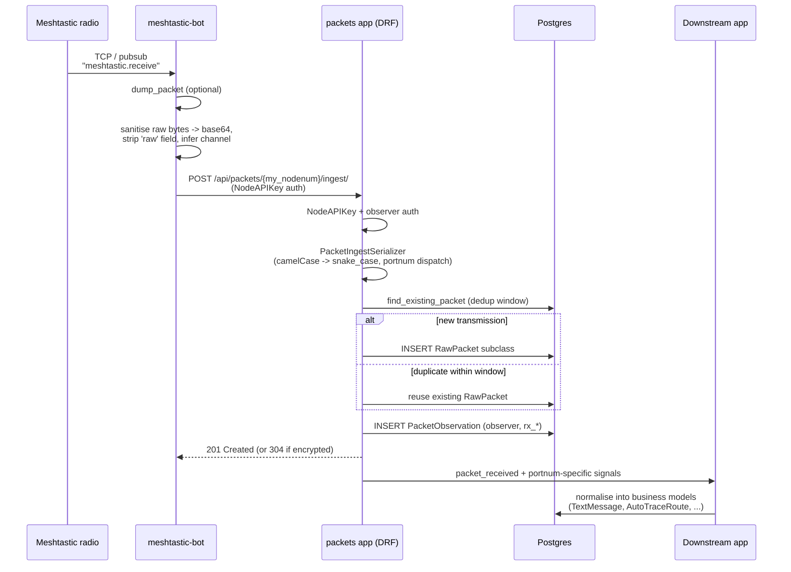

# Packet Ingestion

Packet ingestion is the spine of Meshflow: every other feature is downstream of
the raw mesh traffic that lands in the API through this pipeline. The pipeline
straddles two repositories:

- **[meshtastic-bot](https://github.com/patrickbatty/meshtastic-bot)** —
Python bot running next to each managed Meshtastic radio. Subscribes to the
radio over TCP, transforms the firmware's packet structure into JSON, and
uploads each packet to the API.
- **meshflow-api `packets` Django app** — receives ingest requests,
authenticates the observer, deduplicates, persists `RawPacket` subclasses and
`PacketObservation` rows, and emits Django signals.

Specific features such as text messages, traceroutes, mesh monitoring, and DX
monitoring are **not** owned by the `packets` app. They subscribe to the
signals emitted here and do their own normalisation. Refer to those features'
own documentation for what they do with the packets — this README intentionally
stops at "signal emitted".

## Reference docs

- [PACKET_FIELDS.md](PACKET_FIELDS.md) — wire-level field reference for every
packet type accepted by ingestion.
- [DEDUPLICATION.md](DEDUPLICATION.md) — the rules that decide when two
ingested packets describe the same on-air transmission.

Sample raw packet payloads (one per port number) live in
`[docs/packets/](../../packets/)` at the top of `docs/`.

## End-to-end Flow

## Bot side: read, transform, upload

### Listening to the radio

`meshtastic-bot/src/bot.py` subscribes to the Meshtastic Python library's
pubsub topics on startup:

- `meshtastic.receive` — every packet, used for ingestion.
- `meshtastic.receive.text` — text messages, used additionally for
command/responder handling.
- `meshtastic.node.updated` — `NodeDB` changes from the radio.
- `meshtastic.connection.established` — connection bring-up hook.

The TCP connection is wrapped in `AutoReconnectTcpInterface`
(`src/tcp_interface.py`) so that a flapping radio does not lose the
subscription.

### Filtering before upload

`MeshtasticBot.on_receive` decides whether a packet should be uploaded:

- Packets in the configured `IGNORE_PORTNUMS` list are skipped.
- Packets with no `decoded` (and no `decrypted`) payload are skipped — fully
encrypted packets carry no useful fields for ingestion.
- Telemetry packets sent **by this node to itself** (the radio firmware sends
a `deviceMetrics` frame to its connected client roughly once a minute) are
skipped — another bot will hear the over-the-air broadcast and we do not
want to count the local-loopback copy.

Everything that survives the filter is forwarded to every configured storage
API (the bot supports two — primary and optional secondary — so the same
ingest can populate, for example, prod and pre-prod simultaneously).

### Sanitising the packet

`StorageAPIWrapper.store_raw_packet` (`src/api/StorageAPI.py`) walks the
packet dict before posting it:

- The `raw` field — a `MeshPacket` protobuf object — is dropped. Its
contents are not useful to the API and it is not JSON-serialisable.
- Any remaining `bytes` values are base64-encoded.
- `channel` is filled in from the protobuf if the dict was missing it
(the firmware omits zero/null values, but the API needs an explicit
channel index for `PacketObservation`).

The bot then `POST`s the JSON to:

- v2 (current): `POST /api/packets/{my_nodenum}/ingest/`
- v1 (legacy): `POST /api/raw-packet/`

`my_nodenum` is the bot's own decimal node ID — it identifies the
**observer**, not the packet sender. Authentication uses an API key
(`STORAGE_API_TOKEN`) provisioned per managed node.

### When upload fails

If the API returns an HTTP error (or anything else throws), the bot writes the
sanitised packet, the raw protobuf, and the response error to a JSON file
under `failed_packets_dir`. There is no in-process retry; failed packets are
expected to be inspected by an operator. The bot continues so a single bad
packet does not stop ingestion.

## API side: receive, dedupe, store, signal

### Endpoint and authentication

URL: `POST /api/packets/{node_id}/ingest/`
View: `packets.views.PacketIngestView`

`NodeAPIKeyAuthentication` looks up the API key, finds the observer
`ManagedNode`, and attaches it to `request.auth.node`. The observer is **not**
the packet sender — it is the feeder that heard the transmission. The
`{node_id}` path component identifies the observer too, and the bot fills it
in with its own node number.

A separate (legacy) authentication class
`packets.authentication.PacketIngestNodeAPIKeyAuthentication` additionally
binds the API key to the packet's `from` field via `NodeAuth`. This guards
against a bot trying to upload packets claiming to be sent by an unrelated
managed node.

### Encrypted-only short-circuit

If the request body has an `encrypted` field at the top level, the view
returns `304 Not Modified` immediately. Encrypted packets carry no payload
the API can decode; they are treated as "received and acknowledged, nothing
to store".

### Serialisation and dispatch

`PacketIngestSerializer` is a polymorphic dispatcher: it inspects
`decoded.portnum` and delegates to the matching subclass serializer
(`MessagePacketSerializer`, `PositionPacketSerializer`,
`NodeInfoPacketSerializer`, `DeviceMetricsPacketSerializer`,
`EnvironmentMetricsPacketSerializer`, `TraceroutePacketSerializer`, etc.).

Each subclass:

1. Maps camelCase JSON onto snake_case model fields.
2. Converts `rxTime` (Unix seconds) into a timezone-aware `datetime`.
3. Resolves the channel index against the observer's
  `channel_0` … `channel_n` foreign keys to a `MessageChannel`.
4. Calls `find_existing_packet(model, from_int, packet_id, rx_time)` to
  apply the dedup window (see [DEDUPLICATION.md](DEDUPLICATION.md) and
   `PACKET_DEDUP_WINDOW_MINUTES` in `ENV_VARS.md`).
5. Either reuses the existing `RawPacket` row or `INSERT`s a new one of the
  correct subclass.
6. Always creates a `PacketObservation` linking observer → packet
  (idempotent for the same `(packet, observer)` pair).

### Storage shape

Persisted models live in `packets.models`:

- `RawPacket` — abstract base (UUID PK, `packet_id`, `from_int`, `from_str`,
`to_int`, `to_str`, `port_num`, `first_reported_time`).
- One concrete subclass per port number: `MessagePacket`, `PositionPacket`,
`NodeInfoPacket`, `TraceroutePacket`, `DeviceMetricsPacket`,
`LocalStatsPacket`, `EnvironmentMetricsPacket`, `AirQualityMetricsPacket`,
`PowerMetricsPacket`, `HealthMetricsPacket`, `HostMetricsPacket`,
`TrafficManagementStatsPacket`. Each carries the fields specific to that
port.
- `PacketObservation` — many-to-one onto `RawPacket`, foreign key to the
observer `ManagedNode`, plus per-observation fields the radio reports
(`rx_time`, `rx_rssi`, `rx_snr`, `hop_limit`, `hop_start`, `relay_node`,
`channel`, `upload_time`).

This shape is what makes multi-feeder coverage useful: one row per
on-air transmission, but one row per *hearing* of that transmission, so we
can compare SNR / RSSI between observers and reason about who heard what.

### Signals

Once the packet and observation are persisted, the view emits Django signals
(`packets/signals.py`):

- `packet_received` — every successful ingest.
- One of `message_packet_received`, `position_packet_received`,
`node_info_packet_received`, `device_metrics_packet_received`,
`local_stats_packet_received`, `environment_metrics_packet_received`,
`air_quality_metrics_packet_received`, `health_metrics_packet_received`,
`host_metrics_packet_received`, `power_metrics_packet_received`,
`traffic_management_stats_packet_received`,
`traceroute_packet_received` — depending on the concrete subclass.

The `packets` app subscribes to these in `packets/receivers.py` and runs a
small per-type `*PacketService` whose job is just to:

- Ensure the sender exists as an `ObservedNode` (creating a placeholder if
this is the first time we have heard from them, and emitting
`new_node_observed`).
- Update `ObservedNode.last_heard`.
- Update `NodeLatestStatus` (latest position, latest device metrics, inferred
max hops) for telemetry/position packets.
- Hand off to DX monitoring for candidate detection on the same call
(`maybe_detect_dx_candidate`).
- Clear mesh-monitoring presence state on any packet that advances
`last_heard` (`clear_presence_on_packet_from_node`).

Beyond that, the `packets` app deliberately stops. Other apps subscribe to
the same signals and own their own normalisation:

- **Text messages** (`text_messages`) — listens for
`message_packet_received` and creates `TextMessage` rows. Also handles
node-claim secret-token detection and emits `node_claim_authorized` and
`text_message_received`. See [features/node-lifecycle/](../node-lifecycle/)
and the text-messages feature docs.
- **Traceroutes** (`traceroute`, `traceroute_analytics`) — listens for
`traceroute_packet_received` to match incoming responses to pending
`AutoTraceRoute` rows (or create an `External` row for cross-environment
responses), and to push edges into Neo4j. See
[features/traceroute/](../traceroute/).
- **Mesh monitoring** (`mesh_monitoring`) — uses `last_heard` updates and
`device_metrics_recorded` for offline-verification and battery-alert
decisions. See [features/mesh-monitoring/](../mesh-monitoring/).
- **DX monitoring** (`dx_monitoring`) — invoked inline from
`BasePacketService` to evaluate distant/returning-node observations. See
[features/dx-monitoring/](../dx-monitoring/).

If you are adding a new downstream feature, the right pattern is almost
always: subscribe to the relevant `*_packet_received` signal in your own app
and write your normalisation there. Do not add app-specific business logic to
`packets/services/` or `packets/receivers.py`.

## Cross-environment ingest

A managed node can be configured (`STORAGE_API_2_`*) to upload to a second
API instance. This is how a single feeder can feed both prod and pre-prod.
Pre-prod will see the responses to traceroutes triggered by prod and has no
matching `AutoTraceRoute` row to attach them to; the traceroute receiver
handles this by creating an `AutoTraceRoute` with `trigger_type=2` (External).
See [features/traceroute/](../traceroute/) for the full story.

Deduplication is per-instance — the dedup window only collapses observations
within a single API. Each instance keeps its own copy of the `RawPacket`.

## Operational notes

- **Idempotency:** the same observer reporting the same packet twice never
creates a second `PacketObservation`. Bots can safely retry.
- **Failed-packet drops:** the bot dumps to disk on upload failure. There is
no automatic replay; an operator must inspect and re-feed if needed.
- **Dedup window:** `PACKET_DEDUP_WINDOW_MINUTES` (default 10) controls how
long after `first_reported_time` a `(from_int, packet_id)` collision is
treated as the same on-air transmission. See
[DEDUPLICATION.md](DEDUPLICATION.md) and `docs/ENV_VARS.md`.
- **Schema migrations:** packet model changes go through normal Django
migrations (`makemigrations` / `migrate`), and the `openapi.yaml` ingest
schema must be updated alongside.
- **Recency / `last_heard`:** see `[docs/RECENCY.md](../../RECENCY.md)` for
the full semantics — `packets` is the only writer of `ObservedNode.last_heard`.

