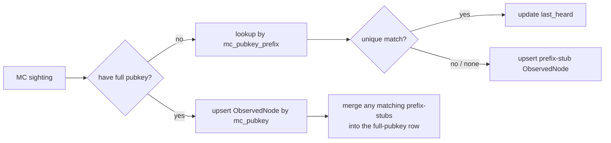

# ADR-0001 — MeshCore node identity

**Status:** Accepted
**Date:** 2026-05-12
**Tracking:** [meshflow-api#276](https://github.com/pskillen/meshflow-api/issues/276)

Phase 1 MVP ([#265](https://github.com/pskillen/meshflow-api/issues/265)) kept a stored `node_id_str` column temporarily; [#294](https://github.com/pskillen/meshflow-api/issues/294) removed it in favour of the computed display id in §6.

## Context

Meshtastic (MT) `ObservedNode` is keyed on a 32-bit `node_id` (BigInt) plus a derived `node_id_str` (`!12345678`). MeshCore (MC) has no such identifier on the wire: nodes are identified by **32-byte Ed25519 public keys**.

The Phase 0.4 capture campaign (6 days, South Scotland, firmware 1.15.0 — see [`docs/features/packet-ingestion/MESHCORE_PACKET_FIELDS.md`](../MESHCORE_PACKET_FIELDS.md)) showed that the per-event identity information varies sharply by event type:

| Event | Identity on the wire | Notes |
| --- | --- | --- |
| `advertisement` | Full 64-hex `public_key` | Pubkey only — no name, no position. |
| `path_update` | Full 64-hex `public_key` | Pubkey only. |
| `discover_response` | Full 64-hex `pubkey` + 8-hex `tag` + `node_type` | No name, no position. |
| `rx_log_data` (`ADVERT` decode) | Full 64-hex `adv_key`, **plus** `adv_name`, `adv_lat`, `adv_lon`, `adv_flags`, `adv_type`, `signature` | Only event that ever carries node name and position. `adv_lat=0.0` / `adv_lon=0.0` when absent. |
| `rx_log_data` (non-ADVERT) | Only on-wire fields: `pkt_hash`, `path`, raw `payload` | No sender identity. |
| `channel_message` | **No** sender pubkey. Synthetic dispatch id only. | Decoded text view only. |
| `contact_message` | 12-hex `pubkey_prefix` (6 bytes) | Partial identity only. |

Channel text is therefore identity-blind, and DM text is identity-partial. Node name and location are only ever set by `rx_log_data` frames that the companion was able to decode as `ADVERT`. Any storage model that assumes "every incoming frame names its sender" or "every sender carries a full pubkey at observation time" will not match what the radio actually emits.

The previous backend-migration plan (parent plan §0.5) proposed `mc_pubkey` + `mc_pubkey_hash` (1-byte secondary, "indexed"). The captures show no such hash field on the wire; if we want one we have to compute it client-side, and a 1-byte hash carries no useful selectivity for a single-country mesh.

## Decision

1. **Add `ObservedNode.protocol`** (`IntegerChoices`, `MESHTASTIC=1`, `MESHCORE=2`, indexed). One row per `(protocol, identity)` pair.
2. **MC primary identity = `mc_pubkey`**, `CharField(max_length=64)`, lowercase hex, nullable. Unique within `protocol=MESHCORE` (partial unique index). Populated whenever we observe a full pubkey: `advertisement.public_key`, `path_update.public_key`, `discover_response.pubkey`, `rx_log_data.adv_key`.
3. **Secondary identity = `mc_pubkey_prefix`**, `CharField(max_length=12)`, lowercase hex, nullable, **indexed**. Mirrors the on-wire `contact_message.pubkey_prefix` (12 hex chars = 6 bytes). For rows with a full key this is just the first 12 hex of `mc_pubkey`; for prefix-only sightings it is the only identity we have.
4. **Drop `mc_pubkey_hash`** from the migration plan. Not on the wire, not needed once `mc_pubkey_prefix` is indexed.
5. **MT-side `node_id` becomes nullable** when `protocol != MESHTASTIC`. Add a row-level CHECK:
   - `protocol = MESHTASTIC` ⇒ `node_id IS NOT NULL`
   - `protocol = MESHCORE` ⇒ `mc_pubkey IS NOT NULL OR mc_pubkey_prefix IS NOT NULL`
6. **`node_id_str` becomes a protocol-aware computed display**: `!{hex8}` for MT, `mc:{first 12 hex}` for MC (matches the convention already used in `meshflow-bot/src/meshcore/radio.py`). No DB column — computed in the model / serializer.
7. **Node metadata enrichment is ADVERT-driven, not identity-event-driven.** `long_name`, `short_name`, position fields, and any `role`/flags equivalent are only updated when an MC packet receiver sees an `rx_log_data` frame whose decoder expanded an `ADVERT` payload. `advertisement` / `path_update` / `discover_response` only ever touch identity columns and `last_heard`; they never overwrite name/position.
8. **Prefix-stub reconciliation.** Prefix-only sightings (today only DM text — `contact_message`) follow this rule:
   - Look up `ObservedNode` where `mc_pubkey LIKE '<prefix>%'` OR `mc_pubkey_prefix = '<prefix>'`.
   - **Exactly one match** ⇒ update `last_heard` on that row. Done.
   - **Zero matches** ⇒ insert a "prefix stub" row with `mc_pubkey = NULL` and `mc_pubkey_prefix = <prefix>`.
   - **Multiple matches** ⇒ leave the existing rows untouched, attach the observation to a prefix-stub row (insert if missing). Reconcile later when a full-pubkey sighting disambiguates.
   - When a full-pubkey sighting arrives whose first 12 hex match an existing stub row, **merge** the stub into the full-pubkey row (move `PacketObservation` / `last_heard`, delete the stub). Idempotent.

## Consequences

- **First-sight nodes are nameless.** A node we first observe via channel text won't appear in `ObservedNode` at all (no identity). A node first observed via DM text appears as a prefix stub with no name/position. Name and position only appear once we hear that node's `ADVERT` frame. The UI must tolerate "MC node with no name yet".
- **Possible prefix collisions.** 6-byte prefixes are not collision-free over an infinite population, but for a single-country mesh (hundreds to low thousands of nodes) collisions are unlikely. The "multiple matches ⇒ stub" rule fails safe (no false merge), and the operator can resolve stubs later from the admin UI.
- **`ObservedNode` cardinality grows slightly** by the number of distinct DM-text senders we never get an `ADVERT` for. Acceptable; each prefix stub is one row.
- **Channel text leaves no identity trail.** This is a protocol limitation, not a modelling choice. `channel_message` rows will be stored against `MeshCoreRawPacket` (Phase 1) but won't create or update `ObservedNode`.
- **Migration impact.** Making MT `node_id` nullable is a non-trivial schema change on a hot table; Phase 1 must run it during a maintenance window and provide a rollback migration. Pre-flight on a prod-sized DB clone.
- **Out of scope for this ADR:** how managed-node ownership (`ManagedNode.protocol`, `ManagedNode.mc_pubkey`) and API-key binding work. Phase 1 design ticket will cover that and reuse this identity contract.

## Evidence

Sample files in this repo (one per shape):

- [`docs/packets/meshcore/advertisement/20260506_211140_430432.json`](../../../packets/meshcore/advertisement/20260506_211140_430432.json) — pubkey-only advert event.
- [`docs/packets/meshcore/path_update/20260506_205759_895381.json`](../../../packets/meshcore/path_update/20260506_205759_895381.json) — pubkey-only routing update.
- [`docs/packets/meshcore/discover_response/20260506_211530_400913.json`](../../../packets/meshcore/discover_response/20260506_211530_400913.json) — full pubkey + `tag` + `node_type`.
- [`docs/packets/meshcore/rx_log_data_advert.json`](../../../packets/meshcore/rx_log_data_advert.json) — the only sample carrying `adv_name` / `adv_lat` / `adv_lon` / `signature`.
- [`docs/packets/meshcore/contact_message/20260506_205758_541689.json`](../../../packets/meshcore/contact_message/20260506_205758_541689.json) — prefix-only DM sender.
- [`docs/packets/meshcore/channel_message/20260507_094921_075978.json`](../../../packets/meshcore/channel_message/20260507_094921_075978.json) — no sender identity at all.

Field reference: [`MESHCORE_PACKET_FIELDS.md`](../MESHCORE_PACKET_FIELDS.md) (`advertisement`, `contact_message`, `discover_response`, `rx_log_data` optional ADVERT fields).

Full capture tree: [`meshflow-bot/docs/meshcore_packets/`](https://github.com/pskillen/meshflow-bot/tree/main/docs/meshcore_packets).
