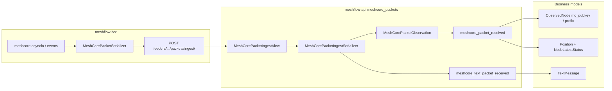

# MeshCore packet ingestion — data path

Reverse-engineered map of how MeshCore (MC) traffic moves from a feeder through **meshflow-bot** into **meshcore_packets** and downstream business models. Capture-level field reference: [MESHCORE_PACKET_FIELDS.md](MESHCORE_PACKET_FIELDS.md) (derivative of [meshflow-bot `docs/meshcore_packets/`](https://github.com/pskillen/meshflow-bot/tree/main/docs/meshcore_packets)).

Phase 1 MVP is shipped; [epic #266](https://github.com/pskillen/meshflow-api/issues/266) tracks full packet-type parity (advert subclasses, ack/req/resp, telemetry, dual-FK migrations).

---

## What the bot uploads today

`MeshCorePacketSerializer.UPLOADABLE_PAYLOAD_TYPES` = `advert`, `channel_text`, `contact_text` only.

| Bot `event_type` (envelope)                                                             | API `payload_type`                                       | Uploaded?                                               |
| --------------------------------------------------------------------------------------- | -------------------------------------------------------- | ------------------------------------------------------- |
| `advertisement`                                                                         | `advert`                                                 | Yes                                                     |
| `rx_log_data` with `payload_typename == ADVERT`                                         | `advert` (+ optional `adv_lat` / `adv_lon` / `adv_name`) | Yes                                                     |
| `channel_message`                                                                       | `channel_text`                                           | Yes                                                     |
| `contact_message`                                                                       | `contact_text`                                           | Yes                                                     |
| `rx_log_data` (non-ADVERT, e.g. TEXT_MSG, PATH, REQ, CONTROL)                           | —                                                        | **No** — `MeshCoreSkipUpload` in bot                    |
| `control_data`, `discover_response`, `path_update`, `trace_data`, `messages_waiting`, … | —                                                        | **No** — capture/dump only unless later phases map them |

Requires `RADIO_PROTOCOL=meshcore` and `MESHCORE_UPLOAD_ENABLED=true`. Otherwise the bot writes JSON under `data/meshcore_packets/` only.

POST: `POST /api/meshcore/feeders/{feeder_pubkey_prefix}/packets/ingest/` — prefix is the feeder’s **12-hex pubkey prefix** (same as WebSocket URL). Auth: `NodeAPIKey` + `MeshCoreFeederPermission`.

Code: `meshflow-bot/src/meshcore/serializers.py`, `src/api/StorageAPI.py` (`store_raw_meshcore_packet`).

### Bot events translated but not uploaded

`meshflow-bot/src/meshcore/translation.py` builds `IncomingPacket` for many `EventType`s (e.g. `ACK`, `PATH_UPDATE`, `RAW_DATA`, `BATTERY`) for local dispatch and dumps; only the three payload types above are serialised for API ingest.

---

## Packet types the API accepts

`MeshCorePacketIngestSerializer` (`meshcore_packets/serializers.py`):

| `payload_type` | `MeshCorePayloadType` | Raw model            | Business / side effects                                                                                                                        |
| -------------- | --------------------- | -------------------- | ---------------------------------------------------------------------------------------------------------------------------------------------- |
| `advert`       | `ADVERT` (1)          | `MeshCoreRawPacket`  | `ObservedNode` upsert (pubkey / prefix); optional `Position` + `NodeLatestStatus` if `adv_lat`/`adv_lon` non-zero; `meshcore_adv_type` on node |
| `channel_text` | `CHANNEL_TEXT` (2)    | `MeshCoreTextPacket` | `TextMessage` (`original_mc_packet`, `protocol=MESHCORE`); channel FK via feeder `channel_idx`                                                 |
| `contact_text` | `CONTACT_TEXT` (3)    | `MeshCoreTextPacket` | `TextMessage` + sender `ObservedNode` from `from_pubkey_prefix`; node-claim path                                                               |
| `raw`          | `RAW` (99)            | `MeshCoreRawPacket`  | `rx_log_data` **TEXT_MSG** / **PATH** (path + `pkt_hash`); twin-merge onto `channel_text` for Heard — see [tier-1-message-path-twin.md](../meshcore/packet-path-tracing/tier-1-message-path-twin.md) |

Also creates or updates **MeshCorePacketObservation** per `(packet, observer)` (deduped). Repeater **path_hashes** are stored on the observation row only (not on deduped `MeshCoreRawPacket`), so two feeders reporting the same `pkt_hash` can keep different paths. See [ADR-0001 (path hash resolution)](../traceroute/adr/0001-mc-path-hash-resolution.md).

Dedup: `meshcore_packets/services/dedup.py` — `pkt_hash` + time window (see [adr/0004-mc-dedup-key.md](adr/0004-mc-dedup-key.md)).

### API short-circuits

| Condition                    | Response          |
| ---------------------------- | ----------------- |
| Top-level `encrypted`        | **304**, no write |
| Invalid body                 | **400**           |
| Non-MC feeder / wrong prefix | **403**           |

---

## End-to-end flow

---

## API → raw storage

| Model                       | Role                                                                                                   |
| --------------------------- | ------------------------------------------------------------------------------------------------------ |
| `MeshCoreRawPacket`         | Common row: observer, `payload_type`, `event_type`, pubkey fields, `pkt_hash`, RF metadata, `raw_json` |
| `MeshCoreTextPacket`        | Subclass for channel/contact text (`text`, `channel`, `to_pubkey_prefix`)                              |
| `MeshCorePacketObservation` | Per-feeder hearing (like MT `PacketObservation`)                                                       |

List API (JWT): `GET /api/meshcore/packets/` — filter `payload_type`, `from_pubkey_prefix`.

---

## Raw → business

### `meshcore_packets` app

| Step            | Module                                                   | Behaviour                                                                       |
| --------------- | -------------------------------------------------------- | ------------------------------------------------------------------------------- |
| All ingests     | `receivers.upsert_observed_node_from_meshcore_packet`    | `meshcore_packet_received` → `resolve_or_create_mc_observed_node`, `last_heard` |
| ADVERT + coords | `services/position.apply_advert_position`                | `Position.original_mc_packet`, `NodeLatestStatus`                               |
| Text            | `text_messages.receivers` → `MeshCoreTextMessageService` | `TextMessage.original_mc_packet`                                                |

No dedicated services yet for ack/req/resp/telemetry — **#266** scope.

### Cross-app

| App              | Role                                                                                                                                |
| ---------------- | ----------------------------------------------------------------------------------------------------------------------------------- |
| `text_messages`  | MC text + claims (`try_accept_node_claim` on contact text)                                                                          |
| `stats`          | `mc_packet_volume` snapshots count `MeshCoreRawPacket` / observations (see [packet-stats/meshcore.md](../packet-stats/meshcore.md)) |
| `constellations` | `MessageChannel` resolution for `channel_idx` on text + observations                                                                |

MC does **not** use the Meshtastic `packets` app or `MtRawPacket` tables.

---

## Identity model (summary)

- Full node: 64-hex Ed25519 pubkey → `ObservedNode.mc_pubkey`, id `mc:{hex}` in bot.
- Prefix-only senders (channel frames, some DMs): `mc_pubkey_prefix` (12 hex) until a full ADVERT arrives — [adr/0001-mc-node-identity.md](adr/0001-mc-node-identity.md).

---

## Phase 2 gap vs [#266](https://github.com/pskillen/meshflow-api/issues/266)

Captured on air (see [MESHCORE_PACKET_FIELDS.md](MESHCORE_PACKET_FIELDS.md)) but **not** end-to-end in API yet:

| Wire / dump area                                                                   | Epic direction                              |
| ---------------------------------------------------------------------------------- | ------------------------------------------- |
| `rx_log_data` TEXT_MSG, PATH, REQ, RESP, CONTROL                                   | Subclasses + storage-only or business rules |
| Dedicated `ack` / `req` / `resp` events                                            | Storage models                              |
| Telemetry / CayenneLPP                                                             | `NodeLatestStatus` + metric receivers       |
| `protocol` + `original_mt_packet` / `original_mc_packet` on shared business tables | Dual-FK migrations with CHECK               |

Track execution: [meshcore/phase-2-outstanding.md](../meshcore/phase-2-outstanding.md). Path/traceroute parity ([#267](https://github.com/pskillen/meshflow-api/issues/267)): [traceroute/meshcore-path-progress.md](../traceroute/meshcore-path-progress.md).

---

## Provenance FKs (MC)

| Business model | Link to raw                                                |
| -------------- | ---------------------------------------------------------- |
| `TextMessage`  | `original_mc_packet` → `MeshCoreTextPacket`                |
| `Position`     | `original_mc_packet` → `MeshCoreRawPacket` (ADVERT ingest) |

Meshtastic provenance remains `original_packet` on `TextMessage` only (no MC FK on MT-only paths).

---

## Related docs

- [Packet ingestion hub](README.md)
- [MESHCORE_PACKET_FIELDS.md](MESHCORE_PACKET_FIELDS.md)
- [MeshCore phase 1](../meshcore/phase-1-progress.md)
- [Packet stats (MC)](../packet-stats/meshcore.md)

