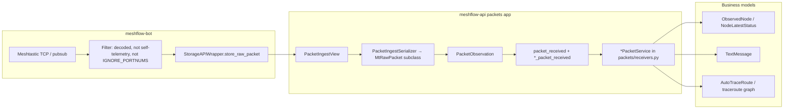

# Meshtastic packet ingestion — data path

Reverse-engineered map of how Meshtastic (MT) traffic moves from a feeder radio through **meshflow-bot** into **meshflow-api** raw tables and downstream business models. Wire field detail lives in [PACKET_FIELDS.md](PACKET_FIELDS.md); dedup rules in [DEDUPLICATION.md](DEDUPLICATION.md).

Parent epic for MeshCore parity: [meshflow-api#266](https://github.com/pskillen/meshflow-api/issues/266).

---

## Packet types the API accepts

Ingestion is keyed on `decoded.portnum` in the JSON body. Anything else returns **400** (`Unknown packet type`).

| `decoded.portnum` | TELEMETRY variant (if applicable) | Raw model (`packets.models`) | Business / side effects |
| --- | --- | --- | --- |
| `TEXT_MESSAGE_APP` | — | `MessagePacket` | `TextMessage` (`original_packet` FK); claim tokens via `text_messages`; `text_message_received` signal |
| `NODEINFO_APP` | — | `NodeInfoPacket` | `ObservedNode` name/role/hw/key fields |
| `POSITION_APP` | — | `PositionPacket` | `Position` row + `NodeLatestStatus` lat/lon/time |
| `TELEMETRY_APP` | `deviceMetrics` | `DeviceMetricsPacket` | `DeviceMetrics` + `NodeLatestStatus`; `device_metrics_recorded` → mesh monitoring |
| `TELEMETRY_APP` | `localStats` | `LocalStatsPacket` | **Raw storage only** — `local_stats_packet_received` is emitted but has **no** `packets/receivers.py` handler (no `BasePacketService`; stats queries count `LocalStatsPacket` rows) |
| `TELEMETRY_APP` | `environmentMetrics` | `EnvironmentMetricsPacket` | `EnvironmentMetrics` + `NodeLatestStatus` |
| `TELEMETRY_APP` | `airQualityMetrics` | `AirQualityMetricsPacket` | `AirQualityMetrics` + `NodeLatestStatus` |
| `TELEMETRY_APP` | `powerMetrics` | `PowerMetricsPacket` | `PowerMetrics` + `NodeLatestStatus` |
| `TELEMETRY_APP` | `healthMetrics` | `HealthMetricsPacket` | `HealthMetrics` + `NodeLatestStatus` |
| `TELEMETRY_APP` | `hostMetrics` | `HostMetricsPacket` | `HostMetrics` + `NodeLatestStatus` |
| `TELEMETRY_APP` | `trafficManagementStats` | `TrafficManagementStatsPacket` | **Raw storage only** — receiver logs; no metrics tables |
| `TRACEROUTE_APP` | — | `TraceroutePacket` | `AutoTraceRoute` completion, Neo4j export, DX/mesh-monitoring via `auto_traceroute_completed_from_packet` |

Every successful ingest also creates **`PacketObservation`** (per feeder hearing) and runs the generic **`packet_received`** receiver (placeholder `ObservedNode`, `meshtastic_inferred_max_hops` when `hop_start` is present).

### Not ingested (bot or API)

| Stage | Behaviour |
| --- | --- |
| Bot | `IGNORE_PORTNUMS` env — portnums skipped before POST |
| Bot | No `decoded` / encrypted-only — skipped (no upload) |
| Bot | Self `deviceMetrics` loopback to TCP client — skipped (`is_self_telemetry`) |
| API | Top-level `encrypted` — **304**, no DB write |
| API | Unknown `portnum` — **400** |
| API | `TELEMETRY_APP` without a recognised telemetry object — **400** |

Other Meshtastic portnums (e.g. `ROUTING_APP`, `ADMIN_APP`) are not mapped in `PacketIngestSerializer` today.

---

## End-to-end flow

---

## Bot → API

| Step | Location | Notes |
| --- | --- | --- |
| Listen | `meshtastic-bot` `MeshtasticRadio` — `meshtastic.receive` | Builds `IncomingPacket` with Meshtastic-shaped `raw` dict |
| Filter | `MeshflowBot._on_packet` | See table above |
| Sanitise | `StorageAPIWrapper.store_raw_packet` | Drops non-JSON `raw` protobuf; base64 `bytes`; fills `channel` |
| POST | `POST /api/packets/{my_nodenum}/ingest/` | `my_nodenum` = **observer** (feeder), not sender; `NodeAPIKey` auth |
| Legacy | `POST /api/raw-packet/` | Still supported by bot for older deployments |
| Failure | `failed_packets_dir` JSON dump | No automatic retry |

Code: `meshflow-bot/src/meshtastic/radio.py`, `src/bot.py`, `src/api/StorageAPI.py`.

---

## API → raw storage

| Step | Location | Notes |
| --- | --- | --- |
| Auth | `NodeAPIKeyAuthentication` + `NodeAuthorizationPermission` | Observer `ManagedNode` on `request.auth.node` |
| Dispatch | `PacketIngestSerializer` | `Meshflow/packets/serializers.py` — portnum → subclass serializer |
| Dedup | `find_existing_packet(from_int, packet_id, rx_time)` | Reuses one `MtRawPacket` per on-air TX within window; always ensures observation |
| Persist | `MtRawPacket` hierarchy + `PacketObservation` | See [README — Storage shape](README.md#storage-shape) |
| Signals | `PacketIngestView` | Type-specific `*_packet_received` + always `packet_received` |

OpenAPI: `openapi.yaml` — `packets` ingest paths.

---

## Raw → business (by app)

### Inside `packets` app (`packets/receivers.py` + `packets/services/`)

All type-specific services extend **`BasePacketService`**: upsert `ObservedNode` (protocol=`MESHTASTIC`), emit `packet_from_node_processed`, update **`last_heard`** (see [RECENCY.md](../../RECENCY.md)), then type logic.

| Service | Primary writes |
| --- | --- |
| `TextMessagePacketService` | `TextMessage` + `original_packet` |
| `NodeInfoPacketService` | `ObservedNode` identity fields |
| `PositionPacketService` | `Position`, `NodeLatestStatus` |
| `DeviceMetricsPacketService` | `DeviceMetrics`, `NodeLatestStatus`, `device_metrics_recorded` |
| `EnvironmentMetricsPacketService` | `EnvironmentMetrics`, `NodeLatestStatus` |
| `AirQualityMetricsPacketService` | `AirQualityMetrics`, `NodeLatestStatus` |
| `HealthMetricsPacketService` | `HealthMetrics`, `NodeLatestStatus` |
| `HostMetricsPacketService` | `HostMetrics`, `NodeLatestStatus` |
| `PowerMetricsPacketService` | `PowerMetrics`, `NodeLatestStatus` |
| `TraceroutePacketService` | `AutoTraceRoute` + completion signals |

### Other Django apps (subscribe to ingest / post-processing signals)

| App | Trigger | Outcome |
| --- | --- | --- |
| `text_messages` | `message_packet_received` (via packets receiver) | Claims, `text_message_received` |
| `traceroute` | `traceroute_packet_received` → completion wiring | WS notify, Neo4j |
| `mesh_monitoring` | `device_metrics_recorded`, `node_last_heard_advanced`, traceroute completion | Watches / presence |
| `dx_monitoring` | `packet_from_node_processed`, traceroute completion | DX candidates |
| `stats` | ORM on `MtRawPacket` subclasses | Dashboard packet-type counts (not live ingest) |

Post-processing signal catalogue: [signals.md](signals.md).

---

## Provenance FKs (MT)

| Business model | Link to raw |
| --- | --- |
| `TextMessage` | `original_packet` → `MessagePacket` |
| `Position` | No `original_packet` FK today — history keyed by `node` + `reported_time` |
| Metrics tables | Historical rows per ingest; latest mirrored on `NodeLatestStatus` |

Dual-protocol `TextMessage.protocol` and CHECK constraints: `text_messages.models`.

---

## Related docs

- [Packet ingestion hub](README.md)
- [PACKET_FIELDS.md](PACKET_FIELDS.md)
- [Packet stats (MT counts)](../packet-stats/meshtastic.md)
- [Traceroute](../traceroute/)
