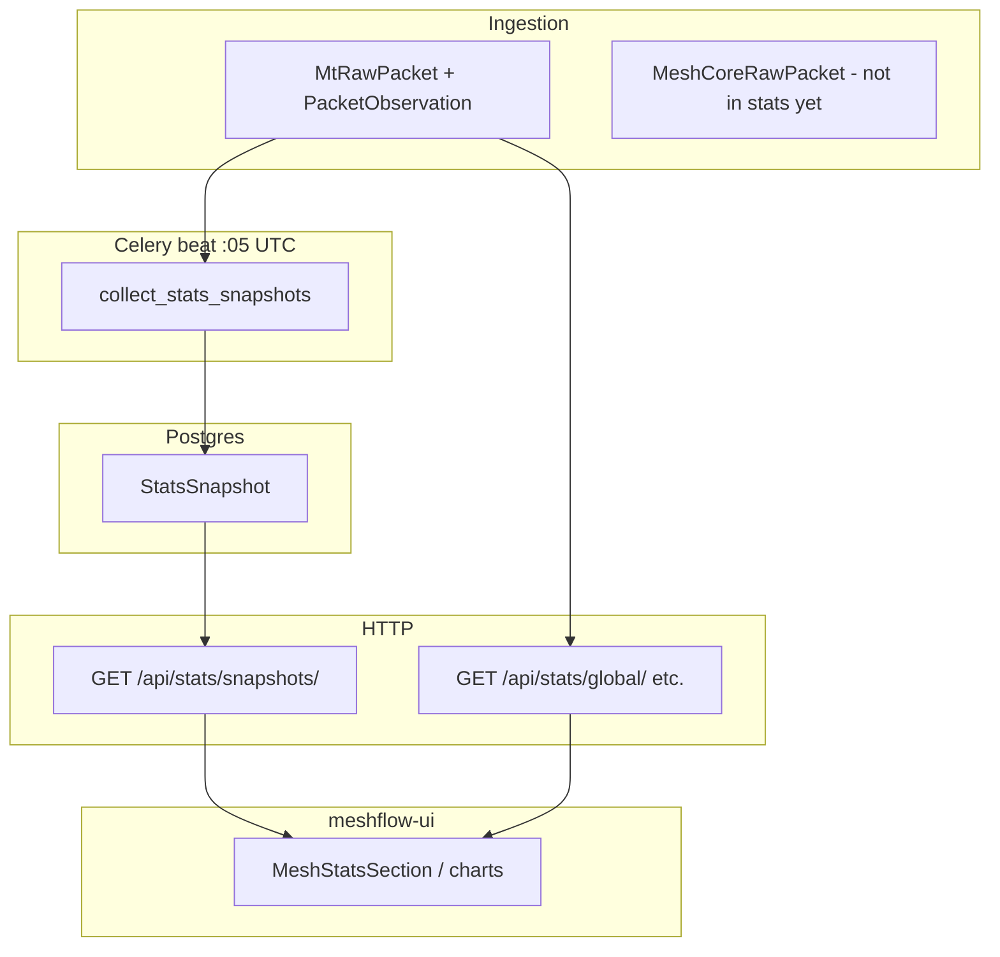

# Packet statistics

Meshflow exposes **packet and node activity statistics** for operations visibility and the dashboard. Two mechanisms coexist:

1. **Stored hourly snapshots** — Celery writes completed-hour aggregates into `StatsSnapshot` (cheap to chart over long ranges).
2. **Live aggregation** — HTTP handlers query `MtRawPacket` / `PacketObservation` on demand for arbitrary date ranges and intervals.

Today both paths are **Meshtastic-only**. MeshCore hourly snapshots are tracked in [#329](https://github.com/pskillen/meshflow-api/issues/329) (parent epic [#266](https://github.com/pskillen/meshflow-api/issues/266)).

Django app: [`Meshflow/stats/`](../../../Meshflow/stats/). Related but separate: traceroute daily success snapshots (`stat_type=tr_success_daily`) in `traceroute_analytics` — see [traceroute](../traceroute/README.md).

## Implementation status

| Area | Status | Notes |
| --- | --- | --- |
| Hourly MT snapshots (`online_nodes`, `packet_volume`, `new_nodes`) | Shipped | `collect_stats_snapshots` at `:05` UTC |
| MT snapshot backfill | Shipped | `backfill_stats_snapshots` + management command |
| `GET /api/stats/snapshots/` | Shipped | Guest-readable list + filters |
| Live MT global / per-node stats | Shipped | `GET /api/stats/global/`, `/nodes/{id}/…` |
| Hourly MC snapshots | Not started | [#329](https://github.com/pskillen/meshflow-api/issues/329) API Task 2 |
| Dashboard + protocol dashboards | Not started | [#329](https://github.com/pskillen/meshflow-api/issues/329) UI Task 3 (meshflow-ui) |
| Live MC stats API | Not planned in #329 | Snapshots + list API only |

## Documentation map

| Doc | Contents |
| --- | --- |
| [meshtastic.md](meshtastic.md) | Reverse-engineered MT snapshots, collectors, live API, UI consumers |
| [meshcore.md](meshcore.md) | Planned MC parity (#329), gaps vs MT |
| [packet-stats-progress.md](packet-stats-progress.md) | Execution log for #329 |
| [packet-stats-outstanding.md](packet-stats-outstanding.md) | Debt discovered during #329 work |
| [../../RECENCY.md](../../RECENCY.md) § `stats/` | Ops quick reference (windows, beat schedule) |
| [../packet-ingestion/README.md](../packet-ingestion/README.md) | Where `MtRawPacket` / `MeshCoreRawPacket` originate |

## High-level flow

## Cross-links

- **Permissions:** snapshots and global live stats are guest-readable; per-node live stats require authenticated user ([permissions](../../permissions/README.md)).
- **OpenAPI:** `Stats` tag — [`openapi.yaml`](../../../openapi.yaml).
- **MeshCore phase 2:** [phase-2-outstanding.md](../meshcore/phase-2-outstanding.md) (#329 item).
