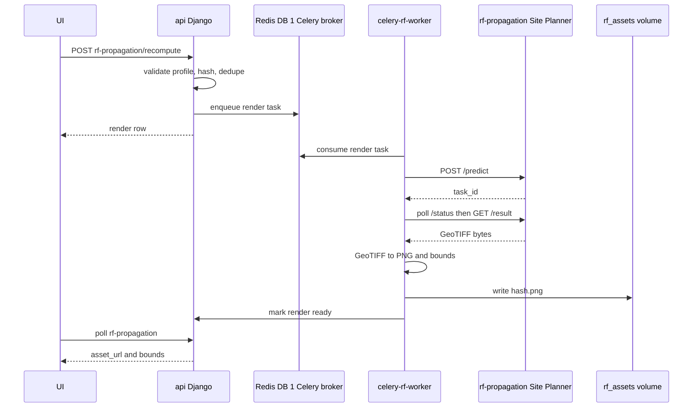

# RF propagation

Owners of observed nodes can request a predicted RF coverage map for their
hardware. Meshflow stores RF profile settings, queues a render through Celery,
calls the Meshtastic Site Planner Docker image, converts the returned GeoTIFF
to a browser asset, and displays it over the normal map.

## Docs

- [pipeline.md](pipeline.md) - queue admission, deduplication, Celery pickup,
  and the handoff to the Site Planner Docker image.
- [rendering.md](rendering.md) - render inputs, Site Planner output,
  GeoTIFF-to-PNG conversion, asset storage, cache keys, and retention.
- [geo-rendering.md](geo-rendering.md) - geospatial bounds, raster display,
  Leaflet overlay placement, and alignment investigation notes.
- [privacy.md](privacy.md) - private-coordinate threat model, leak surfaces,
  candidate mitigations, and expected tests.

## Architecture



## Main components

- `NodeRfProfile` stores RF render inputs for an `ObservedNode`, including
  private RF coordinates and radio parameters.
- `NodeRfPropagationRender` stores one render attempt, status, cache hash,
  asset filename, bounds, errors, and completion time.
- `rf_propagation.payload` builds the Site Planner request body.
- `rf_propagation.hashing` computes the cache key from normalized profile
  fields, render version, and render tunables.
- `rf_propagation.tasks.render_rf_propagation` drives the engine roundtrip and
  writes the generated asset.
- `rf_propagation.image` decodes the GeoTIFF, extracts bounds, applies
  transparency, and writes PNG bytes.
- `meshtastic-bot-ui` displays ready renders with a Leaflet image overlay.

## Runtime services

Three containers collaborate on a render:

- `api` accepts requests and owns database state.
- `celery-rf-worker` consumes RF render tasks from the Celery broker.
- `rf-propagation` runs the Site Planner FastAPI service and SPLAT!.

Redis is shared across services with logical database partitioning. Channels
uses DB 0, Celery uses DB 1, Django cache uses DB 2, and Site Planner uses DB 3
for its own task state.

## Engine dependency

The engine image is published from `meshflow-rf-propagation` and pulled from
GHCR. Local stacks default to `latest-dev`; Portainer stacks pin an explicit
`RF_PROPAGATION_TAG`.

Smoke-test the engine without the UI:

```bash
# local docker compose
docker compose exec api curl -sf http://rf-propagation:8080/docs >/dev/null && echo ok

# portainer stack (service is named "site-planner" there)
docker compose exec api curl -sf http://site-planner:8080/docs >/dev/null && echo ok
```

## Operational notes

- A stuck `pending` render usually means the RF worker is not consuming the
  queue or the engine URL is wrong.
- A failed row exposes `error_message` and can be dismissed before retrying.
- Force fresh output by bumping `RF_PROPAGATION_RENDER_VERSION` or changing RF
  profile inputs.
- `RF_PROPAGATION_READY_RETENTION` controls how many ready rows are kept per
  node.
- Update [docs/ENV_VARS.md](../../ENV_VARS.md) when adding or changing RF
  propagation environment variables.

## Known limitations

- Directional antennas are captured in Meshflow but Site Planner currently
  renders omni coverage only.
- The default engine image ships UK SRTM tiles; renders outside coverage may
  fail.
- Current display uses a PNG plus bounds rather than rendering the original
  GeoTIFF directly.
- Private-coordinate renders need a stricter public response contract before
  exact georeferencing can be treated as safe for broad access.
