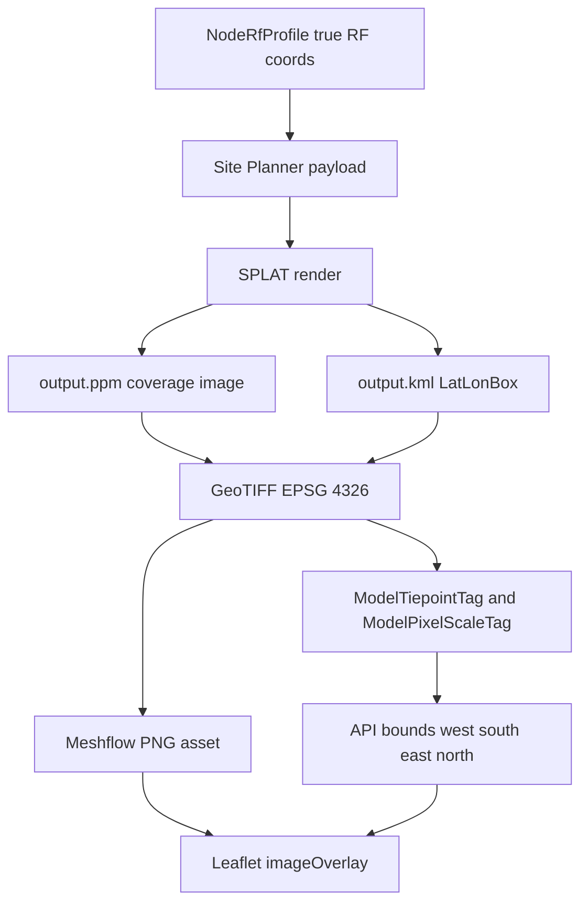

# RF propagation geospatial display

This document explains how RF propagation render output is positioned on a
geographic map. It includes the geospatial parts of image generation because
the display can only be correct if the rendered raster and exposed bounds use
the same coordinate model.

For queueing details, see [pipeline.md](pipeline.md). For image conversion and
storage, see [rendering.md](rendering.md). For private-coordinate risk, see
[privacy.md](privacy.md).

## Current display contract

The API exposes a ready render as:

```json
{
  "status": "ready",
  "input_hash": "...",
  "asset_url": "https://.../{hash}.png",
  "bounds": {
    "west": -4.5,
    "south": 55.0,
    "east": -4.0,
    "north": 55.5
  },
  "created_at": "...",
  "completed_at": "..."
}
```

The frontend treats `asset_url` as a plain image and `bounds` as the WGS84
extent of that image.

In `meshtastic-bot-ui`,
`src/components/nodes/RfPropagationMap.tsx` converts API order
`west/south/east/north` into Leaflet image overlay order:

```text
[[south, west], [north, east]]
```

It then calls:

```text
L.imageOverlay(assetUrl, [[south, west], [north, east]])
```

## Geospatial source of truth

The source of truth for display bounds should be the rendered raster's own
georeferencing, not the requested radius.

The pipeline is:



Site Planner derives the GeoTIFF extent from SPLAT's KML `LatLonBox`. Meshflow
then extracts bounds from the GeoTIFF tags and stores them on
`NodeRfPropagationRender`.

This matters because SPLAT/Site Planner may render an extent that differs from
the naive request radius. The request radius is a hint for the engine; it is not
the display contract.

## Coordinate systems in play

- Site Planner emits a GeoTIFF in `EPSG:4326`.
- Meshflow stores bounds as WGS84 longitude/latitude degrees.
- Leaflet's default map display is Web Mercator (`EPSG:3857`).
- `L.imageOverlay` accepts lat/lng corner bounds, then Leaflet projects those
  corners into its map CRS and stretches the image between them.

That means a PNG overlay is not the same thing as rendering the GeoTIFF as a
geospatial raster. Once Meshflow converts the GeoTIFF into a plain PNG, the
frontend no longer has the original raster transform, CRS, pixel scale, nodata
value, or colormap metadata. It only has the image pixels and outer bounds.

## Current API-side geometry changes

Before writing the PNG, Meshflow currently applies pixel aspect correction in
`rf_propagation.image._maybe_resample_pixel_aspect_for_web_mercator()`.

The correction compares:

- source image aspect ratio, `width / height`
- approximate ground-distance aspect ratio,
  `(lng_span * cos(center_lat)) / lat_span`

If they differ by more than two percent, the converter resizes the bitmap.
The stored API bounds are still the GeoTIFF-derived bounds.

This is a critical detail for alignment work: resizing a georeferenced raster
as a plain bitmap can change where internal terrain features fall within the
same outer bounds. Any alignment investigation should compare:

1. The raw engine GeoTIFF.
2. The PNG with aspect correction enabled.
3. The PNG with aspect correction disabled.
4. A frontend that renders the GeoTIFF directly with a geospatial raster layer.

## Frontend fitting vs overlay placement

`RfPropagationMap.tsx` has two separate responsibilities:

- Place the image with `L.imageOverlay(assetUrl, bounds)`.
- Fit the map viewport so the user can see a useful area.

The viewport fitting code may cap the viewed diameter for large render bounds.
That changes what part of the overlay is visible initially, but it should not
change overlay placement. Alignment bugs should therefore focus first on the
asset pixels and bounds, not on `fitBoundsForPropagation()`.

## Recommended investigation path

When debugging misalignment, start from the most geospatially complete artifact
and move outward:

1. Inspect the raw Site Planner GeoTIFF: CRS, transform, bounds, dimensions,
   nodata, and visual alignment in a geospatial viewer.
2. Compare GeoTIFF bounds with the API's stored `bounds_*` values.
3. Compare the raw GeoTIFF dimensions with the served PNG dimensions.
4. Disable API pixel aspect correction in a local probe and compare alignment.
5. Compare `L.imageOverlay` with direct GeoTIFF rendering, such as
   `georaster-layer-for-leaflet`.

If the GeoTIFF aligns but the PNG overlay does not, the likely fault is in the
API conversion or frontend display strategy. If the GeoTIFF is already offset,
the fault is earlier in Site Planner's SPLAT output, KML `LatLonBox`, or terrain
tile conversion.
