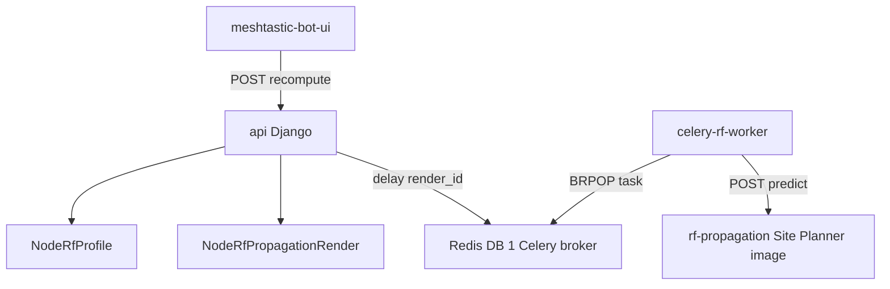

# RF propagation queue pipeline

This document covers the pipeline from a user requesting an RF propagation
render up to the point where Meshflow sends a prediction request to the
Meshtastic Site Planner engine. For image conversion and display details, see
[rendering.md](rendering.md) and [geo-rendering.md](geo-rendering.md).

## Components



- `meshtastic-bot-ui` calls the observed-node RF propagation endpoints.
- `api` owns validation, permissions, render rows, hashing, and enqueueing.
- `Redis DB 1` is the Celery broker. It is separate from Channels, Django
  cache, and the Site Planner engine's own Redis task state.
- `celery-rf-worker` consumes the dedicated RF render task and performs the
  blocking engine roundtrip.
- `rf-propagation` is the Docker image published from
  `ghcr.io/pskillen/meshflow-rf-propagation`. It wraps the upstream
  Meshtastic Site Planner FastAPI service and SPLAT!.

## Request entry point

The UI starts or reuses a render with:

```text
POST /api/nodes/observed-nodes/{node_id}/rf-propagation/recompute/
```

The Django action is `nodes.views.ObservedNodeViewSet.rf_propagation_recompute`.
It requires the same permission as editing the node RF profile: staff or the
user who has claimed the observed node.

The action loads `node.rf_profile`. If the profile is missing required fields
for rendering, the API returns `400` before creating or enqueueing any render.

## Payload and hash preparation

The API builds the engine payload with `rf_propagation.payload.build_request`.
The payload contains the true RF profile coordinates and radio settings needed
by Site Planner:

- `lat`, `lon`
- `tx_height`, `tx_gain`, `tx_power`
- `frequency_mhz`
- `rx_height`, `rx_gain`
- `signal_threshold`
- `radio_climate`
- `colormap`
- `radius`
- `min_dbm`, `max_dbm`
- `high_resolution`

Directional antenna fields are stored in Meshflow and included in the cache
hash, but the current Site Planner engine renders omni coverage only.

`rf_propagation.hashing.compute_input_hash` is computed before enqueueing so
the API and worker agree on cache identity. The hash includes normalized RF
profile values, `RF_PROPAGATION_RENDER_VERSION`, and render tunables from
`hash_extras_from_payload`.

## Deduplication before enqueue

`rf_propagation_recompute` avoids unnecessary work in this order:

1. If a `ready` render with the same `input_hash` has an asset still present
   on disk, return it. If it belongs to another node with an identical RF
   profile, create a new ready row pointing at the shared content-addressed
   asset.
2. If this node already has a `pending` or `running` row, return that row.
3. Otherwise create a fresh `pending` `NodeRfPropagationRender` row and enqueue
   `render_rf_propagation.delay(row.pk)`.

The response is a serialized render row. New pending rows return `201`; reused
in-flight rows return `200`.

## Celery task pickup

The queued task is `nodes.tasks.render_rf_propagation`, implemented by
`rf_propagation.tasks.render_rf_propagation`.

On pickup, the worker:

1. Loads the `NodeRfPropagationRender` by id.
2. Skips immediately if the row has vanished or is already terminal.
3. Loads the related `ObservedNode` and `NodeRfProfile`.
4. Rebuilds the Site Planner payload and input hash.
5. Checks again for a ready cache hit with the same hash.
6. Refreshes the row before the engine call so a cancel or dismiss can stop
   work before the expensive roundtrip.

Only after those checks does the worker mark the row `running`.

## Passing work to Site Planner

The worker reads `RF_PROPAGATION_ENGINE_URL` and creates a
`SitePlannerClient`. In local Docker Compose the service is normally
`http://rf-propagation:8080`; in some Portainer deployments it is named
`site-planner`.

The first engine call is:

```text
POST /predict
```

The request body is the payload built from `NodeRfProfile` and environment
settings. At that point the Meshflow queue pipeline is complete: Site Planner
has accepted the prediction instruction and returns an engine task id.

The worker then polls `/status/{task_id}` and fetches `/result/{task_id}`.
Those steps are covered in [rendering.md](rendering.md), because they are part
of image generation rather than queue admission.

## Cancel and dismiss behavior

Meshflow cannot interrupt a Site Planner `/predict` request once it is running.
Instead, cancel and dismiss are implemented around the `NodeRfPropagationRender`
row:

- `cancel` marks `pending` or `running` rows as `failed`.
- `dismiss` deletes non-ready rows.
- The worker checks for terminal or missing rows on pickup, before the engine
  call, and after the engine returns.

If a row is cancelled or dismissed while the engine is already running, the
engine request may still complete, but the worker refuses to revive the row.
