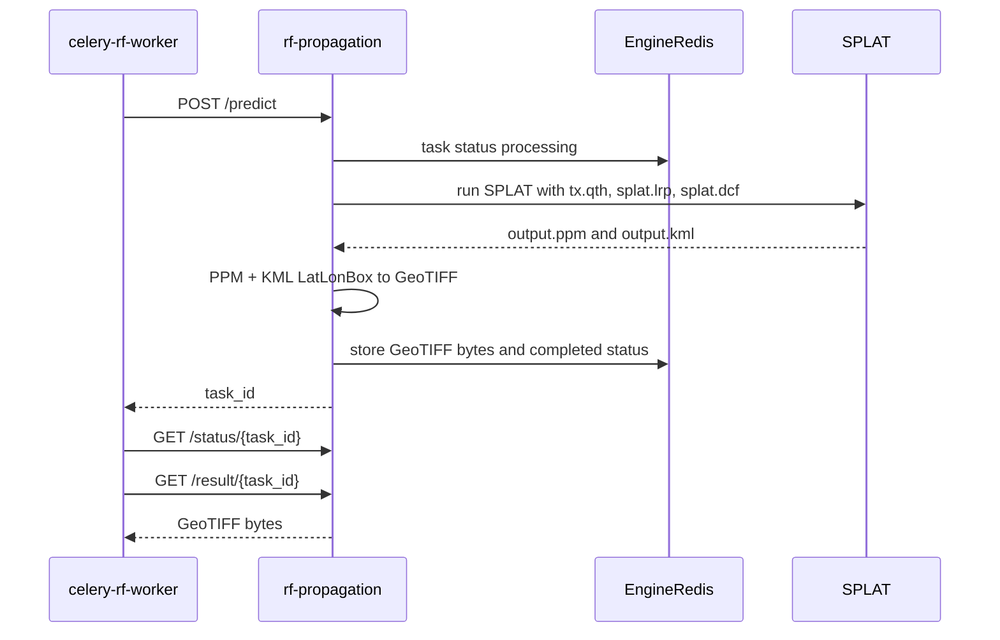

# RF propagation image rendering

This document explains how Meshflow turns a queued RF propagation render into
a stored browser asset. For queue admission and worker dispatch, see
[pipeline.md](pipeline.md). For how the final image is placed on a map, see
[geo-rendering.md](geo-rendering.md). For private-coordinate risk, see
[privacy.md](privacy.md).

## Render inputs

The worker builds a Site Planner `CoveragePredictionRequest` from
`NodeRfProfile` plus RF propagation settings.

Profile inputs:

- `rf_latitude`, `rf_longitude`
- `rf_altitude_m` or `antenna_height_m`
- `antenna_gain_dbi`
- `tx_power_dbm`
- `rf_frequency_mhz`
- `antenna_pattern`, `antenna_azimuth_deg`, `antenna_beamwidth_deg`

Runtime settings:

- `RF_PROPAGATION_DEFAULT_RADIUS_M`
- `RF_PROPAGATION_COLORMAP`
- `RF_PROPAGATION_HIGH_RESOLUTION`
- `RF_PROPAGATION_MIN_DBM`
- `RF_PROPAGATION_MAX_DBM`
- `RF_PROPAGATION_SIGNAL_THRESHOLD_DBM`
- `RF_PROPAGATION_RENDER_VERSION`

The current Site Planner engine is omni-only. Meshflow still stores directional
antenna choices and includes them in the input hash so future engine support
will invalidate old renders correctly.

## Engine roundtrip

After the worker marks a render row `running`, it calls the Site Planner
container:



The Site Planner image is built from the `meshflow-rf-propagation` repository,
which pins an upstream `meshtastic-site-planner` revision and applies small
Docker/runtime patches. Inside that engine, SPLAT produces a PPM coverage image
and KML metadata. The engine converts those into a GeoTIFF using the KML
`LatLonBox` as the raster bounds.

## GeoTIFF decoding

Meshflow receives GeoTIFF bytes from `/result/{task_id}` and decodes them in
`rf_propagation.image.geotiff_to_render_image`.

The decoder tries:

1. Pillow for baseline TIFFs.
2. `tifffile` as a fallback for variants Pillow cannot decode.

The output is a `RenderImage` containing:

- `png_bytes`: browser-ready RGBA PNG bytes.
- `bounds`: the WGS84 bounding box recovered from GeoTIFF georeferencing tags,
  when available.

## Bounds extraction

Meshflow reads the GeoTIFF `ModelTiepointTag` and `ModelPixelScaleTag`.
For the normal north-up case, these tags identify the raster's north-west
origin and per-pixel degree scale.

The computed bounds are:

- `west = tiepoint_x - tiepoint_i * scale_x`
- `north = tiepoint_y + tiepoint_j * scale_y`
- `east = west + width * scale_x`
- `south = north - height * scale_y`

The worker stores those values as:

- `bounds_west`
- `bounds_south`
- `bounds_east`
- `bounds_north`

If GeoTIFF tags are missing or invalid, the worker falls back to a coarse
`bbox_from_center(profile.rf_latitude, profile.rf_longitude, radius)` estimate.
That fallback should be treated as degraded output because Site Planner may
snap the rendered extent to terrain tile or SPLAT output boundaries.

## PNG conversion

After decoding, the image is converted to RGBA PNG.

Pixels close to the configured nodata color are made transparent:

- `RF_PROPAGATION_NODATA_RGB` defaults to `0,0,0`.
- `RF_PROPAGATION_NODATA_TOLERANCE` defaults to `8`.

The intent is to let the Leaflet basemap show through where SPLAT produced
background/no-coverage pixels.

The current converter also performs pixel aspect correction in
`_maybe_resample_pixel_aspect_for_web_mercator()`. It resizes the PNG so its
pixel aspect approximates east-west vs north-south metres at the bounding-box
centre latitude. This was added because Leaflet stretches the PNG over a Web
Mercator map. It is important for alignment investigations because it changes
the raster dimensions after the GeoTIFF georeferencing has been read.

## Storage

The worker writes the PNG to `RF_PROPAGATION_ASSET_DIR`, which must be mounted
into both the API and RF worker containers.

The filename is content-addressed:

```text
{input_hash}.png
```

The `NodeRfPropagationRender` row stores:

- `status = ready`
- `input_hash`
- `asset_filename`
- `bounds_*`
- `completed_at`
- empty `error_message`

The API serves the file through:

```text
GET /api/nodes/observed-nodes/{node_id}/rf-propagation/asset/{filename}
```

The current asset response is public, cacheable for one year, and immutable.
The `node_id` path component is reserved for future validation; today the hash
filename is the only asset locator.

## Retention and reuse

Successful renders share assets by `input_hash`. Two nodes with identical RF
profiles and render settings can point at the same PNG.

After a successful render, retention keeps the newest
`RF_PROPAGATION_READY_RETENTION` ready rows per node and deletes older rows and
their unreferenced PNG files. Failed rows older than seven days are pruned.

Changing render inputs or output behavior should bump
`RF_PROPAGATION_RENDER_VERSION` so stale PNG assets are not reused.
