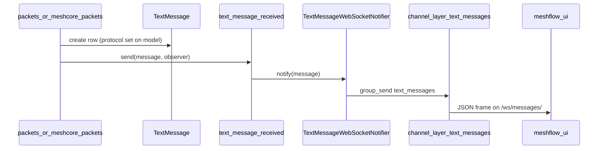

# Text messages

Meshflow stores normalised **text messages** from Meshtastic and MeshCore feeders: public channel chat, emoji reactions, and (Meshtastic) threaded replies. Rows live in the `text_messages` Django app; ingest paths differ by protocol but both emit the same `text_message_received` signal for WebSocket fan-out.

This folder documents cross-cutting text-message behaviour. MeshCore-specific ingest and channel modelling remain under [meshcore/text-message-channels.md](../meshcore/text-message-channels.md) and [meshcore/mc-channel-sync/](../meshcore/mc-channel-sync/).

## Implementation status

| Area | Status | Notes |
| --- | --- | --- |
| REST list/detail `GET /api/messages/text/` | Shipped | `protocol`, `channel_id`, `constellation_id`, pagination |
| `TextMessage.protocol` on DB row | Shipped | `Protocol.MESHTASTIC` / `Protocol.MESHCORE` |
| WebSocket `/ws/messages/` | Shipped | JWT; Redis group `text_messages` |
| WS payload `protocol` | Shipped | `TextMessageWSSerializer` (see [unread-count.md](unread-count.md)) |
| Server-side unread / read receipts | Not implemented | Unread is entirely client-side in meshflow-ui |

## Documentation map

| Doc | Purpose |
| --- | --- |
| [unread-count.md](unread-count.md) | Realtime push, WS serializer fields, UI nav badges ([#279](https://github.com/pskillen/meshflow-ui/issues/279)) |
| [../meshcore/text-message-channels.md](../meshcore/text-message-channels.md) | MC ingest, channels, sender inference |
| [../packet-ingestion/meshtastic.md](../packet-ingestion/meshtastic.md) | MT `TEXT_MESSAGE_APP` → `TextMessage` |

## Concepts

- **`TextMessage`** — business row with `protocol`, optional `sender`, `channel` FK, provenance via `original_packet` (MT) or `original_mc_packet` (MC).
- **`text_message_received`** — Django signal (`packets.signals`) fired after a row is created; `ws.receivers` pushes to connected UI clients.
- **Unread** — not stored in Postgres; the SPA keeps an in-memory list keyed by protocol (see UI doc).

## Flow (high level)

## HTTP API

- **List:** `GET /api/messages/text/` — filter `protocol=meshtastic|meshcore`, `channel_id`, `constellation_id`, `sender_node_id`; paginated.
- **OpenAPI:** `TextMessage` schema includes `protocol` (`MeshProtocol` string).
- **Auth:** JWT (same as rest of API).

## WebSocket

- **Path:** `/ws/messages/?token={jwt}` — see [openapi.yaml](../../../openapi.yaml) and [REDIS.md](../../REDIS.md) (Channels group `text_messages`).
- **Consumer:** `ws.consumers.TextMessageConsumer` — adds socket to group `text_messages`; handler `text_message` forwards `event["message"]` as JSON.
- **Notifier:** `ws.services.text_message.TextMessageWebSocketNotifier` serializes with `TextMessageWSSerializer`.

## Consumers

| Consumer | Use |
| --- | --- |
| meshflow-ui `WebSocketProvider` | Nav unread badges, toasts when off messages page |
| meshflow-ui `useMessagesWithWebSocket` | Prepend to active channel list on messages page |
| (none server-side) | No unread persistence |

## Related issues

| Issue | Repo | Topic |
| --- | --- | --- |
| [#279](https://github.com/pskillen/meshflow-ui/issues/279) | meshflow-ui | Protocol-scoped unread nav badges |
| [#341](https://github.com/pskillen/meshflow-api/issues/341) | meshflow-api | Messages UI epic (parent) |
| [#277](https://github.com/pskillen/meshflow-ui/issues/277)–[#281](https://github.com/pskillen/meshflow-ui/issues/281) | meshflow-ui | Picker / layout rework |

## Cross-repo docs

- UI messages feature hub: [meshflow-ui `docs/features/messages/README.md`](https://github.com/pskillen/meshflow-ui/blob/main/docs/features/messages/README.md)
- UI legacy overview: [meshflow-ui `docs/messages/`](https://github.com/pskillen/meshflow-ui/blob/main/docs/messages/README.md)
